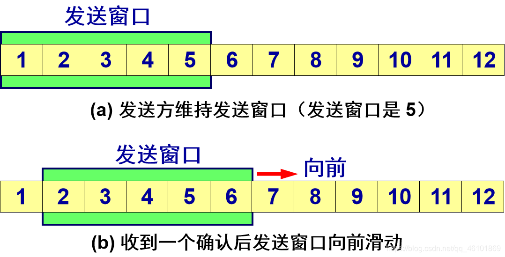

# 传输层

传输层位于OSI模型的第四层，位于网络层之上，会话层之下，是通信协议栈中的关键层之一。它为上层提供端到端的通信服务，确保数据能够在源主机和目标主机的应用程序之间可靠、有序地传输

- 网络层的任务是提供网络中的两个主机提供逻辑通信。从IP层上来看，通信的是两个主机。
- 传输层在网络中负责是两个主机上的应用程序进程提供逻辑通信。在传输层上看，通信双方是主机上的两个应用进程。

## 传输层概述

- 传输层位于应用层和网络层之间：
  - 基于网络层提供的服务，向分布式应用程序提供通信服务
- 按照因特网的“端到端”设计原则：
  - 应用程序只运行在终端上，即不需要为网络设备编写程序
- 站在应用程序的角度：
  - 传输层应提供"进程之间"本地通信的抽象：即运行在不同终端上的应用进程仿佛是直接连在一起的

### 套接字

- 设想在应用程序和网络之间存在一扇“门”：
  - 需要发送报文时：发送进程将报文推到门外
  - 门外的运输设施（因特网）将报文送到接收进程的门口
  - 需要接收报文时：接收进程打开门，即可收到报文
- 在TCP/IP网络中，这扇“门”称为套接字（socket），是应用层和传输层的接口，也是应用程序和网络之间的API

### 传输层提供的服务

- 因特网的网络层提供“尽力而为”的服务：
  - 网络层尽最大努力在终端间交付分组，但不提供任何承诺
  - 具体来说，不保证交付，不保证按序交付，不保证数据完整，不保证延迟，不保证带宽等
- 传输层的有所为、有所不为:
  - 传输层可以通过差错恢复、重排序等手段提供可靠、按序的交付服务
  - 但传输层无法提供延迟保证、带宽保证等服务

### 因特网传输层提供的服务

- 最低限度的传输服务：
  - 将终端-终端的数据交付扩展到进程-进程的数据交付
  - 报文检错
- 增强服务：
  - 可靠数据传输
  - 流量控制
  - 拥塞控制
- 因特网传输层通过UDP协议和TCP协议，向应用层提供两种不同的传输服务：
  - UDP协议：仅提供最低限度的传输服务
  - TCP协议：提供基础服务和增强服务

## 核心协议

- UDP，User Datagram Protocol 用户数据报协议
- TCP，Transmission Control Protocol 传输控制协议

>在OSI术语中，传输层的传输数据叫运输协议数据单元，即TPDU（Transport Protocol Data）
Unit）但是在TCP/IP体系中，使用的协议是TCP或UDP，称为TCP报文端或UDP用户数据报

### UDP：无连接传输

#### UDP报文段结构

- UDP报文：
  - 报头：携带协议处理需要的信息
  - 载荷（payload）：携带上层数据
- 用于复用和分用的字段：
  - 源端口号
  - 目的端口号
- 用于检测报文错误的字段：
  - 报文总长度
  - 校验和（checksum）

#### UDP校验和（checksum）

校验和字段的作用: 对传输的报文段进行检错
以下是报文段的字段

将上表中所有的 16 进制数加起来，之后取反码。有一点需要注意的是，如果遇到最高位进位，那么需要对结果进行回卷，意思是:

求出来的即是校验和。

#### 为什么需要UDP？

1. 为什么需要UDP

   - 应用可以尽可能快地发送报文：
     - 无建立连接的延迟
     - 不限制发送速率（不进行拥塞控制和流量控制）
   - 报头开销小
   - 协议处理简单

2. UDP适合哪些应用？

   - 容忍丢包但对延迟敏感的应用：
   如流媒体
   - 以单次请求/响应为主的应用：
   如DNS
   - 若应用要求基于UDP进行可靠传输：
   由应用层实现可靠性

### TCP：面向连接的传输

#### 可靠传输

数据包有序、无差错到达接收端

1. 如何实现可靠传输，基本原则是什么？

   - 利用ACK确认
   - 重传机制
   - 差错检测

2. 可靠传输实现举例-Stop and Wait

    >注：该实现俗称tcp的三次握手和四次挥手。三次挥手我们也常称为“请求 -> 应答 -> 应答之应答”的三个回合，主要就是为了建立连接

3. 建立一条TCP连接需要确定两件事：

   - 双方都同意建立连接（知晓另一方想建立连接）
   - 初始化连接参数（序号，MSS等）
   
   

#### 流水线技术

由于信道上一直有数据不间断地传送，这种传输方式可获得很高的信道利用率。

##### (1)GBN 协议（回退 N 步协议）

1. 发送窗口
发送方维持的发送窗口，它的意义是：位于发送窗口内的分组都可连续发送出去，而不需要等待对方的确认。这样，信道利用率就提高了。
发送方每收到一个确认，就把发送窗口向前滑动一个分组的位置。

2. 累积确认

- 接收方一般采用累积确认的方式。即不必对收到的分组逐个发送确认，而是对按序到达的最后一个分组发送确认，这样就表示：到这个分组为止的所有分组都已正确收到了。
- 优点：容易实现，即使确认丢失也不必重传。
- 缺点：不能向发送方反映出接收方已经正确收到的所有分组的信息。

如果发送方发送了前 5 个分组，而中间的第 3 个分组丢失了。这时接收方只能对前两个分组发出确认。发送方无法知道后面三个分组的下落，而只好把后面的三个分组都再重传一次。
这就叫做 Go-back-N（回退 N），表示需要再退回来重传已发送过的 N 个分组。
可见当通信线路质量不好时，连续 ARQ 协议会带来负面的影响。

##### (2)SR协议(选择重传协议)

SR 协议在 GBN 协议的基础上进行了改进，它通过让发送方仅重传那些它怀疑在接收方出错（即丢失或受损）的分组而避免了不必要的重传。选择重传协议只重传真正丢失的分组。

- 选择重传的接收窗口与发送窗口一样大
- 选择重传协议允许与接收窗口一样多的分组失序到达,并保存这些失序到达的分组,直到连续的一组分组被交付给应用层。
- 标记发出分组,当ACK=Sf 时,将窗口滑过所有连续的已确认的分组
  - 如果还有未确认的分组,则重发所有检测到的未被确认的分组并重启计时器
  - 如果所有分组都被确认了则停止计时器
- 确认，确认号(ACK)只定义完好接收的那一个分组的序号,并不反馈任何其他分组的信息

>注：SR协议ack确认和GBN的累计确认不同，是一个一个确认

1. 计时器
理论上选择重传协议要为每个分组使用一个计时器。当某个计时器超时后,只有相应的分组被重传。换而言之，返回N协议将所有的分组当做一个整体对待，而选择重传协议则分别对待每一个分组。但是大多数SR的运输层仅使用了一个计时器。注意只使用一个计时器而做到跟踪所有发出去的分组的情况的做法是：标记发出分组,当ACK=Sf 时,将窗口滑过所有连续的已确认的分组，如果还有未确认的分组，则重发所有检测到的未被确认的分组并重启计时器，如果所有分组都被确认了则停止计时器。

2. 快速重传

   - 仅靠超时重发丢失的报文段，恢复太慢！
   - 发送方可利用重复ACK检测报文段丢失：
     - 发送方通常连续发送许多报文段
     - 若仅有个别报文段丢失，发送方将收到多个重复序号的ACK
     - 多数情况下IP按序交付分组，重复ACK极有可能因丢包产生
   - TCP协议规定： 当发送方收到对同一序号的3次重复确认时，立即重发包含该序号的报文段
   - 所谓快速重传，就是在定时器到期前重发丢失的报文段

3. TCP 可靠通信的具体实现

   - TCP 连接的每一端都必须设有两个窗口——一个发送窗口和一个接收窗口。
   - TCP 的可靠传输机制用字节的序号进行控制。TCP 所有的确认都是基于序号而不是基于报文段。
   - TCP 两端的四个窗口经常处于动态变化之中。
   - TCP连接的往返时间 RTT 也不是固定不变的。需要使用特定的算法估算较为合理的重传时间

##### (3)GBN、SR和TCP小结

Go-Back-N协议
接收方：

- 使用累积确认
- 不缓存失序的分组
- 对失序分组发送重复ACK
发送方：
- 超时后重传从基序号开始的所有分组
SR
接收方：
- 缓存失序的分组
- 单独确认每个正确收到的分组
发送方：
- 每个分组使用一个定时器
- 仅重传未被确认的分组

TCP协议
接收方：

- 使用累积确认
- 缓存失序的报文段
- 对失序报文段发送重复ACK
- 增加了推迟确认
发送方：
- 超时后仅重传最早未确认的报文段
- 增加了快速重传

#### TCP报文段结构

- 最大段长度（MSS）：
  - TCP段中可以携带的最大数据字节数
  - 建立连接时，每个主机可声明自己能够接受的MSS，缺省为536字节
- 窗口比例因子（window scale）：
  - 建立连接时，双方可以协商一个窗口比例因子
  - 实际接收窗口大小 = window size * 2^window scale
- 选择确认（SACK）：
  - 最初的TCP协议只使用累积确认
  - 改进的TCP协议引入选择确认，允许接收端指出缺失的数据字节
- 发送序号和确认序号的含义

## 复用和分用

### 复用和分用概述

传输层基本服务：将主机间交付扩展到进程间交付，通过复用和分用实现

- 复用：
  - 发送方传输层将套接字标识置于报文段中，交给网络层
- 分用：
  - 接收方传输层根据报文段中的套接字标识，将报文段交付到正确的套接字

### 套接字标识与端口号

- 端口号是套接字标识的一部分：
  - 每个套接字在本地关联一个端口号
  - 端口号是一个16比特的数
- 端口号的分类：
  - 熟知端口：0～1023，由公共域协议使用
  - 注册端口：1024～49151，需要向IANA注册才能使用
  - 动态和/或私有端口：49152～65535，一般程序使用
- 报文段中有两个字段携带端口号
  - 源端口号：与发送进程关联的本地端口号
  - 目的端口号：与接收进程关联的本地端口号

### TCP/UDP套接字（复用和分用）

UDP套接字

- 使用`<IP地址，端口号>`二元组标识UDP套接字
- 服务器使用一个套接字服务所有客户
- TCP套接字
- 使用<源IP地址，目的IP地址，源端口号，目的端口号> 四元组标识连接套接字
- 服务器使用一个监听套接字和多个连接套接字服务多个客户，每个连接套接字服务一个客户

## 流量控制

1. TCP接收端

   - 使用显式的窗口通告，告知发送方可用的缓存空间大小
   - 在接收窗口较小时，推迟发送确认
   - 仅当接收窗口显著增加时，通告新的窗口大小

2. TCP发送端

   - 使用Nagle算法确定发送时机
   - 使用接收窗口限制发送的数据量，已发送未确认的字节数不超过接收窗口的大小

3. Nagle算法的解决方法：

   - 在新建连接上，当应用数据到来时，组成一个TCP段发送（那怕只有一个字节）
   - 在收到确认之前，后续到来的数据放在发送缓存中
   - 当数据量达到一个MSS或上一次传输的确认到来（取两者的较小时间），用一个TCP段将缓存的字节全部发走

4. Nagle算法的优点：

   - 适应网络延时、MSS长度及应用速度的各种组合 常规情况下不会降低网络的吞吐量

## 拥塞控制

发送方根据自己感知的网络拥塞程度，限制其发送速率

### 拥塞控制的类型

- 网络辅助的拥塞控制
  - 路由器向端系统提供显式的反馈，例如：
    - 设置拥塞指示比特
    - 给出发送速率指示
  - ATM、X.25采用此类方法
- 端到端拥塞控制
  - 网络层不向端系统提供反馈
  - 端系统通过观察丢包和延迟，自行推断拥塞的发生
  - TCP采用此类方法

### TCP拥塞控制要解决的问题

1. 发送方如何感知网络拥塞？

   - 发送方利用丢包事件感知拥塞：
     - 拥塞造成丢包和分组延迟增大
     - 无论是丢包还是分组延迟过大，对于发送端来说都是丢包了
   - 丢包事件包括：
     - 重传定时器超时
     - 发送端收到3个重复的ACK

2. 发送方采用什么机制限制发送速率?

   - 发送方使用拥塞窗口cwnd限制已发送未确认的数据量:
   LastByteSent-LastByteAcked <= cwnd
   
   - cwnd随发送方感知的网络拥塞程度而变化

3. 发送方感知到网络拥塞后，采取什么策略调节发送速率？
(1)AIMD

- 乘性减（Multiplicative Decrease）
  - 发送方检测到丢包后，将cwnd的大小减半（但不能小于一个MSS）
  - 目的：迅速减小发送速率，缓解拥塞
- 加性增（Additive Increase）
  - 若无丢包，每经过一个RTT，将cwnd增大一个MSS，直到检测到丢包
  - 目的：缓慢增大发送速率，避免振荡

>注：MSS是发送速率TCP建立连接时双方确定的每一个报文段所能承载的最大数据长度

(2)CP慢启动

- 慢启动的策略：
  - 每经过一个RTT，将cwnd加倍
- 慢启动的具体实施：
  - 每收到一个ACK段，cwnd增加一个MSS
  - 只要发送窗口允许，发送端可以立即发送下一个报文段
- 特点：
  - 以一个很低的速率开始，按指数增大发送速率

## 数据分段与重组

传输层可以根据需要将上层数据分割成更小的段（对于TCP而言），并在接收端进行重组。每个段包含头部信息和数据负载，头部信息中记录了必要的控制信息。

## 传输层的重要性

传输层的存在使得高层协议和应用程序不必关心底层网络的细节，如数据包的丢失、乱序、重复等问题，大大简化了应用开发。同时，通过提供两种服务模型（TCP的可靠传输和UDP的高效传输），满足了不同应用场景的需求。

## 应用场景

- TCP：广泛用于Web浏览（HTTP）、文件传输（FTP）、电子邮件（SMTP/POP3）、远程登录（SSH）等需要可靠数据传输的场景。
- UDP：适用于实时多媒体通信（如VoIP、视频会议、在线游戏）、DNS查询、即时消息等对低延迟和容忍一定丢包率的应用。

## 传输层安全

传输层还可以通过TLS/SSL（Transport Layer Security/Secure Sockets Layer）协议为数据传输提供加密和安全认证，保护数据在传输过程中的安全性和隐私，常见于HTTPS、FTPS等安全协议中。
