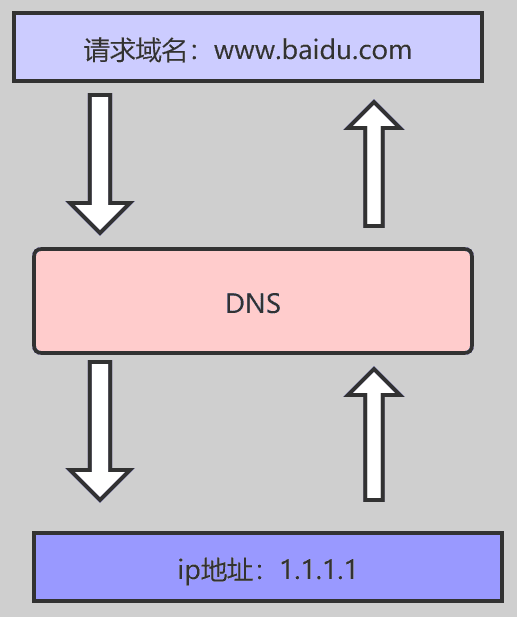

# DNS

DNS（Domain Name System，域名系统）协议是**应用层协议**。在OSI（Open Systems Interconnection）七层模型中，应用层是最高层，负责处理特定的应用程序细节。DNS位于这一层，因为它提供了一个应用程序级别的服务，即域名解析服务，允许将人类可读的域名转换为计算机网络使用的IP地址。

DNS协议的功能包括：

- 解析域名到IP地址。
- 提供反向解析，即将IP地址转换回域名。
- 支持邮件服务器查找（MX记录）。
- 提供其他与域名相关的查询，如主机信息（TXT记录）。

DNS使用UDP协议在端口53上进行大多数的查询和响应，尽管对于较大的响应或者需要更高可靠性的交互，DNS也支持使用TCP协议。

应用层协议还包括HTTP（超文本传输协议）、FTP（文件传输协议）、SMTP（简单邮件传输协议）等，它们都在OSI模型的同一层，为用户提供特定的网络服务。

## DNS的定义及基本概念

### 什么是DNS？

DNS（Domain Names System），域名系统，是互联网一项服务，是进行域名和与之相对应的 IP 地址进行转换的服务器

简单来讲，DNS相当于一个翻译官，负责将域名翻译成ip地址



- IP 地址：一长串能够唯一地标记网络上的计算机的数字
- 域名：是由一串用点分隔的名字组成的 Internet 上某一台计算机或计算机组的名称，用于在数据传输时对计算机的定位标识

DNS使用的是网络的查询，监听的是53号端口，通常DNS以UDP来查询，而当没有查询到完整的信息时，就会以TCP再次查询，所以启动DNS时，会同时启动TCP和UDP的53号端口。

### DNS的结构

域名结构是互联网命名系统的基础，它采用层次化的方式来组织和标识互联网上的每一个站点。域名结构的理解可以从两个角度出发：域名的分类和域名的层级结构。

#### 域名

域名是一个具有层次的结构，从上到下一次为根域名、顶级域名、二级域名、三级域名…


例如 `www.xxx.com，www`为三级域名、`xxx`为二级域名、`com`为顶级域名，系统为用户做了兼容，域名末尾的根域名.一般不需要输入。

#### 域名的结构


1. 根域名：整个域名系统的起点，理论上是所有域名的最高级别。`.root` 或者 `.`，通常是省略的。

2. 顶级域名（TLD, Top-Level Domain）：域名的最后部分，如 `.com`，`.cn` 等
   - 国家顶级域名（ccTLD, Country-code Top-Level Domain）：采用ISO3166的规定，这类域名用于代表具体的国家或地区，
     - 如 `.cn`(中国);`.uk`(英国);`.jp`(日本)等。
   - 通用顶级域名（gTLD, Generic Top-Level Domain）：这类域名不特指任何国家，而是面向全球使用。
     - 最常见的七个通用顶级域名，com--公司企业，org--非盈利组织，net--网络服务机构，int--国际组织，edu--美国专用教育机构，gov--美国的政府部门，mil--美国军事部门
   - 基础结构域名：这类域名用于互联网的基础架构，如.arpa，它主要用于反向DNS查找和某些特定的技术用途。
     - 基础结构顶级域只有一个arpa，是一个特殊的顶级域名（TLD），它是DNS（Domain Name System）基础设施的一部分，专门用于反向域名解析以及其他一些技术性的用途。被称为反向域名
3. 次级域名（SLD, Second-Level Domain）：位于顶级域名前的部分，如 `baidu.com` 里的 `baidu`，这个是用户可以进行注册购买的。

4. 主机域名：通常指的是在次级域名前的任何额外部分，可以包括多个层级的子域名，`baike.baidu.com` 里的 `baike`，这个是用户可分配的

例如：

```cpp
主机名.次级域名.顶级域名.根域名
mail.google.com.root
```

- `.root`是根域名，也可以写作`.`，一般默认省略。
- `com`是顶级域名（gTLD）。
- `google`是次级域名。
- `mail`是子域名，也可以看作是主机域名的一部分。

Domain 分层架构呈现为树形结构，最顶上的为根服务器，然后为顶级域名（常见的如aliyun.com，sina.com.net，zte.com.cn）。目前，已经有超过 250 个顶级域名，每个顶级域名又可以进一步的划分出二级域名，二级域名又可以再划分出三级域名。依此类推，最终形成了我们现在见到的 `www.baidu.com.` 此类形式。（注：最后一个点表示根服务器，默认可忽略。）

Domain 的分层架构设计体现了高效简单可用，如下：

- 层级清晰：每一级域名代表一个层级，整个域名系统具有清晰的层次结构，简化每一层的管理和维护。
- 分布式管理：DNS 是一个分布式数据库，不同的域名由不同的 DNS 服务器管理。分布式管理的最大优点就是提高整个集群的健壮性，单点故障不会影响整个DNS系统。
- 易于扩展：可以根据需要简易的在树形结构上添加新的域名节点，而不会影响到整个系统的稳定性和性能。
- 易于解析：使得域名更容易被解析，有助于搜索和查找。也方便进行域名解析的缓存，提高了域名解析的效率。

##### `www.`域名

`www.` 不是一个独立的域名，而是一个域名前缀，通常被称为子域名，它常常用于指示一个网站的主服务器，即Web服务器。www 是 "World Wide Web" 的缩写，中文里常被称为“万维网”。

在标准的域名结构中，`www.` 前缀通常出现在顶级域名（TLD）和次级域名之前。例如，在 `www.example.com` 这个完整的域名中：

- `com` 是顶级域名，表明这个网站属于商业实体；
- `example` 是次级域名，由网站所有者选择，以唯一标识他们的网站；
- `www` 是子域名，通常用于指向网站的主要Web服务器。

然而，`www` 的使用并非强制性的。很多网站可以直接使用次级域名作为主要入口，例如 `example.com`，而不使用 `www` 前缀。在现代互联网实践中，使用 `www` 还是省略它，主要取决于网站所有者的偏好和配置。一些网站甚至会设置重定向，使得 `www.example.com` 和 `example.com` 都指向同一个网站，以避免搜索引擎索引问题和保持网站链接的一致性。

#### 域名服务器

在域名的每一层都会有一个域名服务器，如下图：


##### 按照功能和部署位置分类

- 主DNS服务器：这是权威的DNS服务器，负责维护一个DNS区域的所有记录，并能直接响应DNS查询。
- 辅助DNS服务器：它们从主DNS服务器复制数据，作为备份，以防主服务器出现故障或负载过高时，可以继续提供服务。
- 缓存DNS服务器：这些服务器存储最近查询过的DNS记录，以加速后续的查询响应，减少对外部DNS服务器的请求。

##### 按照在DNS层次结构中的位置分类

- 根DNS服务器：位于DNS层次结构的顶端，提供顶级域名服务器的信息，负责指向顶级域名（TLD）服务器，是DNS查询的第一站。
- 顶级域名（TLD）服务器：负责管理其下一级的域名，如.com、.org等，并指向具体的权威DNS服务器。
- 权威DNS服务器：对于一个特定的域名，它是最终的权威信息来源，负责特定域名的解析，存储该域名的完整DNS记录，如A记录、MX记录等。
- 递归DNS服务器：接收终端用户的查询请求，负责递归地查找域名对应的IP地址，并将结果返回给查询者。

##### 两种域名服务器分类方法对比分析

- 主DNS服务器和权威DNS服务器在功能上有相似之处，权威服务器通常也是主服务器，但权威服务器的定义更加严格，它强调的是对特定域名的最终裁决权。
- 辅助DNS服务器的概念与DNS层次结构中的分类不直接对应，但它们可以存在于任何层级，作为权威服务器的备份。
- 缓存DNS服务器与递归DNS服务器在功能上有交集，递归服务器通常也会进行缓存，但递归服务器的重点在于它会全程追踪DNS查询直到得到最终答案。

简而言之，第一种分类方式侧重于服务器在网络中的角色和功能，而第二种分类方式则侧重于它们在DNS层次结构中的位置。两者从不同的维度描述了DNS系统的复杂性。在实际网络部署中，一台服务器可能同时承担多种角色，例如，一个DNS服务器可能既是权威服务器也是缓存服务器，同时还提供递归查询服务。

## DNS查询

### DNS查询类型

- 递归查询：DNS客户端向递归服务器发起查询，该服务器负责追踪所有必要的步骤来获得答案，并将结果返回给客户端。
- 迭代查询：DNS服务器之间传递查询，每次查询只返回指向下一个DNS服务器的信息，直到找到最终答案。

例如：
递归查询：如果 A 请求 B，那么 B 作为请求的接收者一定要给 A 想要的答案


迭代查询：如果接收者 B 没有请求者 A 所需要的准确内容，接收者 B 将告诉请求者 A，如何去获得这个内容，但是自己并不去发出请求


### 域名解析(正向查询)

解析域名的过程如下：

- 首先搜索浏览器的 DNS 缓存，缓存中维护一张域名与 IP 地址的对应表
- 若没有命中，则继续搜索操作系统的 DNS 缓存
- 若仍然没有命中，则操作系统将域名发送至本地域名服务器，本地域名服务器采用递归查询自己的 DNS 缓存，查找成功则返回结果
- 若本地域名服务器的 DNS 缓存没有命中，则本地域名服务器向上级域名服务器进行迭代查询

  - 首先本地域名服务器向根域名服务器发起请求，根域名服务器返回顶级域名服务器的地址给本地服务器
  - 本地域名服务器拿到这个顶级域名服务器的地址后，就向其发起请求，获取权限域名服务器的地址
  - 本地域名服务器根据权限域名服务器的地址向其发起请求，最终得到该域名对应的 IP 地址
- 本地域名服务器将得到的 IP 地址返回给操作系统，同时自己将 IP 地址缓存起来
- 操作系统将 IP 地址返回给浏览器，同时自己也将 IP 地址缓存起
- 至此，浏览器就得到了域名对应的 IP 地址，并将 IP 地址缓存起

流程如下图所示：


下面解析步骤进行讲解，后面将采用命令行的形式来跟踪解析过程。当用户在地址栏键入并敲下回车键之后，域名解析就开始了。

**第一步：检查浏览器缓存中是否缓存过该域名对应的IP地址**:

用户通过浏览器浏览过某网站之后，浏览器就会自动缓存该网站域名对应的地址，当用户再次访问的时候，浏览器就会从缓存中查找该域名对应的IP地址，因为缓存不仅是有大小限制，而且还有时间限制（域名被缓存的时间通过属性来设置），所以存在域名对应的找不到的情况。当浏览器从缓存中找到了该网站域名对应的地址，那么整个解析过程结束，如果没有找到，将进行下一步骤。对于的缓存时间问题，不宜设置太长的缓存时间，时间太长，如果域名对应的发生变化，那么用户将在一段时间内无法正常访问到网站，如果太短，那么又造成频繁解析域名。

**第二步：如果在浏览器缓存中没有找到IP，那么将继续查找本机系统是否缓存过IP**:

如果第一个步骤没有完成对域名的解析过程，那么浏览器会去系统缓存中查找系统是否缓存过这个域名对应的地址，也可以理解为系统自己也具备域名解析的基本能力。在系统中，可以通过设置文件来将域名手动绑定到某上，文件位置在。对于普通用户，并不推荐自己手动绑定域名和，对于开发者来说，通过绑定域名和，可以轻松切换环境，可以从测试环境切换到开发环境，方便开发和测试。在系统中，黑客常常修改他的电脑的文件，将用户常常访问的域名绑定到他指定的上，从而实现了本地解析，导致这些域名被劫持。在或者系统中，文件在，修改该文件也可以实现同样的目的。

前两步都是在本机上完成的，所以没有在上面示例图上展示出来，从第三步开始，才正在地向远程DNS服务器发起解析域名的请求。

**第三步：向本地域名解析服务系统发起域名解析的请求**:

如果在本机上无法完成域名的解析，那么系统只能请求本地域名解析服务系统进行解析，本地域名系统一般都是本地区的域名服务器，比如你连接的校园网，那么域名解析系统就在你的校园机房里，如果你连接的是电信、移动或者联通的网络，那么本地域名解析服务器就在本地区，由各自的运营商来提供服务。对于本地服务器地址，系统使用命令就可以查看，在和系统下，直接使用命令来查看服务地址。一般都缓存了大部分的域名解析的结果，当然缓存时间也受域名失效时间控制，大部分的解析工作到这里就差不多已经结束了，负责了大部分的解析工作。

**第四步：向根域名解析服务器发起域名解析请求**:

本地域名解析器还没有完成解析的话，那么本地域名解析服务器将向根域名服务器发起解析请求。

**第五步：根域名服务器返回gTLD域名解析服务器地址**:

本地域名解析向根域名服务器发起解析请求，根域名服务器返回的是所查域的通用顶级域（）地址，常见的通用顶级域有、、、等。

**第六步：向gTLD服务器发起解析请求**:

本地域名解析服务器向gTLD服务器发起请求。

**第七步：gTLD服务器接收请求并返回Name Server服务器**:

服务器接收本地域名服务器发起的请求，并根据需要解析的域名，找到该域名对应的域名服务器，通常情况下，这个服务器就是你注册的域名服务器，那么你注册的域名的服务商的服务器将承担起域名解析的任务。

**第八步：Name Server服务器返回IP地址给本地服务器**:

服务器查找域名对应的地址，将地址连同值返回给本地域名服务器。

**第九步：本地域名服务器缓存解析结果**:

本地域名服务器缓存解析后的结果，缓存时间由时间来控制。

**第十步：返回解析结果给用户**:

解析结果将直接返回给用户，用户系统将缓存该地址，缓存时间由来控制，至此，解析过程结束。

这里对解析的步骤进行了一个简单的介绍分析，后面将通过命令行的形式来解析一个域名的具体解析过程。

### 正向解析(同上DNS查询)

1. 客户端查询：当用户在浏览器输入一个网址时，操作系统或浏览器内置的DNS解析器首先会查询本地缓存。如果缓存中有记录，将立即返回结果；否则，将查询请求发送给配置的递归DNS服务器。
2. 递归或迭代查询：
   1. 递归查询：如果没有缓存记录，解析器会向其配置的DNS服务器发送查询，该服务器会递归地查询直到找到结果或遇到错误。
   2. 迭代查询：DNS服务器可能只知道下一个查询服务器的地址，于是将这个信息返回给客户端的DNS解析器，由其继续查询。
3. 权威服务器响应：当递归DNS服务器或查询者最终联系到权威DNS服务器时，该服务器将返回请求的DNS记录，如IP地址、邮件服务器地址等。
4. 结果返回与缓存：递归DNS服务器将得到的响应返回给客户端，并将记录缓存起来，以备后续查询使用。缓存的时间长度由DNS记录中的TTL（Time to Live）值决定。

示例：
咱们以访问 `www.163.com` 这个域名为例，来看一看当你访问 `www.163.com` 时，会发生哪些事：

1. 先查找本地 DNS 缓存（自己的电脑上），有则返回，没有则进入下一步
2. 查看本地 hosts 文件有没有相应的映射记录，有则返回，没有则进入下一步
3. 向本地 DNS 服务器（一般都是你的网络接入服务器商提供，比如中国电信，中国移动）发送请求进行查询，本地DNS服务器收到请求后，会先查下自己的缓存记录，如果查到了直接返回就结束了，如果没有查到，本地DNS服务器就会向DNS的根域名服务器发起查询请求：请问老大， `www.163.com` 的ip是啥？
4. 根域名服务器收到请求后，看到这是个 .com 的域名，就回信说：这个域名是由 .com 老弟管理的，你去问他好了，这是.com老弟的联系方式（ip1）。
5. 本地 DNS 服务器接收到回信后，照着老大哥给的联系方式（ip1），马上给 .com 这个顶级域名服务器发起请求：请问 .com 大大，www.163.com 的ip 是啥？
6. `.com` 顶级域名服务器接收到请求后，看到这是 163.com 的域名，就回信说：这个域名是 .`163.com` 老弟管理的，你就去问他就行了，这是他的联系方式（ip2）
7. 本地 DNS 服务器接收到回信后，按照前辈的指引（ip2），又向 `.163.com` 这个权威域名服务器发起请求：请问 `163.com` 大大，请问 `www.163.com` 的ip是啥？
8. `163.com` 权威域名服务器接收到请求后，确认了是自己管理的域名，马上查了下自己的小本本，把 `www.163.com` 的ip告诉了 本地DNS服务器。
9. 本地DNS服务器接收到回信后，非常地开心，这下总算拿到了 `www.163.com`的ip了，马上把这个消息告诉了要求查询的客户（就是你的电脑）。由于这个过程比较漫长，本地DNS服务器为了节省时间，也为了尽量不去打扰各位老大哥，就把这个查询结果偷偷地记在了自己的小本本上，方便下次有人来查询时，可以快速回应。

总结起来就是三句话：

1. 从"根域名服务器"查到"顶级域名服务器"的NS记录和A记录（IP地址）
2. 从"顶级域名服务器"查到"次级域名服务器"的NS记录和A记录（IP地址）
3. 从"次级域名服务器"查出"主机名"的IP地址


### 反向解析

DNS（Domain Name System）的反向解析是指将IP地址转换为域名的过程，与正向解析（将域名转换为IP地址）相对。反向解析主要应用于网络管理、安全审计以及邮件服务器认证等领域，特别是在验证邮件发送者的身份时尤为重要。

#### 反向解析的作用

- 网络安全：帮助识别网络上的设备，验证IP地址的合法性和归属，防止匿名攻击和垃圾邮件。
- 邮件服务器验证：邮件服务器通常会检查发送方的反向DNS记录，以确认发送者是否为已知实体，减少垃圾邮件和钓鱼邮件。
- 故障排除：在网络故障排查时，能够快速定位到具体的服务器或设备。
- 审计和监控：在日志记录和安全审计中，IP地址的反向解析有助于理解事件发生的上下文。

#### 反向解析的技术实现

反向解析是通过在DNS中添加特殊的记录——`PTR(Pointer)`记录来实现的。这些记录存储在特殊的子域中，对于IPv4地址，这个子域是 `in-addr.arpa`；对于IPv6地址，这个子域是 `ip6.arpa`。

##### IPv4反向解析示例

- 如果有一个IPv4地址 `192.0.2.1`，它的反向解析格式为 `1.2.0.192.in-addr.arpa`。
- 在DNS服务器中，需要为这个IP地址创建一个PTR记录，其值为相应的FQDN（Fully Qualified Domain Name）。

##### IPv6反向解析示例

对于IPv6地址，反向解析区域则以.ip6.arpa结尾。IPv6地址的反向解析格式遵循一种特殊的顺序，即地址的十六进制部分从右向左分组，每四个字符一组，然后逆序排列。例如，IPv6地址2001:db8::1的反向解析记录将位于 `1.0.0.0.0.0.0.0.0.0.0.0.0.0.0.0.0.0.0.0.0.0.0.0.0.0.0.0.0.0.0.0.0.0.0.0.0.8.b.d.0.1.0.0.2.ip6.arpa`区域中，但实际书写时会省略连续的0组，简化为 `1.0.0.0.8.b.d.0.1.0.0.2.ip6.arpa`。

#### 配置反向解析

为了使反向解析工作，DNS服务器必须配置正确的PTR记录。这通常涉及到以下步骤：

1. 在DNS服务器上创建一个反向解析区域，对于IPv4是.in-addr.arpa区域，对于IPv6是.ip6.arpa区域。
2. 在相应的区域中创建PTR记录，将IP地址映射到域名。
3. 确保TTL（Time To Live）值设置适当，以便在IP地址或域名发生变化时，更新能够及时传播。

### 资源记录（RR）

DNS（Domain Name System）资源记录（Resource Record，简称RR）是DNS系统中核心的数据结构，用于存储各种与域名相关的数据，包括IP地址、邮件服务器信息、权威名称服务器和其他元数据。每个资源记录都包含了特定的信息，使得DNS能够执行其主要功能：域名到IP地址的转换以及其他多种用途。

#### 资源记录的结构

资源记录具有标准化的格式，由以下几部分组成：

1. 名称（Name）：标识该资源记录所属的域名。
2. 类型（Type）：定义了记录的种类，例如A记录、MX记录、CNAME记录等。
3. 类（Class）：通常为IN（Internet），表示该记录适用于互联网。
4. TTL（Time to Live）：定义了记录可以被缓存的时间长度。一旦超过TTL，记录将被视为过期，需要重新查询DNS服务器获取最新信息。
5. 数据（Data）：具体的数据，根据记录类型的不同而变化，如IP地址、邮件服务器信息或其他数据。

#### 常见的资源记录类型

以下是DNS中一些最常见的资源记录类型：

| 类型 | 编码 |                                                                          内容                                                                          |
| :---: | :--: | :----------------------------------------------------------------------------------------------------------------------------------------------------: |
|   A   |  1  |                                        将 DNS 域名映射到 IPv4 地址，基本作用是说明一个域名对应了哪些 IPv4 地址                                        |
|  NS  |  2  |                                             权威名称服务器记录，用于说明这个区域有哪些 DNS 服务器负责解析                                             |
| CNAME |  5  |                                                            别名记录，主机别名对应的规范名称                                                            |
|  SOA  |  6  | 起始授权机构记录，NS 记录说明了有多台服务器在进行解析，但哪一个才是主服务器，<br />NS 并没有说明，SOA 记录了说明在众多 NS 记录里哪一台才是主要的服务器 |
|  PTR  |  12  |                                            IP 地址反向解析，是 A 记录的逆向记录，作用是把 IP 地址解析为域名                                            |
|  MX  |  15  |                                                 邮件交换记录，指定负责接收和发送到域中的电子邮件的主机                                                 |
|  TXT  |  16  |                                                     文本资源记录，用来为某个主机名或域名设置的说明                                                     |
| AAAA |  28  |                                        将 DNS 域名映射到 IPv6 地址，基本作用是说明一个域名对应了哪些 IPv6 地址                                        |

1. A记录：地址记录，用于将域名映射到IPv4地址。
2. NS记录：名称服务器记录，用于指定负责某域名的权威DNS服务器。
3. CNAME记录：规范名记录，用于将一个域名映射到另一个域名。
4. SOA记录：起始授权记录，每个DNS区域都必须有一个SOA记录，它包含了关于该区域的重要管理信息，如主服务器、备份服务器、区域版本号等。
5. PTR记录：指针记录，用于反向解析，即将IP地址映射回域名。
6. MX记录：邮件交换记录，用于指定负责接收电子邮件的邮件服务器。
7. TXT记录：文本记录，可以包含任意文本信息，常用于SPF（Sender Policy Framework）记录，以帮助防止邮件欺骗。
8. AAAA记录：与A记录类似，但用于IPv6地址。
9. SRV记录：服务记录，用于指定特定的服务在何处可用，以及如何连接到该服务。
10. CAA记录：证书颁发机构记录，用于控制哪些CA可以为域名颁发SSL/TLS证书。

### 邮件交换器（MX，Mail eXchanger）记录

邮件交换器（MX，Mail eXchanger）记录是DNS（Domain Name System）中的一种重要记录类型，用于指示哪些邮件服务器被授权接收并处理发送给特定域名的电子邮件。MX记录不仅决定了邮件的接收地点，还定义了优先级，帮助邮件在遇到问题时选择备用路径。

#### MX记录的作用

1. 邮件服务器定位：当发送方尝试发送邮件至某一域名时，发送方的邮件服务器会查询该域名的MX记录，以确定邮件应发送至哪个邮件服务器。
2. 优先级分配：MX记录包含一个优先级数值，数值越低表示优先级越高。如果一个域名有多个MX记录，邮件将首先尝试发送到优先级最高的邮件服务器。如果首选邮件服务器不可达，邮件将被发送到次优先的服务器，以此类推。

#### MX记录的格式

MX记录由两部分组成：优先级和主机名。格式通常如下所示：

```s
<域名> IN MX <优先级> <邮件服务器主机名>
```

例如：

```s
example.com. IN MX 10 mail.example.com.
```

这表明 `mail.example.com`是 `example.com`域名的主要邮件服务器，且其优先级为10。

#### 如何设置MX记录

MX记录需要在域名的权威DNS服务器上进行设置。通常，这可以通过登录到DNS服务提供商的控制面板，找到DNS管理界面，然后添加或修改MX记录来完成。设置时，需要确保：

- 指定正确的邮件服务器主机名。
- 设置合适的优先级，确保主要和备用邮件服务器的正确排序。

#### MX记录的使用场景

- 多服务器冗余：企业可能拥有多个邮件服务器，以提供冗余和容错能力。MX记录允许定义多个邮件服务器，确保即使主要邮件服务器发生故障，邮件仍能被其他服务器接收。
- 外部邮件服务：如果使用第三方邮件服务提供商（如Google Workspace、Microsoft 365等），则需要在自己的域名DNS设置中添加提供商推荐的MX记录，以便所有邮件都路由至该服务。

#### MX记录的安全性和优化

- 安全性：MX记录的存在使得邮件发送者能够验证接收邮件的服务器，有助于防止垃圾邮件和恶意邮件。
- 性能优化：通过合理设置MX记录，可以确保邮件流量均匀分布，避免单一邮件服务器过载。

#### 资源记录的应用

资源记录的应用非常广泛，从基本的域名解析到复杂的网络服务配置，如：

- 域名解析：A记录和AAAA记录用于将域名转换为IP地址。
- 邮件服务：MX记录用于确定邮件应发送到哪个邮件服务器。
- 安全配置：TXT记录中的SPF和DKIM信息用于增强电子邮件的安全性。
- 服务发现：SRV记录用于定位特定服务的位置，例如LDAP或SIP服务。

## DNS缓存

在域名服务器解析的时候，DNS解析的结果会被缓存，使用缓存保存域名和IP地址的映射。

计算机中DNS的记录也分成了两种缓存方式：

- 浏览器缓存：浏览器在获取网站域名的实际 IP 地址后会对其进行缓存，减少网络请求的损耗
- 操作系统缓存：操作系统的缓存其实是用户自己配置的 hosts 文件

DNS缓存能够减少未来查询的延迟和网络负载。缓存的有效时间由TTL（Time To Live）决定，这是一个DNS记录在缓存中保留的时间。意思就是这个缓存可以存活多长时间，过了这个时间，本地 DNS 就会删除这条记录，删除了缓存后，你再访问，就要重新走一遍上面的流程，获取最新的地址。

- DNS缓存提高效率
  - DNS查询涉及多个步骤，从客户端到递归DNS服务器，再到权威DNS服务器，最后返回结果。每次查询都需要在网络中往返，这可能会消耗大量时间和带宽。DNS缓存通过存储之前查询的结果，可以显著减少重复查询的次数，因为如果结果已经被缓存，那么后续的相同查询可以直接从缓存中获取答案，而无需再次发送请求到远程服务器。这样就减少了网络延迟，节省了带宽，提高了整体的查询效率。
- 缓存导致准确率损失
  - 然而，DNS缓存也会带来一个问题，那就是缓存中的信息可能不是最新的。例如，当一个网站的IP地址发生改变，或者域名记录进行了更新，这些更改需要一定时间才能在全球的DNS缓存中生效。这是因为DNS记录在缓存中有一个TTL（Time to Live）值，这个值定义了记录可以在缓存中保存多久。在TTL到期之前，即使记录已经发生了变化，DNS服务器仍然会返回旧的缓存记录，这就可能导致查询结果的不准确。
  - 例如，假设一个网站的IP地址从192.0.2.1改为192.0.2.2，新的DNS记录可能已经在全球的权威DNS服务器上更新，但是那些TTL未到期的DNS缓存中仍然会返回192.0.2.1这个旧地址，导致部分用户的访问失败或被导向错误的位置。

## DNS协议

- 报文头：包含标识、标志、问题数量、答案数量、权威数量和额外数量等字段。
- 查询报文：客户端发送的请求，包含请求的域名和请求类型。
- 响应报文：DNS服务器的回应，包含请求的资源记录或其他服务器的信息。

### DNS协议段


DNS协议的层级在传输层之上，常见的是用UDP作为传输层，用的是知名端口53，当然也有TCP的DNS。


1. 标识(identifier)
   - 标识占16 位，标识用于DNS的请求和响应是不是一对。对于一对的请求和响应，标识字段是一样的。

2. 标志(flags)
   - 标志占 16 位，其包含8个标志字段，其含义分别如下
   - QR 查询应答标志，0表示这是查询报文，1表示这是应答报文。
   - opcode 查询应答类型，0表示标准查询，1表示反向查询，2表示请求服务器状态。
   - AA 表示权威回答( authoritative answer )，意味着当前查询结果是由域名的权威服务器给出的，仅由应答报文使用。
   - TC 位表示截断( truncated )，使用 UDP 时，如果应答超过 512 字节，只返回前 512 个字节，仅当DNS报文使用UDP服务时使用。DNS 协议使用UDP服务，但也明确了 『当 DNS 查询被截断时，应该使用 TCP 协议进行重试』 这一规范。
   - RD 表示递归查询标志 ( recursion desired )，在请求中设置，并在应答中返回。
     - 该位为 1 时，服务器必须处理这个请求：如果服务器没有授权回答，它必须替客户端请求其他 DNS 服务器，这也是所谓的 递归查询；
     - 该位为 0 时，如果服务器没有授权回答，它就返回一个能够处理该查询的服务器列表给客户端，由客户端自己进行 迭代查询。
   - RA 位表示可递归 ( recursion available )，如果服务器支持递归查询，就会在应答中设置该位，以告知客户端。仅由应答报文使用。
   - zero 这三位未使用，固定为0。
   - rcode 表示返回码（reply code），用来返回应答状态，常用返回码：0表示无错误，2表示格式错误，3表示域名不存在。

3. 问题数（question count ）
   - 占16位，表示后面问题节中的记录个数

4. 应答资源记录数（answer count）
   - 占16 位，表示答案节中的记录个数

5. 授权资源记录数（authority record count）
   - 占16 位，表示授权信息节中的记录个数

6. 额外资源记录数（additional record count）
   - 占16 位，表示额外信息节中的记录个数

7. 查询问题
   - 询问题部分由多个（question count）问题构成，每个问题的格式都相同，分为3个段：
     1. 查询名，以example.com为例，将被编码为7example3com0这13个字节。数字7表示后面example的长度，最后0则表示后面没跟任何字符，相当于一个结束符。单个字节最长可表示255大小，因此每一级域名的最大长度也是255。
     2. 查询类型（type）
     3. 查询类（class），通常为 1 ，表示 TCP/IP 互联网地址；

### 查询报文(Query Message)

DNS查询报文由客户端发送至DNS服务器，请求关于特定域名的信息。报文结构如下：

1. 事务ID (Transaction ID)：16位长度，用于匹配请求和响应报文。
2. 标志 (Flags)：16位，包含以下字段：
   - QR (Query/Response)：1位，0表示查询，1表示响应。
   - Opcode：4位，指定请求的操作类型，如标准查询（0）、反向查询（1）等。
   - AA (Authoritative Answer)：1位，仅在响应中有效，表示应答服务器是否是权威服务器。
   - TC (Truncation)：1位，表示报文是否被截断。
   - RD (Recursion Desired)：1位，表示客户端是否希望DNS服务器递归查询。
   - RA (Recursion Available)：1位，仅在响应中有效，表示DNS服务器是否支持递归查询。
   - Z：3位，保留未使用。
   - RCODE (Response Code)：4位，响应代码，仅在响应报文中有效，表示响应状态。
3. 问题计数 (Question Count)：16位，表示问题数量，通常为1。
4. 回答资源记录数 (Answer RRs Count)：16位，表示响应报文中回答资源记录的数量，查询报文中为0。
5. 权威资源记录数 (Authority RRs Count)：16位，表示响应报文中权威资源记录的数量，查询报文中为0。
6. 额外资源记录数 (Additional RRs Count)：16位，表示响应报文中额外资源记录的数量，查询报文中为0。
7. 问题部分 (Question Section)：包含了要查询的域名和查询类型（如A记录、MX记录等）。

### 响应报文

DNS响应报文由DNS服务器发送回客户端，响应客户端的查询请求。响应报文结构与查询报文类似，但是某些字段的值会根据实际情况有所不同：

1. 事务ID (Transaction ID)：与查询报文相同。
2. 标志 (Flags)：QR位为1，表示这是一个响应报文。其他的标志位根据响应的具体情况设定。
3. 问题计数 (Question Count)：通常与查询报文中相同。
4. 回答资源记录数 (Answer RRs Count)：表示响应中提供的回答资源记录的数量。
5. 权威资源记录数 (Authority RRs Count)：表示响应中提供的权威资源记录的数量，如NS记录，指示权威服务器。
6. 额外资源记录数 (Additional RRs Count)：表示响应中提供的额外资源记录的数量，如A记录，用于快速访问权威或额外的DNS信息。
7. 问题部分 (Question Section)：与查询报文的问题部分相同。
8. 回答部分 (Answer Section)：包含响应的资源记录，如IP地址。
9. 权威部分 (Authority Section)：包含权威资源记录，用于指示权威DNS服务器。
10. 额外部分 (Additional Section)：包含额外的资源记录，如相关A记录，帮助客户端更快地解析其他相关的域名。

DNS查询和响应报文通过UDP或TCP协议在网络上传输，UDP通常用于较小的报文，而较大的报文或需要可靠传输的情况会使用TCP。

## DNS扩展问题

### DNS的安全性

- DNSSEC(DNS Security Extensions)：DNS安全扩展，使用数字签名验证DNS记录的真实性，防止DNS欺骗和中间人攻击。
- DNS缓存污染：一种攻击手段，黑客试图修改DNS缓存中的记录，以重定向流量到恶意站点。

### DNS的优化和扩展

- DNS AnyCast：使用Anycast IP地址，使得最近的DNS服务器可以响应查询，减少延迟。
- DNS over HTTPS (DoH) 和 DNS over TLS (DoT)：通过加密通道传输DNS查询，增加隐私和安全性。
- DNS Cache：存储最近的查询结果，减少对远程DNS服务器的查询，加快响应速度。

### DNS的维护和管理

- DNS服务器的配置需要精确且经常更新，以反映域名和IP地址的变化。
- 管理员负责确保DNS记录的正确性和安全性，监控DNS服务器的健康状态和性能。
