# HTTP

## HTTP基本概念

HTTP（Hyper Text Transfer Protocol）：全称==超文本传输协议==，是用于从万维网（WWW:World Wide Web ）==服务器传输超文本到本地浏览器==的传送协议。

HTTP 是一种==应用层协议==，是基于 ==TCP/IP 通信协议==来传递数据的，其中 `HTTP1.0`、`HTTP1.1`、`HTTP2.0` 均为 `TCP` 实现，`HTTP3.0` 基于 `UDP` 实现。现主流使用 `HTTP1.0` 和 `HTTP3.0`

协议：为了使数据在网络上从源头到达目的，==网络通信==的参与方必须遵循相同的==规则==，这套规则称为协议，它最终体现为在网络上传输的==数据包的格式==。

> 通俗点讲，协议就是要保证网络通信的双方，能够互相对接上号。就像是两个人传递纸条通过互相指定的暗号，如果发送天亮了，表示可以打游戏了等等。

注意： 当我们访问一些网页时，是显示通过 `HTTPS` 来进行通信的，并且当下大多数的网页都是通过 `HTTPS` 来进行通信的，因为 `HTTPS` 在 `HTTP` 的基础上做了一个加密的工作。`HTTPS` 将在本文末尾具体介绍。

### 超文本传输协议

超文本传输协议可以进行文字分割：超文本（Hypertext）、传输（Transfer）、协议（Protocol），它们之间的关系如下

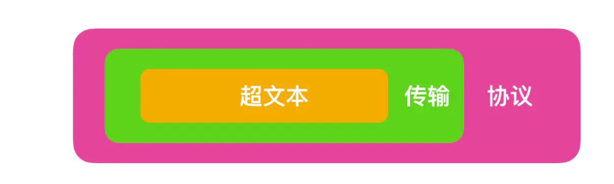

按照范围的大小 协议 > 传输 > 超文本。下面就分别对这三个名次做一个解释。

#### 什么是超文本

在互联网早期的时候，我们输入的信息只能保存在本地，无法和其他电脑进行交互。我们保存的信息通常都以 `文本`即简单字符的形式存在，文本是一种能够被计算机解析的有意义的二进制数据包。而随着互联网的高速发展，两台电脑之间能够进行数据的传输后，人们不满足只能在两台电脑之间传输文字，还想要传输图片、音频、视频，甚至点击文字或图片能够进行 `超链接`的跳转，那么文本的语义就被扩大了，这种语义扩大后的文本就被称为 `超文本(Hypertext)`。

- 超文本：超文本是一种可以包含链接指向其他文档或者资源的文本，这些链接称为超链接，允许用户通过点击从一个页面跳转到另一个页面，从而在文档间导航。

#### 什么是传输

那么我们上面说到，两台计算机之间会形成互联关系进行通信，我们存储的超文本会被解析成为二进制数据包，由传输载体（例如同轴电缆，电话线，光缆）负责把二进制数据包由计算机终端传输到另一个终端的过程（对终端的详细解释可以参考 [你说你懂互联网，那这些你知道么？](https://mp.weixin.qq.com/s?__biz=MzkwMDE1MzkwNQ==&mid=2247496041&idx=1&sn=f8fe490a755a4e373fa36c8114467493&source=41&poc_token=HNr8YGajbN4FBD1JbUbHEP-e3QO1hSY8vhTJzszh)这篇文章）称为 `传输(transfer)`。

通常我们把传输数据包的一方称为 `请求方`，把接到二进制数据包的一方称为 `应答方`。请求方和应答方可以进行互换，请求方也可以作为应答方接受数据，应答方也可以作为请求方请求数据，它们之间的关系如下

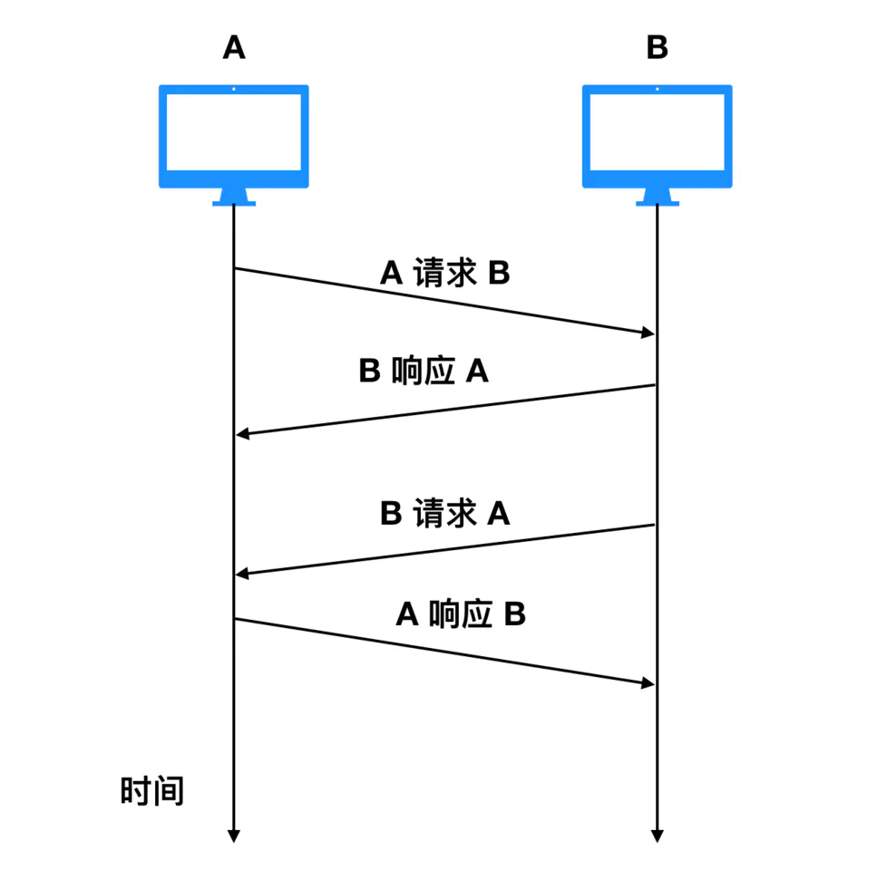

如图所示，A 和 B 是两个不同的端系统，它们之间可以作为信息交换的载体存在，刚开始的时候是 A 作为请求方请求与 B 交换信息，B 作为响应的一方提供信息；随着时间的推移，B 也可以作为请求方请求 A 交换信息，那么 A 也可以作为响应方响应 B 请求的信息。

#### 什么是协议

协议这个名词不仅局限于互联网范畴，也体现在日常生活中，比如情侣双方约定好在哪个地点吃饭，这个约定也是一种 `协议`，比如你应聘成功了，企业会和你签订劳动合同，这种双方的雇佣关系也是一种 `协议`。注意自己一个人对自己的约定不能成为协议，协议的前提条件必须是多人约定。

那么网络协议是什么呢？

网络协议就是网络中(包括互联网)传递、管理信息的一些规范。如同人与人之间相互交流是需要遵循一定的规矩一样，计算机之间的相互通信需要共同遵守一定的规则，这些规则就称为网络协议。

没有网络协议的互联网是混乱的，就和人类社会一样，人不能想怎么样就怎么样，你的行为约束是受到法律的约束的；那么互联网中的端系统也不能自己想发什么发什么，也是需要受到通信协议约束的。

那么我们就可以总结一下，什么是 HTTP？可以用下面这个经典的总结回答一下： **HTTP 是一个在计算机世界里专门在两点之间传输文字、图片、音频、视频等超文本数据的约定和规范**

### HTTP相关的知识

可以直接看[计算机网络](../../计算机网络.md)

#### 网络模型

网络是一个复杂的系统，不仅包括大量的应用程序、端系统、通信链路、分组交换机等，还有各种各样的协议组成，那么现在我们就来聊一下网络中的协议层次。

为了给网络协议的设计提供一个结构，网络设计者以 `分层(layer)`的方式组织协议，每个协议属于层次模型之一。每一层都是向它的上一层提供 `服务(service)`，即所谓的 `服务模型(service model)`。每个分层中所有的协议称为 `协议栈(protocol stack)`。因特网的协议栈由五个部分组成：物理层、链路层、网络层、运输层和应用层。我们采用自上而下的方法研究其原理，也就是应用层 -> 物理层的方式。

##### 应用层

应用层是网络应用程序和网络协议存放的分层，因特网的应用层包括许多协议，例如我们学 web 离不开的HTTP，电子邮件传送协议 SMTP、端系统文件上传协议 FTP、还有为我们进行域名解析的 DNS 协议。

应用层协议分布在多个端系统上，一个端系统应用程序与另外一个端系统应用程序交换信息分组，我们把位于应用层的信息分组称为 报文(message)。

##### 运输层/传输层

因特网的运输层在应用程序断点之间传送应用程序报文，在这一层主要有两种传输协议 TCP和 UDP，利用这两者中的任何一个都能够传输报文，不过这两种协议有巨大的不同。

TCP 向它的应用程序提供了面向连接的服务，它能够控制并确认报文是否到达，并提供了拥塞机制来控制网络传输，因此当网络拥塞时，会抑制其传输速率。

UDP 协议向它的应用程序提供了无连接服务。它不具备可靠性的特征，没有流量控制，也没有拥塞控制。我们把运输层的分组称为 报文段(segment)

##### 网络层

因特网的网络层负责将称为 数据报(datagram) 的网络分层从一台主机移动到另一台主机。

网络层一个非常重要的协议是 IP 协议，所有具有网络层的因特网组件都必须运行 IP 协议，IP 协议是一种网际协议，除了 IP 协议外，网络层还包括一些其他网际协议和路由选择协议，一般把网络层就称为 IP 层，由此可知 IP 协议的重要性。

##### 数据链路层

现在我们有应用程序通信的协议，有了给应用程序提供运输的协议，还有了用于约定发送位置的 IP 协议，那么如何才能真正的发送数据呢？

为了将分组从一个节点（主机或路由器）运输到另一个节点，网络层必须依靠链路层提供服务。链路层的例子包括以太网、WiFi 和电缆接入的 DOCSIS 协议，因为数据从源目的地传送通常需要经过几条链路，一个数据包可能被沿途不同的链路层协议处理，我们把链路层的分组称为 帧(frame)

##### 物理层

虽然链路层的作用是将帧从一个端系统运输到另一个端系统，而物理层的作用是将帧中的一个个 比特 从一个节点运输到另一个节点，物理层的协议仍然使用链路层协议，这些协议与实际的物理传输介质有关，例如，以太网有很多物理层协议：关于双绞铜线、关于同轴电缆、关于光纤等等。

#### OSI 模型

我们上面讨论的计算网络协议模型不是唯一的 协议栈，ISO（国际标准化组织）提出来计算机网络应该按照7层来组织，那么7层网络协议栈与5层的区别在哪里？

OSI 要比上面的网络模型多了 表示层 和 会话层，其他层基本一致。表示层主要包括数据压缩和数据加密以及数据描述，数据描述使得应用程序不必担心计算机内部存储格式的问题，而会话层提供了数据交换的定界和同步功能，包括建立检查点和恢复方案。

#### 浏览器

就如同各大邮箱使用电子邮件传送协议 SMTP 一样，浏览器是使用 HTTP 协议的主要载体，浏览器正式的名字叫做 Web Broser，顾名思义，就是检索、查看互联网上网页资源的应用程序，名字里的 Web，实际上指的就是 World Wide Web，也就是万维网。

我们在地址栏输入URL（即网址），浏览器会向DNS（域名服务器，后面会说）提供网址，由它来完成 URL 到 IP 地址的映射。然后将请求你的请求提交给具体的服务器，在由服务器返回我们要的结果（以HTML编码格式返回给浏览器），浏览器执行HTML编码，将结果显示在浏览器的正文。这就是一个浏览器发起请求和接受响应的过程。

#### Web 服务器

Web 服务器的正式名称叫做 Web Server，Web 服务器一般指的是网站服务器，上面说到浏览器是 HTTP 请求的发起方，那么 Web 服务器就是 HTTP 请求的应答方，Web 服务器可以向浏览器等 Web 客户端提供文档，也可以放置网站文件，让全世界浏览；可以放置数据文件，让全世界下载。目前最主流的三个Web服务器是Apache、 Nginx 、IIS。

#### CDN

CDN的全称是Content Delivery Network，即内容分发网络，它应用了 HTTP 协议里的缓存和代理技术，代替源站响应客户端的请求。CDN 是构建在现有网络基础之上的网络，它依靠部署在各地的边缘服务器，通过中心平台的负载均衡、内容分发、调度等功能模块，使用户就近获取所需内容，降低网络拥塞，提高用户访问响应速度和命中率。CDN的关键技术主要有内容存储和分发技术。

打比方说你要去亚马逊上买书，之前你只能通过购物网站购买后从美国发货过海关等重重关卡送到你的家里，现在在中国建立一个亚马逊分基地，你就不用通过美国进行邮寄，从中国就能把书尽快给你送到。

#### WAF

WAF 是一种 Web 应用程序防护系统（Web Application Firewall，简称 WAF），它是一种通过执行一系列针对HTTP / HTTPS的安全策略来专门为Web应用提供保护的一款产品，它是应用层面的防火墙，专门检测 HTTP 流量，是防护 Web 应用的安全技术。

WAF 通常位于 Web 服务器之前，可以阻止如 SQL 注入、跨站脚本等攻击，目前应用较多的一个开源项目是 ModSecurity，它能够完全集成进 Apache 或 Nginx。

#### WebService

WebService 是一种 Web 应用程序，WebService是一种跨编程语言和跨操作系统平台的远程调用技术。

Web Service 是一种由 W3C 定义的应用服务开发规范，使用 client-server 主从架构，通常使用 WSDL 定义服务接口，使用 HTTP 协议传输 XML 或 SOAP 消息，它是一个基于 Web（HTTP）的服务架构技术，既可以运行在内网，也可以在适当保护后运行在外网。

### 与 HTTP 有关的协议

在互联网中，任何协议都不会单独的完成信息交换，HTTP 也一样。虽然 HTTP 属于应用层的协议，但是它仍然需要其他层次协议的配合完成信息的交换，那么在完成一次 HTTP 请求和响应的过程中，需要哪些协议的配合呢？

#### TCP/IP

TCP/IP 我们一般称之为协议簇，什么意思呢？就是 TCP/IP 协议簇中不仅仅只有 TCP 协议和 IP 协议，它是一系列网络通信协议的统称。而其中最核心的两个协议就是 TCP / IP 协议，其他的还有 UDP、ICMP、ARP 等等，共同构成了一个复杂但有层次的协议栈。

TCP 协议的全称是 Transmission Control Protocol 的缩写，意思是传输控制协议，HTTP 使用 TCP 作为通信协议，这是因为 TCP 是一种可靠的协议，而可靠能保证数据不丢失。

IP 协议的全称是 Internet Protocol 的缩写，它主要解决的是通信双方寻址的问题。IP 协议使用 IP 地址 来标识互联网上的每一台计算机，可以把 IP 地址想象成为你手机的电话号码，你要与他人通话必须先要知道他人的手机号码，计算机网络中信息交换必须先要知道对方的 IP 地址。

#### DNS

你有没有想过为什么你可以通过键入 `http://www.google.com` 就能够获取你想要的网站？我们上面说到，计算机网络中的每个端系统都有一个 IP 地址存在，而把 IP 地址转换为便于人类记忆的协议就是 DNS 协议。

DNS 的全称是域名系统（Domain Name System，缩写：DNS），它作为将域名和 IP 地址相互映射的一个分布式数据库，能够使人更方便地访问互联网。

#### URI / URL

我们上面提到，你可以通过输入 `http://www.google.com` 地址来访问谷歌的官网，那么这个地址有什么规定吗？我怎么输都可以？AAA.BBB.CCC 是不是也行？当然不是的，你输入的地址格式必须要满足 URI 的规范。

URI的全称是（Uniform Resource Identifier），中文名称是统一资源标识符，使用它就能够唯一地标记互联网上资源。

URL的全称是（Uniform Resource Locator），中文名称是统一资源定位符，也就是我们俗称的网址，它实际上是 URI 的一个子集。

URI 不仅包括 URL，还包括 URN（统一资源名称），它们之间的关系如下

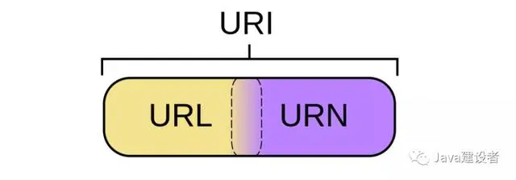

#### HTTPS

HTTP 一般是明文传输，很容易被攻击者窃取重要信息，鉴于此，HTTPS 应运而生。HTTPS 和 HTTP 有很大的不同在于 HTTPS 是以安全为目标的 HTTP 通道，在 HTTP 的基础上通过传输加密和身份认证保证了传输过程的安全性。HTTPS 在 HTTP 的基础上增加了 SSL 层，也就是说 HTTPS = HTTP + SSL。

### 协议版本

- HTTP/1.0：早期版本，引入了许多基本特性，但效率较低，特别是在需要多次请求的网页上。
- HTTP/1.1：改进了1.0版本，增加了持久连接（keep-alive），管道化（pipelining）等机制，减少了通信延迟，提高了效率。
- HTTP/2：进一步优化了性能，引入了多路复用（multiplexing）、头部压缩（header compression）和服务器推送（server push）等功能。
- HTTP/3：基于QUIC传输协议，旨在进一步降低延迟，提高安全性。

### 方法

HTTP定义了一系列请求方法，常见的有：

- GET：请求获取指定的资源。
- POST：提交数据到服务器，常用于表单提交。
- PUT：替换服务器上的资源。
- DELETE：删除指定的资源。
- HEAD：类似GET，但只返回响应头，不返回响应体。
- OPTIONS：用于获取服务器支持的HTTP方法。

### 状态码

HTTP响应状态码是三位数代码，用于表示请求的结果。例如：

- 200 OK：请求成功。
- 404 Not Found：请求的资源未找到。
- 500 Internal Server Error：服务器内部错误。

### 工作流程

1. 客户端通过DNS解析获取服务器的IP地址。
2. 客户端与服务器建立TCP连接（HTTP/1.x默认使用TCP端口80，HTTP/2及HTTP/3可能使用443）。
3. 客户端发送HTTP请求给服务器。
4. 服务器处理请求并返回HTTP响应。
5. 客户端接收响应，渲染内容或执行其他操作。
6. TCP连接关闭（除非使用了持久连接）。

### 安全性

HTTP本身不加密数据，为提升安全性，通常会使用HTTPS（HTTP Secure），这是HTTP加上SSL/TLS协议层，确保数据在传输过程中的安全性和完整性。

HTTP是一个不断发展的协议，随着互联网技术的进步，其新版本不断推出，以适应更高效、更安全的网络通信需求。

## HTTP协议的工作过程

当我们在浏览器输入一个网址，此时浏览器就会给对应的服务器发送一个 **HTTP 请求**，对应的服务器收到这个请求之后，经过计算处理，就会返回一个 **HTTP 响应**。并且当我们访问一个网站时，可能涉及**不止一次的 HTTP 请求和响应的交互过程**。

### 基础术语

- 客户端： 主动发起网络请求的一端
- 服务器： 被动接收网络请求的一端
- 请求： 客户端给服务器发送的数据
- 响应： 服务器给客户端返回的数据

### 客户端-服务器模型

客户端-服务器模型：HTTP基于客户端-服务器架构，其中客户端（通常是Web浏览器）发起请求，而服务器响应这些请求。这种模式简化了系统的复杂性，并促进了网络的可扩展性。

每个HTTP事务包括一个请求和一个响应：

- 请求：包含请求行（方法、URL、协议版本）、请求头（包含元数据，如用户代理、接受的内容类型等）和可选的请求体（如POST请求的数据）。
- 响应：包含状态行（协议版本、状态码、状态消息）、响应头（描述响应的元数据，如内容类型、内容长度等）和响应体（实际传输的数据，如HTML文档、图片等）。

HTTP 协议的重要特点： **一发一收，一问一答**

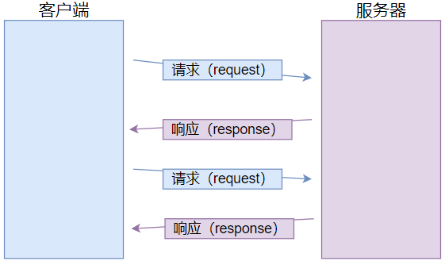

- 注意： 网络编程中，除了一发一收之外，还有其它的模式
  - 多发一收：例如上传大文件
  - 一发多收：例如看直播时，搜索一个词条可以得到多个视频源
  - 多发多收：例如串流（steam link、moonlight 等等）

## Fiddler抓包工具介绍

### 抓包工具的使用

当我们访问一个网站时，可能涉及不止一次的 HTTP 请求和响应的交互，为此为了更加清楚的了解我们访问一个网站时 HTTP 请求/协议是怎么交互的，由于 HTTP 是一个文本格式的协议，就可以通过以下两种方式：

- 方式一： 通过 F12 打开浏览器的**开发者工具**，点击 Network 标签页，然后刷新页面就行。显示的每一条记录都是一次 HTTP 请求/响应

> 这里通过访问搜狗浏览器为例，来进行演示
> 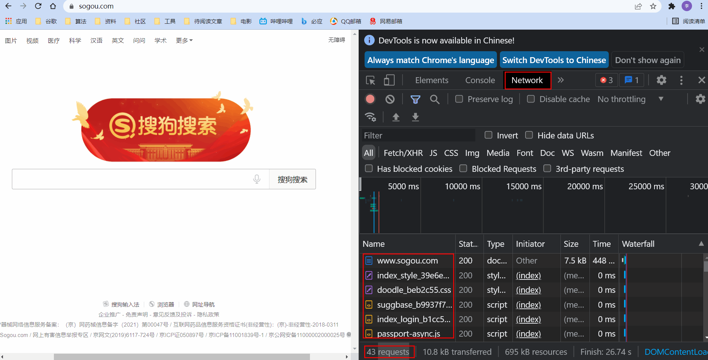

- 方式二（推荐）： **抓包工具**，这里以 Fiddler 为例，它能够直接读取你电脑上网卡的信息，网卡上有什么数据流动，它都能感知到并且显示出来

Fiddler 下载官网： [https://www.telerik.com/fiddler](https://www.telerik.com/fiddler)

Fiddler 使用方式：

- 打开 Fiddler，然后打开你要访问的网站，访问该网站的 HTTP 请求和响应就会显示在 Fiddler 上

> 这里以访问搜狗浏览器为例，来进行演示
> 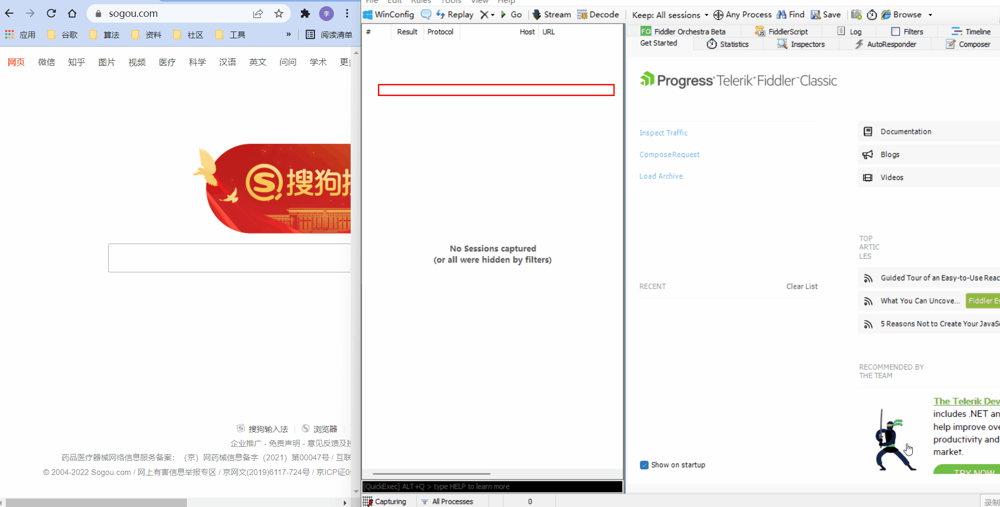

- 当我们选择好我们具体要查看的 HTTP/HTTPS 请求和响应时，右上栏就会显示具体的请求报文内容，右下角就会显示具体的响应报文内容（需要点击 Raw 标签来查看详细的数据格式）
- 请求和响应的详细数据，可以通过右下角的 `view in Notepad` 键通过记事本打开
- 为了方便我们抓取我们自己想查看的抓包结果，可以通过 `ctrl + a` 全选左侧的抓包结果，`ctrl + x` 删除选中的所有抓包结果，再进行网页的刷新就行
- 响应的正文往往是被显示在浏览器上，最常见的响应格式就是 html，很多网站返回的 html 是压缩过的（因为压缩之后，网络传输的数据量就变少了，即节省了网络带宽），所以需要进行解压缩 decode


注意： 直接安装的 Fiddler 是无法抓取 HTTPS 的请求的，需要按照以下步骤配置以下才能够抓取

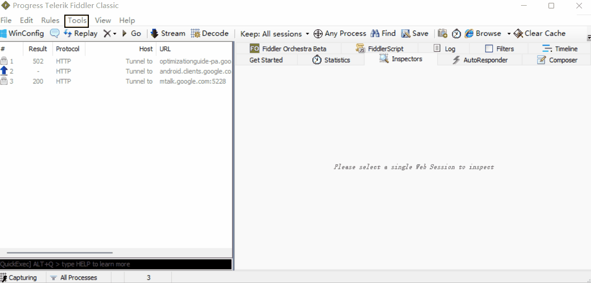

### 抓包结果

接下来我们来抓取搜狗首页的 HTTP 请求，抓取到的结果如下

完整的 HTTP 请求：
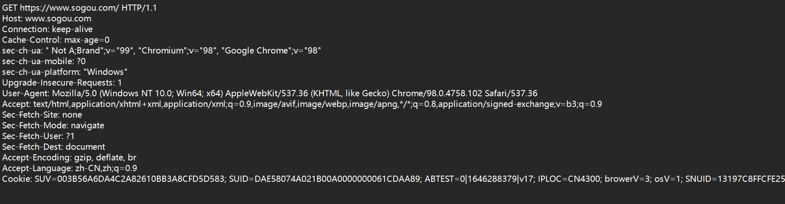

完整的 HTTP 响应：
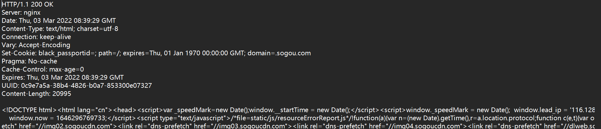

### 抓包工具原理

Fiddler 之所以能够获取到这些 HTTP 请求的详细情况，主要是因为此处的 Fiddler 相当于一个”代理“程序

> 代理，也可以理解为中介或代购，就比如你想通过中介去租房或者买房，你会将你的需求告诉给中介，中介就会去寻找房源并将找到的结果的详细情况反应给你。

上述我们通过 Fiddler 来抓取搜狗首页的 HTTP 请求时，首选我们会访问 sogo.con，即把 HTTP 请求发送给 Fiddler，Fiddler 再把请求转发给搜狗的服务器，当搜狗的服务器返回数据时，Fiddler 就会先拿到返回数据，再把数据交给浏览器

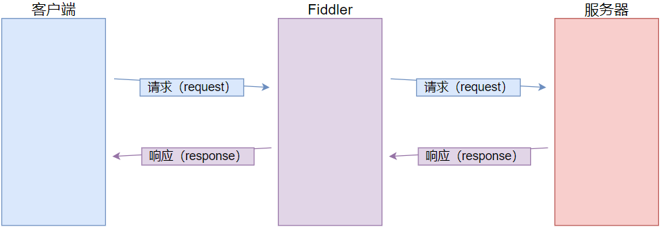

### HTTP 协议格式总览

到这里，我们学习 HTTP 协议的方法已经学会了，那就是使用抓包工具来抓取我们想要的 HTTP 请求。接下来我们将介绍 HTTP 协议的格式，它是学习 HTTP 协议的重头戏！

我们将上述得到的搜狗页面的请求为例，整体介绍下 HTTP 协议格式

- HTTP 请求格式：
  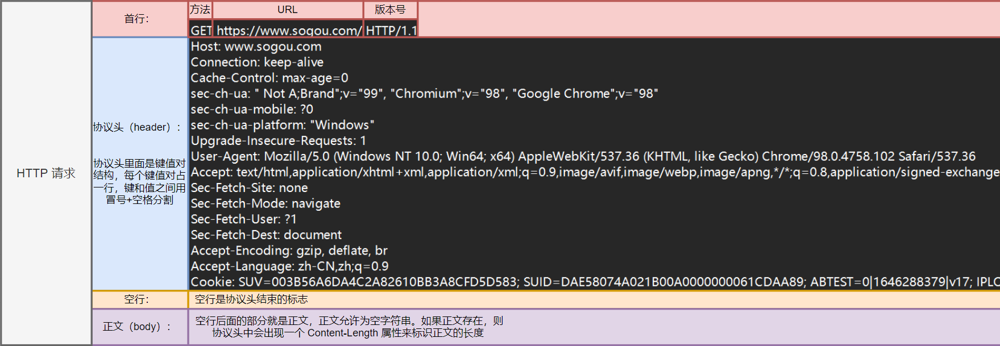
- HTTP 响应格式：
  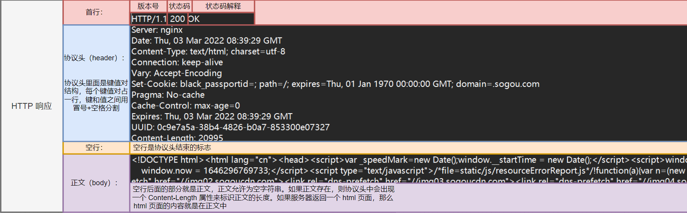
- 注意： 为什么 HTTP 报文中要存在空行呢？

> - 因为 HTTP 协议并没有规定报头部分的键值对有多少个，使用空行就相当于是报文的结束标记或报文和正文之间的分隔符
> - HTTP 在传输层依赖 TCP 协议，TCP 是面向字节流的。如果没有这个空行，就会出现“粘包问题”

## HTTP报文

HTTP 协议主要由三大部分组成：

- 起始行（start line）：描述请求或响应的基本信息；
- 头部字段（header）：使用 key-value 形式更详细地说明报文；
- 消息正文（entity）：实际传输的数据，它不一定是纯文本，可以是图片、视频等二进制数据。

其中起始行和头部字段并成为 请求头 或者 响应头，统称为 Header；消息正文也叫做实体，称为 body。

HTTP 协议规定每次发送的报文必须要有 Header，但是可以没有 body，也就是说头信息是必须的，实体信息可以没有。而且在 header 和 body 之间必须要有一个空行（CRLF），如果用一幅图来表示一下的话，我觉得应该是下面这样

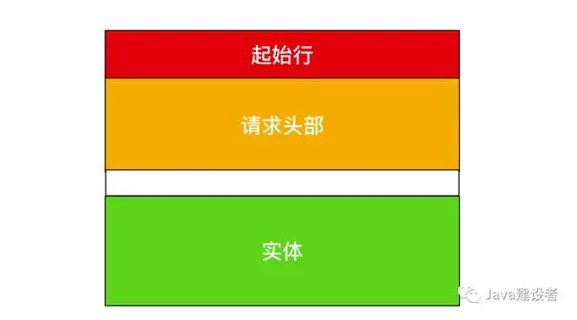

[看完这篇HTTP，跟面试官扯皮就没问题了](https://mp.weixin.qq.com/s/mL-helCnlMo4k4wJtJOqqA)

## HTTP 请求（Request）

### URL

#### URL 基本介绍

平时我们俗称的”网址“，其实就是 URL（Uniform Resource Locator），翻译为统一资源定位符
互连网上的每个文件都有一个**唯一**的 URL，它包含的信息**指出文件的位置**以及**浏览器应该怎么处理它**

#### URL 基本格式

- URL 的标准格式如下：

```ts
协议类型:[//服务器地址[:端口号]][/资源层级 UNIX 文件路径]文件名[?查询字符串][#片段标识符]
```

- URL 的完整格式如下：

```ts
协议类型:[//[访问资源需要的凭证信息@]服务器地址[:端口号]][/资源层级 UNIX 文件路径]文件名[?查询字符串][#片段标识符]
```

#### URL 参数介绍

| 信息                   | 描述                                                                                                                                                                                                                                                                                                                  | 可否省略                                                                                                                                |
| ---------------------- | --------------------------------------------------------------------------------------------------------------------------------------------------------------------------------------------------------------------------------------------------------------------------------------------------------------------- | --------------------------------------------------------------------------------------------------------------------------------------- |
| 协议类型               | 常见的协议类型有 http 和 https，访问 mysql 时的协议类型为 `jdbc:mysql`                                                                                                                                                                                                                                              | 可以省略，省略后默认为 `http://`                                                                                                      |
| 访问资源需要的凭证信息 | 一般就是登录信息（用户名、密码等），但是现在的网站进行认证一般不再通过 URL 进行，故一般省略                                                                                                                                                                                                                           | 可以省略                                                                                                                                |
| 服务器地址             | 服务器的地址可以时一个 IP 地址，也可以是一个域名（域名会通过 DNS 系统解析成一个具体的 IP 地址，可以使用 `ping<span> </span>域名` 来得到该域名的 IP 地址），IP 地址用来描述网络上的一个具体位置，能够用来定位一个具体的主机                                                                                         | 在 HTML 中可以省略（比如 img、link、script、a 标签的 src 或者 href 属性），省略后表示服务器的 ip 或域名与当前 HTML 所属的 ip 或域名一致 |
| 端口号                 | 端口号的主要作用是表示一台计算机中的特定进程所提供的服务，即用来区分一个主机上的不同程序。每个程序在访问网络的时候，都会关联上一个或多个端口号，通过端口号就能区分出当前的请求要给谁。                                                                                                                                | 可以被省略，当端口号省略时，浏览器会根据协议类型自动决定使用哪个端口号（如 http 协议默认使用80端口，https 协议默认使用443端口）         |
| 资源层级 UNIX 文件路径 | 表示访问该服务器程序上某个资源的路径                                                                                                                                                                                                                                                                                  | 可以省略，省略后相当于 `/`                                                                                                            |
| 文件名                 | 表示访问该服务器上的哪个资源（如 html、图片等等）                                                                                                                                                                                                                                                                     | 不能省略                                                                                                                                |
| 查询字符串             | 查询字符串（query string）本质是一个键值对结构，且键值对之间使用 `&` 分割，键和值之间使用 `=` 分割。表示客户端给服务器传递的参数。该参数是 web 开发的一个重要参数，给前后端交互提供了很多可能性。该参数 key 和 value 的取值和个数，完全都是由程序员自己约定，因此可以通过这样的方式来自定制我们需要的信息给服务器 | 可以省略                                                                                                                                |
| 片段标识符             | 片段标识符主要用于页面内跳转，例如跳转到当前页面的某个部分、章节等等                                                                                                                                                                                                                                                  | 可以省略                                                                                                                                |

通过抓包可以我们来看看几个网站的 URL

- 我的 CSDN 博客首页

```ts
https://blog.csdn.net/2401_84028828?spm=1018.2226.3001.5343
```

- 搜狗首页

```ts
https://www.sogou.com/
```

- github首页

```ts
https://github.com/newcleanbird/
```

我们会发现，上述几个 URL 都并不完整，因为 URL 中的有些参数是可以省略的

#### URLencode 介绍

当我们用搜狗搜索蛋糕时，通过抓包，我们会得到下面这个 URL

```cpp
GET https://www.sogou.com/web?query=%E8%9B%8B%E7%B3%95&_asf=www.sogou.com&_ast=&w=01019900&p=40040100&ie=utf8&from=index-nologin&s_from=index&sut=1129&sst0=1646360982664&lkt=0%2C0%2C0&sugsuv=003B56A6DA4C2A82610BB3A8CFD5D583&sugtime=1646360982664 HTTP/1.1
```

我们会发现 query string 的有些值是 `%E8%9B%8B%E7%B3%95`、`0%2C0%2C0`，通过 `urldecode`，知道 `%E8%9B%8B%E7%B3%95` 就是表示蛋糕

##### 需要 urlencode 的原因

- 这是因为像 `/`、`?`、`:` 等这样的字符，已经被 `url` 当做特殊意义理解了，因此这些字符不能随意出现。如果某个参数中需要带有这些特殊字符，就必须先对特殊字符进行转义，即 `urlencode`
- 一个中文字符由 `UTF-8` 或者 `GBK` 这样的编码方式构成，虽然在 `URL` 中没有特殊含义，但是仍然需要进行转义，否则浏览器可能把 `UTF-8/GBK` 编码中的某个字节当做 URL 中的特殊符号

##### 转义的规则如下

将需要转码的字符转为 `16`进制，然后从右到左，取 `4`位（不足 `4`位直接处理），每 `2`位做一位，前面加上 `%`，编码成 `%XY` 格式。

但是现在网上有很多现成的可以进行转码的工具，因此需要的时候找度娘即可！

### 认识“方法”（method）

HTTP 中的方法，就是 HTTP 请求报文中的首行的第一个部分。

原本 HTTP 的设计者，是希望通过不同的方法，来表达不同的语义。但是至今，其实也没有被实现，以下具体的方法具体起到了什么作用，完全看程序员在代码中是如何实现的。

虽然 HTTP 中的方法很多，但是最常用的就两个 GET 和 POST。以下主要介绍这两个方法

| 方法    | 说明                   | 适用版本号         |
| ------- | ---------------------- | ------------------ |
| GET     | 获取资源               | HTTP 1.0、HTTP 1.1 |
| POST    | 传输实体主体           | HTTP 1.0、HTTP 1.1 |
| PUT     | 传输文件               | HTTP 1.0、HTTP 1.1 |
| HEAD    | 获得报文首部           | HTTP 1.0、HTTP 1.1 |
| DELETE  | 删除文件               | HTTP 1.0、HTTP 1.1 |
| OPTIONS | 访问支持的方法         | HTTP 1.1           |
| TRACE   | 追踪路径               | HTTP 1.1           |
| CONNECT | 要求用隧道协议连接代理 | HTTP 1.1           |
| LINK    | 建立和资源之间的联系   | HTTP 1.1           |
| UNLINE  | 断开连接关系           | HTTP 1.1           |

#### GET 方法

**基本介绍**：

GET 是最常用的 HTTP 方法，常用于获取服务器上的某个资源。以下几种方式都会触发 GET 方法的请求

- 在浏览器中直接输入 URL 回车或点击浏览器收藏夹中的链接，此时浏览器就会发送出一个 GET 请求。
- HTML 中的 link、img、script 等标签的属性中放的 URL，浏览器也会构造出 HTTP GET 请求
- 使用 Javascript 重点 ajax，也能构造出 HTTP GET 请求
- 各种编程语言（只要能够访问网络），就都能够构造出 HTTP GER 请求

**GET 请求的特点**：

- 首行里面的第一个部分就是 GET
- URL 里面的 query string 可以为空，也可以不为空
- GET 请求的 header 有若干个键值对结构
- GET 请求的 body 一般是空的
- GET 请求示例： 搜狗首页请求

**GET 请求示例：**搜狗首页请求


#### POST 方法

**基本介绍**：

POST 方法也是一种常见的方法，多用于提交用户输入的数据给服务器（如登录页面）。以下几种方法都会触发 POST 方法的请求

- 通过 HTML 中的 form 标签可以构造 POST 请求
- 使用 JavaScript 的 ajax 可以构造 POST 请求

**POST 请求的特点**：

- 首行第一个部分就是 POST
- URL 里面的 query string 一般是空的
- POST 请求的 header 里面有若干个键值对
- POST 请求的 body 一般不为空（body 的具体数据格式，由 header 中的 Content-Type 来描述；body 的具体数据长度，由 header 中的 Content-Length 来描述

POST 请求示例： QQ 邮箱登录请求


#### GET 和 POST 的区别

其实 GET 和 POST 的区别是一个经典的面试题，以下为大家介绍如何在面试中回答上述问题

**答题模板**：

**GET 和 POST 其实没有本质区别**，使用 GET 的场景完全可以使用 POST 代替，使用 POST 的场景一样可以使用 GET 代替。但是在具体的使用上，还是存在一些细节的区别

- GET 习惯上会把客户端的数据通过 query string 来传输（body 部分是空的）；POST 习惯上会把客户端的数据通过 body 来传输（query string 部分是空的）
- GET 习惯上用于从服务器获取数据；POST 习惯上是客户端给服务器提交数据
- 一般情况，程序员会把 GET 请求的处理，实现成“幂等”的；对于 POST 请求的处理，不要求实现成“幂等”
- GET 请求可以被缓存，可以被浏览器保存到收藏夹中；POST 请求不能被缓存

补充：**幂等是什么**？

- 一个 HTTP 方法是幂等的，指的是同样的请求被执行一次与连续执行多次的效果是一样的，服务器的状态也是一样的。换句话说，幂等的方法不应该具有副作用。
    >比如我们去抢购一件物品，如果我们已经抢到了要进行下单，由于很多人都在抢购，所以下单后，我们发现好像没有什么反应，因此我们又不断的点机下单。如果最终我们只需要付一件产品的钱，就是幂等的，如果要支付N件产品的钱，就不是幂等的
- 在正确的条件下，GET、HEAD、PUT 和 DELETE 等方法是幂等的；POST 方法不是幂等的
- 幂等性只与后端服务器的实际状态有关，而每一次请求接收到的状态码不一定相同

#### 关于 GET 请求的 URL 长度问题的误解

- 网上有一种错误的解释： GET 请求的长度是存在上限的，这个上限有被说成 1024kb、2048kb 等等，并且 GET 请求存在上限的原因是 URL 的长度存在上限
- RFC 2616 标准正确的解释： HTTP 协议由 RFC 2616 标准定义，该标准中明确说明 `"Hypertext Transfer Protocol -- HTTP/1.1," does not specify any requirement for URL length`，即没有对 URL 的长度有任何限制
- URL 的长度取决因素： 实际上 URL 的长度取决于浏览器的实现和 HTTP 服务器端的实现。在浏览器端，不同的浏览器最大的长度是不同的，但是现在浏览器支持的长度一般都很长；在服务器端，一般这个长度是可以配置的

#### 关于 POST 比 GET 更安全的误解

- 网上有一种错误的解释： 如果实现登录页面，如果使用 GET 实现登录，GET 习惯上把数据放到 query string 中，此时就能看到浏览器的 URL 中显示当前的用户名和密码了，所以就并不安全；而 POST 习惯上会把数据放到 body 中，因此登录时就不能直接看到用户名和密码，就安全
- 正确的理解： 安全问题取决于是否加密以及加密算法的强度。这和将数据信息放到 query string 或 body 中无关，因为通过抓包，我们就可以得到这两部分的数据

#### 关于 GET 只能传输文本数据的误解

- 网上有一种错误的解释： GET 只能传输文本数据；POST 可以传输文本数据，也可以传输二进制数据
- 正确的理解： GET 也可以传输二进制数据，虽然不能直接在 query string 中传输二进制数据，但是可以针对二进制数据进行 urlencode，转码后就可以放到 url 中；GET 还可以直接将二进制数据放到 body 中

#### 其它方法

- PUT： 与 POST 相似，但是具有幂等特性，一般用于更新
- DELETE： 删除服务器指定资源
- OPTIONS： 返回服务器所支持的请求方法
- HEAD： 与 GET 类似，只不过响应体不返回，只返回响应头
- TRACE： 能显示服务器端收到的请求，测试的时候会用到
- CONNECT： 预留，暂无使用

上述方法的 HTTP 请求可以使用 ajax 或第三方工具来构造，也能使用可以网络编程的语言来构造

### 认识请求“报头”（header）

header 的整体格式是键值对结构，每个键值对占一行，键和值之间使用 `冒号+空格` 进行分割

以下介绍几个常见的报头

#### Host

HOST 的值**表示服务器主机的地址和端口**（地址可以是域名，也可以是 IP；端口号可以省略或者手动指定）

#### Content-Length

Content-Length **表示 body 的数据长度**，长度单位是字节

#### Content-Type

Content-Type **表示 body 的数据格式**，以下介绍三种**请求**中的数据格式

- application/x-www-form-urlencoded
    >这是 form 表单提交的数据格式，此时 body 的格式就类似于 query string（是键值对的结构，键值对之间使用 & 分割，键与值之间使用 = 分割

- multipart/form-data
    >这是 form 表单提交的数据格式（需要在 from 标签上加上 enctyped="multipart/form-data"），通常用于 HTML 提交图片或者文件

- application/json
    >此时 body 数据为 json 格式，json 格式就是源自 js 的对象的格式。用一个 { } 括住，里面有多个键值对，键值对之间使用逗号分割，键和值之间使用冒号分割

#### User-Agent（简称 UA）

User-Agent **表示浏览器或者操作系统的属性**，形如

```sh
Mozilla/5.0 (Windows NT 10.0; Win64; x64) AppleWebKit/537.36 (KHTML, like Gecko)Chrome/91.0.4472.77 Safari/537.36
```

- Windows NT 10.0; Win64; x64 表示操作系统信息
- AppleWebKit/537.36 (KHTML, like Gecko)Chrome/91.0.4472.77 Safari/537.36 表示浏览器信息

UA 在早年是一个非常有用的字段，网站的开发者可以根据它来检测页面的“兼容性”

#### Referer

Referer **表示这个页面是从哪个页面跳转过来的**，这是一个很有用的字段

假设我用 bing 浏览器搜索蛋糕，会发现有的搜索结果带有广告字眼，这就相当于广告主在 bing 浏览器用来引流的，当该网站的点击次数越多，用户的成交量也就会上升，金主给浏览器的广告费也就增多。为了统计该广告在某一浏览器的点击次数，就可以通过 Referer 字段来查看。

我们可以对该 HTTP 请求进行抓包，其中 Referer 字段的值就是 bing 浏览器，即表面该网页是从 bing 浏览器跳转过来的

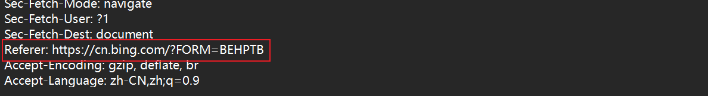

注意： 如果直接在浏览器中输入 URL 或直接通过收藏夹访问页面时，是没有 Referer 的

#### Cookie

##### Cookie 是什么？

Cookie 是浏览器提供的一种让程序员在本地存储数据的能力

##### 为什么需要 Cookie？

如果没有 Cookie，直接将要存储的数据保存在客户端浏览器所在的主机的硬盘上，那么就会出现很大的安全风险，比如当你不小心打开某个不安全的网站，该网站就可以在你的硬盘上写一个病毒程序，那么你的电脑就挂了！因此**浏览器为了保证安全性，就禁止网页中的代码访问主机的硬盘（无法在 JS 中读写文件），因此也就失去了持久化存储的能力，故 Cookie 就很重要！**

##### Cookie 里面存的是什么？

Cookie 中存储了一个字符串，是键值对结构的，键值对之间使用`;`分割，键和值之间使用`=`分割

##### Cookie 来自哪里，如何往 Cookie 中存储数据？

Cookie 这个数据可能是**客户端（网页）自行通过 JS 写入的**，也可能来自于**服务器在 HTTP 响应的 header 中通过 Set-Cookie 字段给浏览器返回数据。**

Cookie 在浏览器这边是**按照域名维度来存储的**，例如我们打开 CSDN 的首页，点击网址栏左边的一把小锁就能找到 Cookie，我们就可以看到打开这个网页时，系统按照不同域名设置了 Cookie
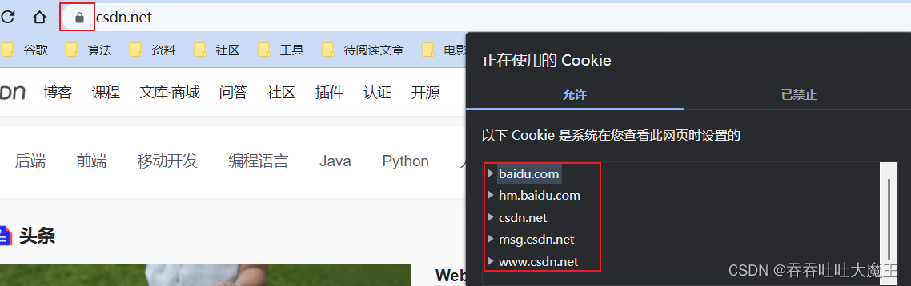

每一组都是中都存储了 Cookie，我们点开 csdn.net 这组的 Cookie 就能看到具体的数据
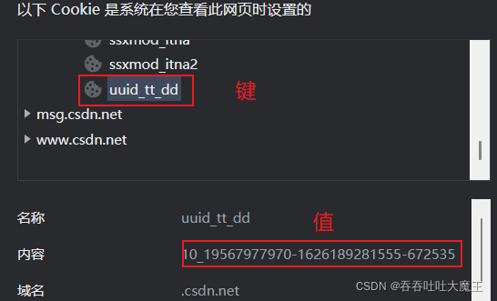

通过抓包工具，我们也能得到 Cookie 的数据，可以发现，上述中的键和值都是存在的，例如 `uuid_tt_dd`
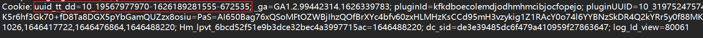

##### Cookie 要到哪里去？

Cookie 字段会在后续的请求中，把浏览器本地存储的这些键值对再发送回服务器
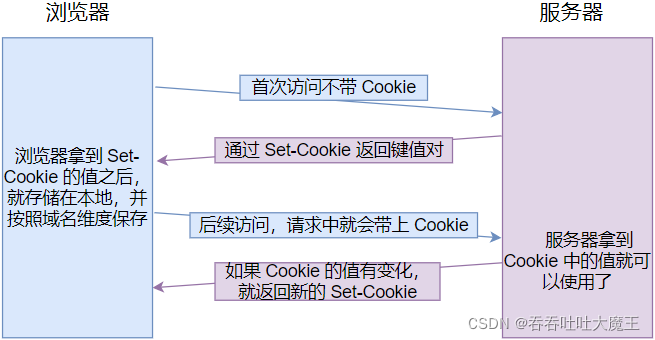

Cookie 的一个经典应用就是保持客户端的登录状态
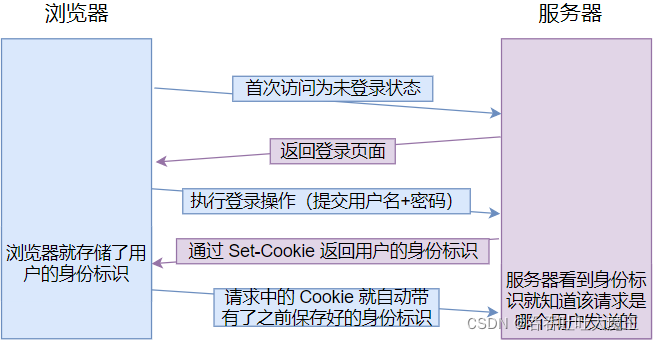

##### Cookie 的缺陷

每次请求都要把该域名下所有的 Cookie 通过 HTTP 请求传给服务器，因此 Cookie 的存储容量是有限的

## HTTP 响应（Response）

### 认识“状态码”（status code）

状态码表示访问一个页面的结果（如访问成功、失败，还是其它一些情况等等），它是一个3位的整数，从 1xx、2xx、3xx、4xx、5xx，分为五个大类，每个大类的含义都不同。以下介绍一些常见的状态码及它的状态码解释

- 200 OK：表示访问成功
- 404 Not Found：表示没有找到资源
- 403 Forbidden：表示访问被拒绝
  - 有的页面通常需要用户有一定的权限才能访问，如未登录
- 405 Method Not Allowed：表示访问的服务器不能支持请求中的方法或者不能使用该请求中的方法
- 500 Internal Server Error：表示服务器出现内部错误
  - 一般是服务器的代码执行过程中遇到了一些特殊的情况，造成服务器崩溃可能会产生这个状态码
- 504 Gateway Timeout：表示当前服务器负载比较大，服务器处理单条请求的时耗很长，就会出现超时情况
- 302 Move temporarily：表示临时重定向
  - 重定向相当于手机呼号的呼叫转移功能，如果我们换了一个手机号，就可以去办理该呼叫转移业务，使朋友拨打你的旧号码时，自动跳转到新号码
- 301 Moved Permanently：表示永久重定向，当浏览器收到这种响应时，后续的请求都会被自动改成新的地址

### 认识响应“报头”（header）

响应报头的基本格式和请求报头的格式基本一致，下面介绍下响应报头的 Content-Type 参数

#### Content-Type响应报头

Content-Type 表示 body 的数据格式，以下介绍三种响应中的数据格式

- text/html：表示数据格式是 HTML
- text/css：表示数据格式是 CSS
- application/javascript：表示数据各式是 JavaScript
- application/json：表示数据格式是 JSON

## HTTP请求实现

### 通过 form 表单构造 HTTP 请求

form 是 HTML 中的一个表单标签，可以用于给服务器发送 GET 或者 POST 请求。

**form 的重要参数**：

- action：用来构造 HTTP 请求的 URL 是什么
- method：用来构造 HTTP 请求的方法（form 只支持 GET 或 POST 方法）

**input 的重要参数在 form 标签中的含义**：

- type：表示输入框的类型（text 表示文本、password 表示密码、submit 表示提交按钮）
- name：表示构造出的 HTTP 请求的 query string 的 key
- value：表示 input 标签的值（对于 type 为 submit 类型来说，value 就对应了按钮上显示的文本）
- input 标签的内容：表示 query string 的 value

当我们用 form 表单构造好了 HTTP 请求，点击 submit 提交按钮，就可以将请求发送出去

#### 发送 GET 请求

示例代码：

```ts
<form action="http://aaaaa/myPath" method="get">
    <input type="text" name="username">
    <input type="text" name="password">
    <input type="submit" name="提交">
</form>
```


在构造的页面中，输入数据后，进行提交，我们再通过抓包，查询到了以下结果


#### 发送 POST 请求

示例代码：

```ts
<form action="http://aaaaa/myPath" method="post">
    <input type="text" name="username">
    <input type="text" name="password">
    <input type="submit" name="提交">
</form>
```


在构造的页面中，输入数据后，进行提交，我们再通过抓包，查询到了以下结果


### 通过 ajax 构造 HTTP 请求

**ajax（Asynchronous Javascript And XML）** 是一种用于创建快速动态网页的技术。通过在后台与服务器进行少量数据交换，ajax 可以使网页实现**异步**更新。这意味着可以**在不重新加载整个网页的情况下，对网页的某部分进行更新**。传统的网页（不使用 ajax）如果需要更新内容，必需重载整个网页面。

这里不使用 JavaScript 中原生的 ajax，而是用第三方库中 jQuery 里面提供的对 ajax 封装好的一个更简便的版本

注意：

- 使用 ajax 不仅可以实现 GET 和 POST 方法的请求，也可以实现其它方法的请求
- 使用 ajax 不能跨域，即访问的域名和构造的域名需要相同（可以跨域的前提是该服务器允许可以跨域）

#### 如何安装使用 jQuery 第三方库？

在 Javascript 中安装第三方库，只要在代码中引入对应库的 CDN 链接即可

- 先搜索 jquery cdn，


- 将复制好的链接，粘贴到 script 标签的 src 中即可


#### CDN 是啥？

CDN 的全称是 Content Delivery Network。即内容分发网络。CDN 是构建在现有网络基础之上的智能虚拟网络，依靠部署在各地的边缘服务器，通过中心平台的负载均衡、内容分发、调度等功能模块，使用户就近获取所需内容，降低网络拥塞，提高用户访问响应速度和命中率。

**jQuery 中的重要参数**：

- $：是一个变量名，是 jQuery 中定义的一个对象。jQuery 里面的各种方法都是这个对象的成员
- ajax：是 jQuery 封装好的 ajax 方法，其参数是一个对象，用来设置 HTTP 请求的一些参数
- url：ajax 方法中用来设置 HTTP 请求的参数
- method：ajax 方法中用来设置 HTTP 方法的参数
- contentType：ajax 方法中用来设置 HTTP body 数据类型的参数
- data：ajax 方法中用来设置 HTTP body 数据内容的参数
- status：ajax 方法中用来表示状态码的参数
- success：是一个回调函数，如果请求成功，响应返回后，浏览器就会自动调用这个参数

#### ajax发送 GET 请求

```s
<script src="https://code.jquery.com/jquery-3.6.0.min.js"></script>
<script>
    $.ajax({
    url: 'http://42.192.83.143:8089/AjaxMockServer/info',
    method: 'GET',
    success: function(data, status){
        console.log(data);
        console.log(status);
    }
});
</script>
```


#### ajax发送 POST 请求

```s
<script src="https://code.jquery.com/jquery-3.6.0.min.js"></script>
<script>
    $.ajax({
    url: 'http://42.192.83.143:8089/AjaxMockServer/info',
    method: 'POST',
    contentType: 'text/plain',
    data: 'this is body',
    success: function(data, status){
        console.log(data);
        console.log(status);
    }
});
</script>
```


## HTTP的特点（优缺点）

### 简单灵活易扩展

HTTP 最重要也是最突出的优点是 简单、灵活、易于扩展。HTTP 的协议比较简单，它的主要组成就是 header + body，头部信息也是简单的文本格式，而且 HTTP 的请求报文根据英文也能猜出来个大概的意思，降低学习门槛，能够让更多的人研究和开发 HTTP 应用。

并且，它并不限定某种编程语言或者操作系统，所以天然具有跨语言、跨平台的优越性。而且，因为本身的简单特性很容易实现，所以几乎所有的编程语言都有 HTTP 调用库和外围的开发测试工具。

### 无状态

无状态其实既是优点又是缺点。因为服务器没有记忆能力，所以就不需要额外的资源来记录状态信息，不仅实现上会简单一些，而且还能减轻服务器的负担，能够把更多的 CPU 和内存用来对外提供服务。

既然服务器没有记忆能力，它就无法支持需要连续多个步骤的事务操作。每次都得问一遍身份信息，不仅麻烦，而且还增加了不必要的数据传输量。由此出现了 Cookie 技术。

### 明文

HTTP 协议里还有一把优缺点一体的双刃剑，就是明文传输。明文意思就是协议里的报文（准确地说是 header 部分）不使用二进制数据，而是用简单可阅读的文本形式。

对比 TCP、UDP 这样的二进制协议，它的优点显而易见，不需要借助任何外部工具，用浏览器、Wireshark 或者 tcpdump 抓包后，直接用肉眼就可以很容易地查看或者修改，为我们的开发调试工作带来极大的便利。

当然缺点也是显而易见的，就是不安全，可以被监听和被窥探。因为无法判断通信双方的身份，不能判断报文是否被更改过。

## 经典问题

### HTTP 请求响应过程

在浏览器中输入网址后，到底发生了什么事情？你想要的内容是如何展现出来的？让我们通过一个例子来探讨一下，我们假设访问的 URL 地址为
`http://www.someSchool.edu/someDepartment/home.index`，当我们输入网址并点击回车时，浏览器内部会进行如下操作

1. DNS服务器会首先进行域名的映射，找到访问`http://www.someSchool.edu`所在的地址，然后HTTP 客户端进程随机端口发起一个到服务器 `http://www.someSchool.edu` 的 TCP 连接。在客户端和服务器进程中都会有一个套接字与其相连。
2. HTTP 客户端通过它的套接字向服务器发送一个 HTTP 请求报文。该报文中包含了路径someDepartment/home.index 的资源，我们后面会详细讨论 HTTP 请求报文。
3. HTTP 服务器通过它的套接字接受该报文，进行请求的解析工作，并从其存储器(RAM 或磁盘)中检索出对象 `http://www.someSchool.edu/someDepartment/home.index`，然后把检索出来的对象进行封装，封装到 HTTP 响应报文中，并通过套接字向客户进行发送。
4. HTTP 服务器随即通知 TCP 断开 TCP 连接，实际上是需要等到客户接受完响应报文后才会断开 TCP 连接。
5. HTTP 客户端接受完响应报文后，TCP 连接会关闭。HTTP 客户端从响应中提取出报文中是一个 HTML 响应文件，并检查该 HTML 文件，然后循环检查报文中其他内部对象。
6. 检查完成后，HTTP 客户端会把对应的资源通过显示器呈现给用户。

至此，键入网址再按下回车的全过程就结束了。上述过程描述的是一种简单的请求-响应全过程，真实的请求-响应情况可能要比上面描述的过程复杂很多。

### HTTP 请求特征

从上面整个过程中我们可以总结出 HTTP 进行分组传输是具有以下特征

- 支持客户-服务器模式
- 简单快速：客户向服务器请求服务时，只需传送请求方法和路径。请求方法常用的有 GET、HEAD、POST。每种方法规定了客户与服务器联系的类型不同。由于 HTTP 协议简单，使得 HTTP 服务器的程序规模小，因而通信速度很快。
- 灵活：HTTP 允许传输任意类型的数据对象。正在传输的类型由 Content-Type 加以标记。
- 无连接：无连接的含义是限制每次连接只处理一个请求。服务器处理完客户的请求，并收到客户的应答后，即断开连接。采用这种方式可以节省传输时间。
- 无状态：HTTP 协议是无状态协议。无状态是指协议对于事务处理没有记忆能力。缺少状态意味着如果后续处理需要前面的信息，则它必须重传，这样可能导致每次连接传送的数据量增大。另一方面，在服务器不需要先前信息时它的应答就较快。