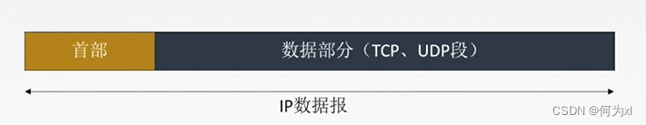
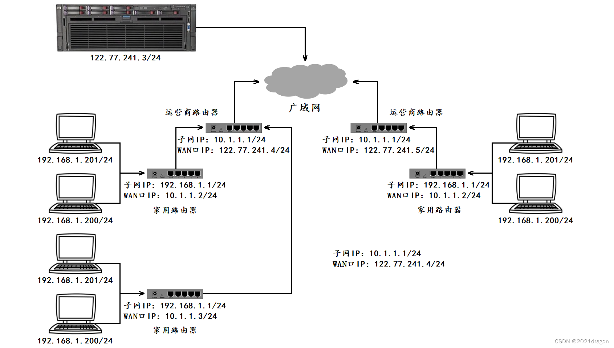
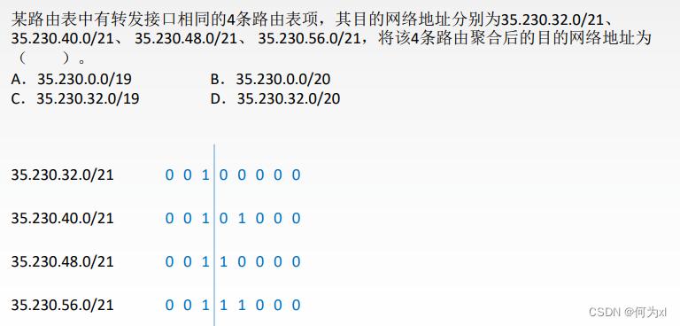

# IP协议

规定网络地址的协议，叫做IP协议。它所定义的地址，就被称为IP地址。
IP协议（Internet Protocol）是Internet Protocol Suite（TCP/IP协议簇）中的核心协议，位于网络层，负责在互联网上传输数据包。

## 基本概念与功能

- 互连性：IP协议设计的主要目的是实现不同网络之间的互连，使得数据能够在异构网络之间传输，从而形成一个统一的全球互联网。
- 无连接服务：IP协议提供的是无连接服务，即在数据传输前，发送端和接收端之间不需要建立固定的连接。每个数据包（称为IP数据报）都是独立处理的。
- 不可靠服务：IP协议不保证数据包的可靠传输，它不进行重传或错误纠正。如果数据包在传输过程中丢失、重复或乱序，IP协议本身不做处理，这些任务留给上层协议如TCP来完成。
- 寻址和路由：IP协议通过IP地址来唯一标识网络中的每一个设备，并利用路由表决定数据包的最佳传输路径。
- 数据分片与重组：对于大于网络最大传输单元（MTU）的数据包，IP协议会进行分片，然后在目的地进行重组。每个分片作为一个独立的数据包传输，并带有足够的信息以便重组。

### 网络层解决的问题

TCP作为传输层控制协议，其保证的是数据传输的可靠性和传输效率，但TCP提供的仅仅是数据传输的策略，而真正负责数据在网络中传输的则传输层之下的网络层和链路层。

- 双方在进行网络通信时，发送的数据并不是直接从一方的传输层直接发送到了另一方的传输层，而是需要传输层将数据继续向下进行交付，在网络层和链路层经过数据封装后再通过网络发送到对方主机，对方主机收到数据后也同样需要在链路层和网络层进行数据解包，此时对方的传输层才拿到了发送过来的数据，然后再继续将该数据向上进行交付。

网络通信的过程，就像两个人在送互相送数据，这两个人分别在两栋楼的四楼，如果一个人要将数据交给对方，那么这个人就必须先从四楼走到一楼，然后再在路上经过路径选择到达对方楼下，最后再上到四楼将数据交给对方。

其中，送数据的这个人从四楼下来的过程就是数据封装的过程，这个人在路上经过路径选择到达对方楼下的过程就是数据路由的过程，而这个人再上到四楼将数据交给对方的过程就是数据解包的过程。

- 而网络层要解决的问题就是，将数据从一台主机送到另一台主机，也就是数据的路由。

### IP协议是保证数据可靠的从一台主机送到另一台主机的前提

- 当双方在进行基于TCP的网络通信时，要保证将数据可靠的从一台主机送到另一台主机，前提是发送方要有将数据送到对方主机的能力，要是发送方连将数据发送给对方的能力都没有，那就更不用谈可靠的将数据送给对方主机了。
  - 需要注意的是，发送方有将数据送到对方主机的能力，并不意味着发送方每次发送的数据都能够成功的发送到对方，但如果发送方连将数据发送给对方的能力都没有，那发送方基本就不可能将数据发送给对方。
  - 一旦发送方有了将数据发送给对方的能力，就算发送方某次发送的数据没有成功到达对方，此时上层TCP由于没有收到对应数据的应答，此时上层TCP会要求进行数据重发，直到数据成功发送到对方主机为止。
- 也就是说，在网络层有能力将数据送到对方主机的情况下，虽然网络层不能保证每次都能将数据成功送到对方主机，但在TCP提供的可靠性策略的保证下，最终网络层就一定能够将数据可靠的发送到对方主机。

说明一下：

- 网络层解决的问题是，将数据从一台主机送到另一台主机，因此网络层解决的是主机到主机的问题。
- 一方传输层从上方进程拿到数据后，该数据贯穿网络协议栈进行封装和解包，最终到达对方传输层，此时对方传输层也会将数据向上交给对应的进程，因此传输层解决的是进程到进程的问题。

### 路径选择

数据进行的网络传输一般都是跨网络的，而路由器就是连接多个网络的硬件设备，因此数据在进行跨网络传输时一定需要经过多个路由器。

数据路由就像我们旅游一样，当确定了要到达的目标主机后，就需要寻找最短的路径到达该目的地。

- 目的地的确定是非常重要的，因为目的地直接决定了数据路由时的路径选择，这也是跨网络找到目标主机的根本。
- 只有数据经过了较为正确的路径选择，最终才可能慢慢趋近于目标网络或目标主机。

确定数据路由的目的地后，数据就可以在网络中进行路由了，但数据在路由时无法自行进行路径选择，因为这个数据本身是“不认识路”的，因此数据在路由的过程中需要不断“找路人问路”，而这里所谓的“路人”就是网络当中的一台台路由器。

网络当中的路由器是“认识路的”，它们将自己的“认路经验”都记录到路由表当中，因此路由器可以通过查路由表找到去特定点的最短路径。因此数据在路由时，会不断通过路由器来进行路径选择，以此来一步步靠近目标网络或目标主机。

### 主机和路由器

- 主机：配有IP地址，但是不进行路由控制的设备。但实际现在几乎不存在不进行路由控制的设备了，就连你的笔记本也会进行路由控制。
- 路由器：既配有IP地址，又能进行路由控制。实际现在主流的路由器已经不仅仅具有路由的功能了，它甚至具备某些应用层的功能。
- 节点：主机和路由器的统称。

## IPV4

一个标准的IPv4数据包包含以下部分：

- 版本（Version）：标识IP协议的版本，例如IPv4为4，IPv6为6。
- 首部长度（Internet Header Length, IHL）：表示IP头的长度，单位是32位字。
- 服务类型（Type of Service, ToS）：现在多用于QoS（Quality of Service）。
- 总长度（Total Length）：整个IP数据报的长度，包括头部和数据部分。
- 标识符（Identification）：用于标识数据报的片段，当数据报被分片时，同一原始数据报的所有分片具有相同的标识符。
- 标志（Flags）：控制数据报的分片，包括是否还可以继续分片以及是否是最后一个分片。
- 分片偏移（Fragment Offset）：用于重组分片，指明该分片在原始数据报中的相对位置。
- 生存时间（Time to Live, TTL）：限制数据包在网络中的生存时间，每经过一个路由器，TTL值减1，减至0时数据包被丢弃。
- 协议（Protocol）：标识上层协议类型，例如TCP为6，UDP为17。
- 头部校验和（Header Checksum）：用于验证IP头部的完整性。
- 源IP地址（Source Address）：发送方的IP地址。
- 目的IP地址（Destination Address）：接收方的IP地址。
- 选项（Options）：可选字段，用于特殊用途，如记录路由、时间戳等。
- 数据（Data）：实际传输的数据。

### IPV4协议格式

一个 IP分组由首部和数据部分组成。首部前一部分的长度固定，共 `20B`，是所有 IP分组 必须具有的。在首部固定部分的后面是一些可选字段，其长度可变，用来提供错误检测及安全等机制。

- **版本号**（version）
  - 占4比特，指定IP协议的版本（IPv4/IPv6），对于IPv4来说，就是4。通信双方使用的IP协议版本必须一致。
- **首部长度**（header length）：
  - 占4比特，表示IP数据报首部长度。该字段取值以4字节为单位。
  - 最小十进制取值为 `5`，表示IP数据报首部只有 `20`字节（`4`字节单位，所以取值 `5`对应 `20`字节）固定部分
  - 最大十进制取值为 `15`，表示IP数据报首部包含 `20`字节固定部分 + 最大 `40`字节可变部分
- **服务类型**（Type Of Service, TOS）：
  - 占 `8`比特。利用该字段的不同数值可提供不同等级的服务质量，只有在使用区分服务时，该字段才起作用。一般情况下不使用该字段。
  - `3`位优先权字段（已经弃用），`4`位 `TOS`字段，和1位保留字段（必须置为0）。`4`位TOS分别表示：最小延时，最大吞吐量，最高可靠性，最小成本。这四者相互冲突，只能选择一个。比如对于 `ssh/telnet`这样的应用程序，最小延时比较重要，而对于ftp这样的程序，最大吞吐量比较重要。
- **总长度**（total length）：
  - 占16比特，表示**IP数据报**（**IP报头+有效载荷/数据载荷**）的总长度，数据报的最大长度为 $2^{16} - 1 = 65535$ ，以字节为单位。用于将各个IP报文进行分离。
  - 以太网帧的最大传送单元(MTU)为 `1500B`，因此当一个IP数据报封装成帧时，数据报的总长度（首部加数据）一定不能超过下面的数据链路层的MTU值。
- **标识**（id）/ **标识符**（Identification）：
  - 占 `16`比特，唯一的标识主机发送的报文，同一个数据报在IP层进行了分片，那么各分片数据报应该具有相同的标识（可理解为ID）。
  - IP软件维持一个计数器，每产生一个数据报，计数器值 `+1`，并将此值赋给标识字段。
- **标志字段**(Flags)：
  - 占 `3`比特
  - **不分片（Don't Fragment, DF）**标志：如果该位置 `1`，路由器将不会对数据包进行分片，如果需要经过的链路MTU（最大传输单元）小于该数据包大小，路由器会丢弃该数据包并发送ICMP错误消息给源主机。
    - `1`表示不允许分片，`0`表示允许分片
  - **更多分片（More Fragments, MF）**标志。除了最后一个分片外，所有其他分片都会将此位置1，指示还有后续的分片。最后一个分片会将MF标志清零。
    - `1`表示"后面还有分片"，`0`表示"这是最后一个分片"
  - **保留位**：必须为0
- **片偏移**（framegament offset）：
  - 占13比特，指出分片数据报的数据载荷部分偏移其在原数据报的位置有多少单位。
  - 片偏移以 `8`个字节为单位，必须是 `8`的整数倍。
  - 分片相对于原始数据开始处的偏移，表示当前分片在原数据中的偏移位置，实际偏移的字节数是这个值 `×8`得到的。因此除了最后一个报文之外，其他报文的长度必须是8的整数倍，否则报文就不连续了。
- **生存时间**（Time To Live，TTL）：
  - 占 `8`位。数据报在网络中可通过的路由器数的最大值，标识分组在网络中的寿命，以确保分组不会永远在网络中循环。
  - 数据报到达目的地的最大报文跳数，一般是 `64`，每经过一个路由，路由器在转发分组前 `TTL -= 1`，一直减到 `0`还没到达，那么就丢弃了。
- 协议：
  - 占8位，指出此分组携带的数据使用何种协议，即分组的数据部分应交给哪个传输层协议，如TCP、UDP等。
  - 值为 `6`表示 `TCP`，值为 `17`表示 `UDP`。
- 首部检验和：
  - 占16位，使用CRC进行校验，来鉴别数据报的首部是否损坏。
  - IP 数据报的首部校验和只校验分组的首部，而不校验数据部分。
- 32位源IP地址和32位目的IP地址：表示发送端和接收端所对应的IP地址。
- 选项字段：不定长，最多40字节。
  - 可选字段
    - 长度从1到40个字节不等。用来支持排错、测量及安全等措施
    - 可选字段增加了IP数据报的功能，但这同时也使得IP数据报的首部长度成为可变的。这就增加了每一个路由器处理IP数据报的开销。实际上可选字段很少被使用
  - 填充字段：确保首部长度为4字节长度的整数倍，使用全0进行填充

注：在**IP数据报首部**中有三个关于**长度**的标记，一个是**首部长度**、一个是**总长度**、一个是**片偏移**，基本单位分别为 `4B、1B、8B`(这个一定要记住)。题目中经常会出现这几个长度之间的加减运算。另外，读者要熟悉IP 数据报首部的各个字段的意义和功能，但不需要记忆 IP数据报的首部，正常情况下如果需要参考首部，题目都会直接给出。TCP、UDP 的首部也是一样的。

#### 理解IP报文头

IP报头在内核当中本质就是一个位段类型，给数据封装IP报头时，实际上就是用该位段类型定义一个变量，然后填充IP报头当中的各个属性字段，最后将这个IP报头拷贝到数据的首部，至此便完成了IP报头的封装。

#### IP如何将报头与有效载荷进行分离？

IP分离报头与有效载荷的方法与TCP是一模一样的，当IP从底层获取到一个报文后，虽然IP不知道报头的具体长度，但IP报文的前 `20`个字节是 `IP`的基本报头，并且这 `20`字节当中涵盖 `4`位首部长度。

因此IP是这样分离报头与有效载荷的：

当IP从底层获取到一个报文后，首先读取报文的前 `20`个字节，并从中提取出 `4`位的首部长度，此时便获得了 `IP`报头的大小 `size`。
如果 `size`的值大于 `20`字节，则需要继续从报文当中读取 `size−20`字节的数据，这部分数据就是IP报头当中的选项字段。
读取完IP的基本报头和选项字段后，剩下的就是有效载荷了。

IP就是通过这种“**定长报头+自描述字段**”的方式进行报头和有效载荷的分离的。但需要注意的是，IP报头当中的 `4`位首部长度描述的基本单位与 `TCP`报头当中的 `4`位首部长度一样，都是以 `4`字节为单位进行描述的，这也恰好是报文的宽度。

`4`位二进制的取值范围是 `0000 ~ 1111`，因此IP报头的最大长度为 `15 × 4 = 60`字节，因为基本报头的长度是 `20`字节，所以IP报头中选项字段的长度最多是 `40`字节。如果IP报头当中不携带选项字段，那么IP报头的长度就是 `20`字节，此时报头当中的 `4`位首部长度字段所填的值就是 `20÷4=5`，即 `0101`。

#### IP如何决定将有效载荷交付给上层的哪一个协议？

基于IP协议的传输层协议不止一种，因此当IP从底层获取到一个报文并对其进行解包后，IP需要知道应该将分离后得到的有效载荷交付给上层的哪一个协议。

在IP报头当中有一个字段叫做8位协议，该字段表示的就是上层协议的类型，IP就是根据该字段判定应该将分离出来的有效载荷交付给上层的哪一个协议的。该字段是发送方的IP层从上层传输层获取到数据后填充的，比如是上层TCP交给IP层的数据，那么该数据在封装IP报头时的**8位协议**填充的就是TCP对应的编号。

#### 32位源IP地址和32位目的IP地址

IP报头当中的32位源IP地址和32位目的IP地址，分别代表的就是该报文的发送端和接收端对应的IP地址。

数据在网络传输过程中会遇到一个个的路由器，这些路由器会帮助网络当中的数据进行路由转发，使得网络中的数据慢慢趋近于目标主机。路由器在帮助数据进行路由转发时，会提取出该数据的IP报头当中的目的IP地址，并以此作为数据路由转发的重要依据。

当接收端收到了发送端发来的数据后，接收端可能也想要给发送端发送数据，因此发送端在发送数据时除了需要指明该数据的目的IP地址，还需要指明该数据的源IP地址，也就是发送端的IP地址。即便接收端收到数据后没有数据想要发送给发送端，但至少接收端需要向发送端发送一个响应报文，表明发送端发送的数据已经被接收端可靠的收到了，因此发送出去的数据除了需要指明该数据的目的IP地址，还需要指明该数据的源IP地址。

#### socket编程需要使用IP地址

- 在进行socket编程的时候，当一端想要发送数据给另一端时，必须要指明对端的IP地址和端口号，也就是发送数据的目的IP地址和目的端口号。
- 其中这里的IP地址就是给网络层的IP用的，用于数据在网络传输过程中的路由转发，而这里的端口号就是给传输层的TCP或UDP用的，用于指明该数据应该交给上层的哪一个进程。
- 发送数据时我们不需要指明发送数据的源IP地址和源端口号，因为传输层和网络层都是在操作系统内核当中实现的，数据在进行封装时操作系统会自行填充上对应的源IP地址和源端口号。

#### 8位生存时间TTL

报文在网络传输过程中，可能因为某些原因导致报文无法到达目标主机，比如报文在路由时出现了环路路由的情况，或者目标主机已经异常离线了，此时这个报文就成了一个废弃的游离报文。

为了避免网络当中出现大量的游离报文，于是在IP的报头当中就出现了一个字段，叫做8位生存时间（Time To Live，TTL）。8位生存时间代表的是报文到达目的地的最大报文跳数，每当报文经过一次路由，这里的生存时间就会减一，当生存时间减为0时该报文就会被自动丢弃，此时这个报文就会在网络中消散。

### IP数据报 分片与组装

IP 首部中的标志位有 `3比特`，但只有后 `2比特`有意义，分别是 **DF位(Don't Fragment)** 和 **MF位(MoreFragment)**。

- 中间位DF（Don’t Fragment）决定是否能被分片。
  - DF=1，禁止分片
  - DF=0，允许分片
- MF位(MoreFragment)则用来告知目的主机该 IP数据报是否为原始数据报的最后一个片。
  - 当MF=1时，表示相应的原始数据报还有后续的片；
  - 当MF=0时，表示该数据报是相应原始数据报的最后一个片。

目的主机在对片讲行重组时，使用片偏移字段来确定片应放在原始数据报的哪个位置。（片偏移的单位为 8B，除了最后一个分片，每个分片长度一定是8B的整数倍。）

分片涉及一定的计算。例如，一个长 `4000B`的 IP数据报(首部 `20B`，数据部分 `3980B`) 到达一个路由器，需要转发到一条 `MTU`为 `1500B` 的链路上。这意味着原始数据报中的 `3980B` 数据必须被分配到 `3` 个独立的片中(每片也是一个IP数据报)。假定原始数据报的标识号为 `777`，那么分成的 `3`片所示。可以看出，由于偏移值的单位是 `8B`，所以除最后一个片外，其他所有片中的有效数据载荷都是 `8`的倍数。

#### 数据链路层解决的问题

IP能够将数据跨网络从一台主机送到另一台主机，而数据在进行跨网络传送时，需要经过一个个的路由器进行路由转发，最终才能到达目标主机。

比如要将数据从主机B跨网络传送到主机C，那么主机B需要先将数据交给路由器F，路由器F再将数据交给路由器G，…，最终由路由器D将数据交给主机C。

因此IP进行数据跨网络传送的前提是，需要先将数据从一个节点传送到和自己相连的下一个节点，这个问题实际就是由IP之下的数据链路层解决的，其中数据链路层最典型的代表协议就是MAC帧。

而两个节点直接相连也就意味着这两个节点是在同一个局域网当中的，因此要讨论两个相邻节点的数据传送时，实际讨论的就是局域网通信的问题。

#### 最大传输单元 MTU

MAC帧作为数据链路层的协议，它会将IP传下来的数据封装成数据帧，然后发送到网络当中。但MAC帧携带的有效载荷的最大长度是有限制的，也就是说IP交给MAC帧的报文不能超过某个值，这个值就叫做**最大传输单元(Maximum Transmission Unit，MTU)**。

即：**一个数据链路层数据报能承载的最大数据量称为最大传送单元(MTU)**。

因为IP数据报被封装在数据链路层数据报中，因此数据链路层的MTU严格地限制着P数据报的长度，而且在TP数据报的源与目的地路径上的各段链路可能使用不同的数据链路层协议，有不同的MTU。

例如,**以太网的MTU**为 `1500B`，而**许多广域网的MTU**不超过 `576B`。

当 IP数据报的总长度大于链路的 MTU时，就需要将 IP数据报中的数据分装在两个或多个较小的 IP数据报中，这些较小的数据报称为片。

由于MAC帧无法发送大于1500字节的数据，因此IP层向下交付的数据的长度不能超过1500字节，这里所说的数据包括IP的报头和IP的有效载荷。

#### 分片与组装

如果IP层要传送的数据超过了 `1500`字节，那么就需要先在IP层对该数据进行分片，然后再将分片后的数据交给下层MAC帧进行发送。

如果发送数据时在IP层进行了分片，那么当这些分片数据到达对端主机的IP层后就需要先进行组装，然后再将组装好的数据交付给上层传输层。

注意：

- 数据的分片不是经常需要做的，实际在网络通信过程中不分片才是常态，因为数据分片会存在一些潜在的问题，比如分片可能会增加丢包的概率。
- 数据的分片和组装发生在IP层，不仅源端主机可能会对数据进行分片，数据在路由过程中的路由器也可能对数据进行分片。因为不同网络的MTU是不一样的，如果传输路径上的某个网络的MTU比源端网络的MTU小，那么路由器就可能对IP数据报再次进行分片。
- 分片数据的组装只会发生在目的端的IP层。
- 在分片的数据中，每一个分片在IP层都会被添加上对应的IP报头，而传输层添加的报头只会出现在第一个分片中，因此网络中传输的数据包可能没有传输层的报头。

#### 数据的分片和组装都是由IP层完成的

数据的分片和组装都是在IP层完成的，上层的传输层和下层的链路层并不关心。

传输层只负责为数据传送提供可靠性保证，比如当数据传送失败后，传输层的TCP协议可以组织进行数据重传。

- 当TCP将待发送的数据交给IP后，TCP并不关心该数据是否会在IP层进行分片，即TCP并不关心数据具体的发送过程。
- 当TCP从IP获取到数据后，TCP也不关心该数据是否在IP层经过了组装。

而链路层的MAC帧只负责，将数据从一个节点传送到和自己相连的下一个节点。

- 当IP将待发送的数据交给MAC帧后，MAC帧并不知道该数据是IP经过分片后的某个分片数据，还是一个没有经过分片的数据，MAC帧只知道它一次最多只能发送MTU大小的数据，如果IP交给MAC帧大于MTU字节的数据，那MAC帧就无法进行发送。
- 当MAC帧从网络中获取到数据后，MAC帧也不关心这个数据是否需要进行组装，MAC帧只需要将该数据的MAC帧报头去掉后直接上交给上层IP就行了，而至于该数据的组装问题则是IP需要解决的。

因此，数据的分片和组装完全是由IP协议自己完成的，传输层和链路层不必关心也不需要关心。

#### 分片的过程

假设IP层要发送4500字节的数据，由于该数据超过了MAC帧规定的MTU，因此IP需要先将该数据进行分片，然后再将一个个的分片交给MAC帧进行发送。

IP报头如果不携带选项字段，那么其大小就是20字节，假设IP层添加的IP报头的长度就是20字节，并按下列方式将数据分片后形成了四个分片报文：

| 分片报文 | 总字节数 | IP报头字节数 | 数据字节数 |
| :------: | :------: | :----------: | :--------: |
|    1    |   1500   |      20      |    1480    |
|    2    |   1500   |      20      |    1480    |
|    3    |   1500   |      20      |    1480    |
|    4    |    80    |      20      |     60     |

需要注意的是，分片后的每一个分片数据都需要封装上对应的IP报头，因此4500字节的数据至少需要分为四个分片报文进行发送。

分片报文到达对方的IP层后需要被重新组装起来，因此IP层在对数据进行分片时需要记录分片的信息，而IP报头当中的 `16`位标识、`3`位标志和 `13`位片偏移实际就是与数据分片相关的字段。

- 16位标识：唯一标识主机发送的报文，如果数据在IP层进行了分片，那么每一个分片报文的16位标识是相同的。
- 3位标志：第一位保留，表示暂时没有规定该字段的意义。第二位表示禁止分片，表示如果报文长度超过MTU，IP模块就会丢弃该报文。第三位表示“更多分片”，如果报文没有进行分片，则该字段设置为0，如果报文进行了分片，则除了最后一个分片报文设置为0以外，其余分片报文均设置为1。
- 13位片偏移：分片相对于原始数据开始处的偏移，表示当前分片在原数据中的偏移位置，实际偏移的字节数是这个值 `×8`得到的。因此除了最后一个报文之外，其他报文的长度必须是8的整数倍，否则报文就不连续了。

因此上述四个分片报文对应的16位标识都是一样的，假设四个分片报文的16位标识都是123，则这四个报文对应的16位标识、3位标志中的“更多分片”和13位片偏移分别如下：

| 分片报文 | 总字节数 | IP报头字节数 | 数据字节数 | 16位标识 | “更多分片” | 13位片偏移 |
| :------: | :------: | ------------ | :--------: | :------: | :----------: | :--------: |
|    1    |   1500   | 20           |    1480    |   123   |      1      |     0     |
|    2    |   1500   | 20           |    1480    |   123   |      1      |    185    |
|    3    |   1500   | 20           |    1480    |   123   |      1      |    370    |
|    4    |    80    | 20           |     60     |   123   |      0      |    555    |

需要注意的是，13位片偏移当中记录的字节数是当前分片在原数据开始处的偏移字节数的值 `÷8`得到的，比如分片报文2在原始数据开始处的偏移字节数是 `1480`，其对应的13位片偏移的值就是 `1480 ÷ 8 = 185`。

#### 组装的过程

MAC帧交给IP层的数据可能来自世界各地，这些数据可能是经过分片后发送的，也可能是没有经过分片直接发送的，因此IP必须要通过某种方式来区分收到的各个数据。

- IP报头当中有 `32`位源IP地址，源IP地址记录了发送端所对应的IP地址，因此通过IP报头当中的 `32`位源IP地址就可以区分来自不同主机的数据。
- IP报头当中有 `16`位标识，未分片的数据各自的 `16`位标识都是不同的，而由同一个数据分片得到的各个分片报文所对应的16位标识都是相同的，因此通过IP报头当中 `16`位标识就可以判断哪些报文是没有经过分片的独立报文，哪些报文是经过分片后的分片报文。

因此IP可以通过IP报头当中的32位源IP地址和16位标识，将经过分片的数据各自聚合在一起，聚合在一起后就可以开始进行组装了。

对于各个分片报文来说：

- 第一个分片报文中的13位片偏移的值一定为0。
- 最后一个分片报文中的“更多分片”标志位一定为0。
- 对于每一个分片报文来说，当前报文的13位片偏移加上当前报文的数据字节数 `÷8`所得到的值，就是下一个分片报文的所对应的13位片偏移。

根据分片报文的这三个特点就能够将分片报文合理的组装起来。

- 先找到分片报文中 `13`位片偏移为 `0`的分片报文，然后提取出其IP报头当中的 `16`位总长度字段，通过计算即可得出下一个分片报文所对应的 `13`位片偏移，按照此方式依次将各个分片报文拼接起来。
- 直到拼接到一个“更多分片”标志位为 `0`的分片报文，此时表明分片报文组装完毕。

#### 分片报文丢包的问题

分片后的报文在网络传输过程中也可能会出现丢包问题，但接收端有能力判断是否收到了全部分片报文，比如假设某组分片报文对应的16位标识值为x：

- 如果分片报文中的第一个分片报文丢包了，那么接收端收到的分片报文中就找不到对应16位标识为x，并且13位片偏移为0的分片报文。
- 如果分片报文中的最后一个分片报文丢包了，那么接收端收到的分片报文中就找不到对应16为标识为x，并且“更多分片”标志位为0的分片报文。
- 如果分片报文中的其它分片报文丢包了，那么接收端在进行分片报文的组装时就会找不到对应13位片偏移为特定值的分片报文。

需要注意的是，未分片报文的“更多分片”标志位为0，最后一个分片报文的“更多分片”标志位也为0，但当接收端只收到分片报文中的最后一个分片报文时，接收端不会将其识别成一个未分片的报文，因为未分片的报文所对应的13位片偏移的值也应该是0，而最后一个分片报文所对应的13位片偏移的值不为0。

因此只有当一个报文的13位片偏移为0，并且该报文的“更多分片”标志位也为0时，该报文才会被识别成一个没有被分片的独立报文，否则该报文就会被识别成一个分片报文。

#### 为什么不建议进行分片？

虽然传输层并不关心IP层的分片问题，但分片对传输层也是有影响的。

- 如果一个数据在网络传输过程中没有经过分片，那么只要接收端收到了这一个报文，我们就可以认为该数据被对方可靠的收到了。
- 而如果一个数据在网络传输过程中进行了分片，那么只有当接收端收到了全部的分片报文并将其成功组装起来，这时我们才认为该数据被对方可靠的收到了。但如果众多的分片报文当中有一个报文出现了丢包，就会导致接收端就无法将报文成功组装起来，这时接收端会将收到的分片报文全部丢弃，此时传输层TCP会因为收不到对方应答而进行超时重传。
- 假设在网络传输时丢包的概率是万分之一，如果将数据拆分为一百份进行发送，那么此时丢包的概率就上升到了百分之一。因为只要有一个分片报文丢包了也就等同于这个报文整体丢失了，因此分片会增加传输层重传数据的概率。

需要注意的是，只要分片报文当中的某一个出现了丢包，此时传输层都需要将数据整体进行重传，因为传输层并不知道底层IP对数据进行了分片，当传输层发送出去的数据得不到应答时传输层就只能将数据整体进行重传，因此数据在发送时不建议进行分片。

#### 如何尽可能避免分片？

实际数据分片的根本原因在于传输层一次向下交付的数据太多了，导致IP无法直接将数据向下交给MAC帧，如果传输层控制好一次交给IP的数据量不要太大，那么数据在IP层自然也就不需要进行分片。

- 因此TCP作为传输控制协议，它需要控制一次向下交付数据不能超过某一阈值，这个阈值就叫做MSS（Maximum Segment Size，最大报文段长度）。
- 通信双方在建立TCP连接时，除了需要协商自身窗口大小等概念之外，还会协商后续通信时每一个报文段所能承载的最大报文段长度MSS。

MAC帧的有效载荷最大为MTU，TCP的有效载荷最大为MSS，由于TCP和IP常规情况下报头的长度都是20字节，因此一般情况下 MSS = MTU - 20 - 20，而MTU的值一般是1500字节，因此MSS的值一般就是1460字节。

所以一般建议TCP将发送的数据控制在1460字节以内，此时就能够降低数据分片的可能性。之所以说是降低数据分片的可能性，是因为每个网络的链路层对应的MTU可能是不同的，如果数据在传输过程中进入到了一个MTU较小的网络，那么该数据仍然可能需要在路由器中进行分片。

### 分组转发流程

网络层的路由器执行的分组转发算法如下:

1. 从数据报的首部提取目的主机的IP地址 `D`，得出目的网络地址 `N`。
2. 若网络 `N`与此路由器直接相连，则把数据报直接交付给目的主机 `D`，这称为路由器的**直接交付**，否则是**间接交付**，执行步骤3。
3. 若路由表中有目的地址为 `D`的特定主机路由(对特定的目的主机指明一个特定的路由，通常是为了控制或测试网络，或出于安全考虑才采用的)，则把数据报传送给路由表中所指明的下一跳路由器，否则，执行步骤4。
4. 若路由表中有到达网络N的路由，则把数据报传送给路由表指明的下一跳路由器；否则,执行步骤5。
5. 若路由表中有一个默认路由，则把数据报传送给路由表中所指明的默认路由器:否则,执行步骤6。
6. 报告转发分组出错。

> 注意：得到下一跳路由器的地址后并不是直接将该地址填入待发送的数据报，而是将该地址转换成MAC地址(通过ARP)，将其放到MAC帧首部中，然后根据这个MAC地址找到下一跳路由器。在不同网络中传送时，MAC帧中的源地址和目的地址要发生变化，但是网桥在转发帧时，不改变帧的源地址，请注意区分。

### IPV4地址 / 网段划分

#### 网络号、主机号和子网掩码

IP地址 = 网络号段 + 主机号段
IP地址 = 网络号段 + (子网号段 + 子网主机号段)

1. 网络号（Network ID） / 网络标识:
   - 网络号用于标识一个特定的网络或子网络。它就像一个地址的区域部分，告诉网络设备（如路由器）数据包应该被送往哪个大的网络区域。
   - 所有属于同一网络的设备共享相同的网络号。这意味着，当数据包在网络上从一个设备发送到另一个设备时，网络号帮助确定数据包应该沿着哪条路径走，直到到达目标网络的边界。
   - 在没有子网划分的情况下，网络号的长度是根据IP地址的类别（A、B、C等）预先定义好的。

2. 主机号（Host ID）:
   - 主机号用于在一个网络内部唯一标识一个特定的设备或主机。它就像是门牌号，指明了数据包在到达目标网络后应该送达的具体设备。
   - 每个网络内的设备拥有独一无二的主机号，这样数据通信时可以精确地定位到目标设备。
   - 在没有子网划分的情况下，IP地址中剩余的部分即为主机号。

3. 子网掩码
   - 子网掩码是一个与IP地址一起使用的32位二进制数，用来区分一个IP地址中的网络号和主机号。掩码中的1对应网络号部分，0对应主机号部分。通过IP地址与子网掩码的逻辑与操作，可以精确提取出网络号部分。
   - 在IP地址后面加上一个斜杠 /，后面跟着一个数字，这种表示方法是用来指明IP地址的前缀长度或者网络掩码的位数。这个数字代表IP地址中网络部分的位数，换句话说，就是子网掩码中连续的1的个数。

举例来说，如果一个IP地址为192.168.1.10，而其子网掩码为255.255.255.0，那么：

- 网络号是192.168.1，因为它与子网掩码的对应位都是1。
- 主机号是0.0.0.10，这部分决定了该IP地址在192.168.1这个网络中的具体位置。

例如，下图中路由器连接了两个网段。对于网络标识来讲，同一网段内主机的网络标识是相同的，不同网段内主机的网络标识是不同的。而对于主机标识来讲，同一网段内主机的主机标识是不同的，不同网段内主机的主机标识是可以相同的。

- 不同的子网其实就是把网络号相同的主机放到一起。
- 如果在子网中新增一台主机，则这台主机的网络号和这个子网的网络号一致，但是主机号必须不能和子网中的其他主机重复。

#### 二级IP地址：网段划分为5类IP

过去曾经提出一种划分网络号和主机号的方案，就是把所有IP地址分为五类，如下图所示：

因此，各类IP地址的取值范围如下：

- A类：`0.0.0.0`到 `127.255.255.255`。
- B类：`128.0.0.0`到 `191.255.255.255`。
- C类：`192.0.0.0`到 `223.255.255.255`。
- D类：`224.0.0.0`到 `239.255.255.255`。
- E类：`240.0.0.0`到 `247.255.255.255`。

- 主机号全为0，表示该网络本身；
- 主机号全为1，表示该网络的广播地址；
- 127.0.0.0 保留为环回自检(Loopback Test)地址，此地址表示任意主机本身，目的地址为环回地址的IP数据报永远不会出现在任何网络上。
- 32位全为0，即 0.0.0.0 表示本网络上的本主机。
- 32位全为1，即 255.255.255.255 表示整个TCP/IP网络的广播地址，又称受限广播地址。实际使用时，由于路由器对广播域的隔离，255.255.255.255 等效为本网络的广播地址。

当要判断一个IP地址是属于哪一类时，只需要遍历IP地址的前五个比特位，第几个比特位最先出现0值，那么这个IP地址对应就属于A、B、C、D、E类地址。

1. A类地址：
   - 范围：从1.0.0.0到127.255.255.255。
   - 第一个字节的最高位为0，接下来的7位表示网络号，剩下的24位表示主机号。因此，A类地址的默认子网掩码为255.0.0.0。
   - 可用的网络数：$2^7-2$，减 2 的原因是：第一，网络号字段全为0的IP地址是保留地址，意思是“本网络"：第二，网络号为 127 的 IP地址是环回自检地址。
   - 网络部分：第一个字节表示网络地址，最高位固定为0。
   - 主机部分：剩余的三个字节表示主机地址。
   - 作用：A类地址适用于大型网络，如互联网服务提供商(ISPs)、大型企业网络或政府机构，因为它可以支持最多约1677万个主机。

2. B类地址：
   - 范围：从128.0.0.0到191.255.255.255。
   - 第一个字节的前两位为10，接下来的14位表示网络号，剩下的16位表示主机号。B类地址的默认子网掩码为255.255.0.0。
   - 可用网络数为$2^{14}-1$，减1的原因是128.0 这个网络号是不可指派的。
   - 网络部分：前两个字节表示网络地址，最高两位固定为10。
   - 主机部分：后两个字节表示主机地址。
   - 作用：B类地址适合中到大型网络，如大型公司或组织，它可以支持约6万五千个主机。
3. C类地址：
   - 范围：从192.0.0.0到223.255.255.255。
   - 第一个字节的前三位为110，接下来的21位表示网络号，剩下的8位表示主机号。C类地址的默认子网掩码为255.255.255.0。
   - 可用网络数为：$2^{21}-1$，减1的原因是网络号为192.0.0 的网络是不可指派的。
   - 网络部分：前三个字节表示网络地址，最高三位固定为110。
   - 主机部分：最后一个字节表示主机地址。
   - 作用：C类地址通常分配给小型网络，如家庭、小型企业或学校的小型局域网，支持最多254个主机。

4. D类地址（多播地址）：
   - 范围：从224.0.0.0到239.255.255.255。
   - D类地址（多播地址）不遵循上述规则，主要用于特殊用途，不分配给单个网络或主机使用，因此不涉及网络号和主机号的区分。
   - 多播组数量：$2^{28} = 268,435,456$。
     - 由于D类地址用于多播，其地址空间并不是用来分配给单个主机或网络接口的，而是用于标识多播组。因此，谈论D类地址的“可用数量”与我们通常理解的可分配给单个设备的地址数量概念不同。
     - Pv4的D类地址理论上可以定义多达约2亿6千8百万个多播组。但实际上，并非所有这些组都会被使用或甚至定义，因为多播地址的分配和使用受到IANA（互联网编号分配管理局）的管理和规范。IANA保留了一部分地址区间用于特定的用途和私有多播组。
   - 特殊用途：不区分网络和主机部分，专门用于多播通信，即一对多的通信模式。
   - 作用：主要用于向多个目标同时发送一个数据包，常用于多媒体会议、IPTV广播等场景。

5. E类地址（保留地址）：
   - 范围：从240.0.0.0到255.255.255.255。
   - E类地址（保留地址）不遵循上述规则，主要用于特殊用途，不分配给单个网络或主机使用，因此不涉及网络号和主机号的区分。
   - 理论有$2^{24} = 16,777,216$ 个地址。
     - 最小的E类地址是 `240.0.0.0`，通常不分配使用。
     - 最大的E类地址是 `255.255.255.255`，该地址用于本地网络广播，并非E类地址的一部分，而是有特殊用途。
     - 实际“可用数量”概念并不直接适用，因为这些地址几乎完全保留未使用。在实践中，并没有所谓的“可用”E类地址用于常规网络分配。
   - 特殊用途：预留作实验和未来使用，不用于普通网络分配。
   - 作用：目前主要用作科研、文档示例或在特殊情况下测试网络设备。

### 子网划分和子网掩码

但随着网络的飞速发展，这种划分方案的局限性很快就显现出来了。

- 比如一些学校、公司、实验室等组织想要申请自己的局域网，由于A类地址的网络号只占7个比特位，因此A类地址可申请的网络只有2^7个，于是大多数组织都选择申请B类地址。
- 由于B类地址的主机号占16个比特位，因此理论上一个B类网络当中允许有65536台主机。
- 但实际网络架设中，一般不会存在一个局域网当中有这么多主机的情况，也就意味着大量的IP地址实际都被浪费掉了。

为了避免这种情况，于是又提出了新的划分方案，称为**CIDR(Classless Interdomain Routing，无类别域间路由)**：

#### CIDR 无类别域间路由

CIDR(Classless Interdomain Routing，无类别域间路由)是一种在Internet上管理和分配IP地址的策略，它替代了传统的基于类别的IP地址分配系统。CIDR的核心在于引入了**可变长度的子网掩码**和**路由聚合**的概念，极大地提高了IP地址分配的灵活性和效率。

##### CIDR基本概念

- **无类别**：在CIDR之前，IP地址被分为五类（A-E），每类地址具有固定的网络号长度。CIDR取消了这种分类，允许网络管理员灵活地决定网络号的长度，而不受类别限制。

- **Interdomain Routing**：CIDR不仅适用于单个网络内，还特别适用于跨域路由，即不同自治系统（Autonomous Systems, AS）之间的路由。它允许大规模的路由聚合，减少了全球路由表的大小。

##### 标记法

CIDR使用一种特殊的标记法来表示IP地址和其关联的前缀长度，例如，`192.168.1.0/24`。这里的`/24`表示前`24`位是网络部分，剩余的`8`位是主机部分。这相当于说该IP地址块有`2^8（256）`个可能的主机地址（减去`全0`的网络地址和`全1`的广播地址，通常不可用，所以实际可用地址为`254个`）。

##### 路由聚合（Route Aggregation）

CIDR的一个关键优势是路由聚合，也称为超网（Supernetting）。它允许将多个连续的网络前缀合并成一个单一的、更宽泛的前缀，从而在路由表中表示一个更大的地址块。这减少了路由表的条目数量，降低了路由器的处理负担，提高了Internet路由的效率。

##### 动态适应性

CIDR支持动态的地址分配策略，可以根据组织的实际需求来分配大小合适的地址块。这意味着即使是小型组织也可以获得足够小的地址空间，而大型组织或ISP可以获得包含更多地址的大块地址空间，避免了地址空间的浪费。

##### 实施细节

- 路由选择协议：CIDR要求路由选择协议（如BGP、OSPF等）支持传递和处理带有前缀长度的路由信息。
- 地址规划：网络管理员需要仔细规划地址分配，确保子网划分既能满足当前需求，又能留有扩展余地。
- 地址转换：CIDR的引入并不影响NAT（网络地址转换）技术的使用，但合理的子网划分可以帮助更高效地利用有限的公有IP地址资源。

#### 子网掩码

- 在原有的五类网络的基础上继续进行子网划分，这也就意味着需要借用主机号当中的若干位来充当网络号，此时为了区分IP地址中的网络号和主机号，于是引入了**子网掩码（subnet mask）**的概念。

**子网掩码**：是一个与P地址相对应的、长 32bit 的二进制串，它由一串1 和跟随的一串0 组成。其中，1 对应于IP地址中的网络号及子网号，而 0 对应于主机号。计算机只需将 IP地址和其对应的子网掩码逐位“与”(逻辑AND运算)，就可得出相应子网的网络地址。

- 每一个子网都有自己的子网掩码，子网掩码实际就是一个 `32`位的正整数，通常用一串 `“0”`来结尾。
- 将IP地址与当前网络的子网掩码进行“**按位与**”操作，就能够得到当前所在网络的网络号。

- 比如在某一子网中将IP地址的前24位作为网络号，那么该网络对应的子网掩码的32个比特位中的前24位就为1，剩下的8个比特位为0，将其用点分十机制表示就是 `255.255.255.0`。
- 假设该子网当中有一台主机对应的IP地址是 `192.168.128.10`，那么将这个IP地址与该网络对应的子网掩码进行“按位与”操作后得到的就是`192.168.128.0`，这就是这个子网对应的网络号。
- 实际在用子网掩码与子网当中主机的IP地址进行“按位与”操作时，本质就是保留了主机IP地址中前24个比特位的原貌，将剩下的8个比特位的值清0了而已，也就是将主机号清0了，所以“按位与”后的结果就是该网络对应的网络号。

##### 深入理解子网掩码

**子网掩码，本质上并不是增加ip的手段，只是人为将ip给分类了。**

比如，P自治系统申请了一个A类的网址，`10.`的ip，那么理论上，A自知系统里面的主机数是`t=2^24-2`个主机。

可以想想，如果一个自治系统最上层路由器，会接纳并转发`10.*.*.*`的ip地址到自己的自制系统中，那么这个路由器理论上就有`t=2^24-2`个表项！

而路由器主要的性能指标就是转发表的查询时间，并且我搜索下，一般企业级路由器已经可以做到200个端口了。

ok，那即使200个端口，实际上也是将200个端口和如上t个表项进行对应，可想而知骨干路由器的压力有多山大！延迟有多长，因为每个数据包都要如此进行处理，从t个表项中确定200个端口的出口！

于是请出解决问题的神--**子网掩码**。

由于我们系统有t个主机，并不可能只有一个一层路由器，肯定还有其他层，比如经典的学校模型，各个院系，图书馆，食堂等等都会划分成网络，ok，那么我们暂定按照子网掩码16的方式划分网络，那么可以设定给到数学系的网址段是`10.1.*.*/16`，物理系的是`10.2.*.*/16`其他类似，这样，在上面骨干路由器上，一个端口对应一个子网网段，那么路由表就可能只有`256`个路由表了， 查找速度大大加快！

当然这也带来一个问题，就是ip地址分类时候，不能过于随意，比如上面的数学系，如果分一个`X:10.1.1.1`，`Y:10.2.1.1`，那么Y主机就无法连接服务器了，因为Y主机的网络号与当前所在区域不符，上层路由的包，会直接将Y IP对应的地址转发到物理系的下层路由器上。

综上：核心点：

1. 子网掩码，并不是增加ip地址的手段，曾经我傻傻的以为（10.1.2.2/12,和10.1.2.2/13）两个是不同的ip，实际上是同样的ip！路由选择的时候，会直接确定子网号从而确定转发到子网下面，而子网下面再次寻址找到对应的主机。
2. 子网划分的目的，并不是增加ip地址，仅仅是方便路由器分组转发而已，可以类比向某人（IP）投递一个包裹，中国，南京，玄武区，君临紫金，南区这样一层层的地址，每个路由器（每个地址表示一个表项，比如三级路由器就有（玄武区，秦淮区，鼓楼区。。。。等7个区而已））不用记录过多的表项，虽然增加了跳数，但是极大的减少了查找时间，由顺序查找变成了树形查找。原来一个10的A类网址对应t个主机的骨干路由器的转发表，现在变成了五六级树形路由器的转发表，人为的将ip地址做了再次的分机（由二级变成了三级）
3. 因特网对等实体间通信的基本还是IP地址，每个IP地址标志了一个通信实体，这个核心原则没有变，理论上，因为网的通信实体数目没有变（IP地址并没有增加！）
4. 子网划分纯属一个自治系统内部的事情，对外仍然表现出来的只有IP！这也解释了，互联网通信，实际上只是ip就可以标识一个实体！

- 之前的错误被误导，以为（10.1.2.2/12,和10.1.2.2/13）是两个不同的ip，因为在不同的子网嘛，那么这样就可以增加ip的数量了，就可以解决地址爆炸问题了！！！实际上是错误的结论

#### 三级IP

- 二级IP分类(ABCD类网络)缺点：
  1. IP 地址的空间利用率很低;
  2. 两级 IP 地址灵活性差;

为解决二级IP存在的问题，更精细的分配IP，三级IP地址出现。

此时一个网络就被更细粒度的划分成了一个个更小的子网，通过不断的子网划分，子网中IP地址对应的主机号就越来越短，因此子网当中可用IP地址的个数也就越来越少，这也就避免了IP地址被大量浪费的情况。

- 网络号（Network ID）
  - 定义：网络号用于标识一个特定的网络，是IP地址中不可变的部分，确保数据包能被正确地路由到目标网络。在互联网中，所有属于同一网络的设备共享相同的网络号。
  - 区分方法：网络号的长度根据IP地址的类别（A、B、C等）预先确定，或在CIDR（无类别域间路由）中通过网络前缀长度指定。例如，对于一个C类地址，默认情况下，前24位是网络号。

- 子网号（Subnet ID）
  - 定义：子网号是在网络内部进一步划分的标识符，允许将一个大的网络分成多个更小的子网络，以更有效地管理IP地址空间和网络流量。
  - 区分方法：通过设置子网掩码（Subnet Mask），可以从主机号部分借用若干位来形成子网号。子网掩码中对应网络号和子网号的部分为1，对应主机号的部分为0。例如，如果原始C类地址的子网掩码从255.255.255.0变为255.255.255.192，则借用了主机号的2位来创建子网。

- 主机号（Host ID）
  - 定义：主机号用于识别网络或子网中的特定设备，确保数据包能精确地送达目标设备。
  - 区分方法：在扣除网络号和子网号之后，剩余的部分即为主机号。每个设备在子网内拥有唯一的主机号。在没有子网划分的情况下，IP地址中除去网络号的所有位都是主机号；有子网划分时，主机号部分会相应减少。

- 示例
  - 假设有一个C类IP地址192.168.1.64，子网掩码为255.255.255.192：
- 网络号：192.168.1（因为这是C类地址，默认前24位为网络号）
- 子网号：从IP地址的最后一位开始数起的前两位（根据子网掩码借位确定），即.64和.128表示不同的子网，因此对于192.168.1.64，子网号可以理解为最后借出的那部分，这里实际操作中会基于子网划分计算得出。
- 主机号：剩余的部分，即IP地址中的最后几位，在这个例子中，考虑到子网掩码，主机号将是指定IP地址在子网内部的唯一标识，但由于具体的计算涉及借位后的解析，简单来说，是在子网内指派给单个设备的地址部分。

注意：

1. 子网划分对外透明：划分子网后，对外仍然表现为一个网络，外部是不知道内部子网划分的详细信息的；
2. 主机号位数：如果主机号只留一位，那么该子网只能有0和1两种可能的主机号，其中一个会被用作网络地址（全0），另一个作为广播地址（全1）。这意味着该子网将没有可用的地址来分配给实际的主机，因此至少需要两位主机号才能确保至少有一个可用的主机地址。
3. 子网号：是否能够设置成全`0`,或者全`1`, 看前提情况;
4. 主机号：不能设置成全`0`，全`1`;

#### 子网划分

子网划分是网络工程中的一项基本技术，它允许将一个大型的IP网络分割成多个较小的网络，即子网。这项技术的目的是更有效地利用IP地址空间、优化网络性能、增强网络管理的灵活性以及提升网络的安全性。

- 基本原理：
  1. 借用主机位：子网划分的核心思想是借用IP地址中原来分配给主机号的部分位数，用作子网号。这样做减少了每个子网中可用的主机地址数量，但增加了网络的组织和管理的灵活性。
  2. 子网掩码：为了区分网络号、子网号和主机号，引入了子网掩码。子网掩码是一个32位的二进制数，与IP地址逐位进行逻辑与运算，帮助确定IP地址的网络部分和主机部分。子网掩码中与网络号和子网号相对应的位设为1，主机号对应的位设为0。

- 划分步骤
  1. 确定需求：首先明确需要多少个子网，以及每个子网预计需要多少个主机地址。
  2. 选择借位数：基于需求，决定从主机号中借用多少位作为子网号。每借用一位，可划分的子网数量翻倍，但每个子网的可用主机数减半。
  3. 计算子网数和主机数：使用公式 $2^𝑛$ 计算子网数（n为借用的位数），$2^𝑚−2$ 计算每个子网的最大主机数（m为主机号剩余位数，减2是因为每个子网的第一个地址是网络地址，最后一个地址是广播地址，均不可分配给主机）。
  4. 设置子网掩码：修改默认的子网掩码，确保新增的子网位被正确地标记。例如，对于C类地址，若借用2位主机位，则子网掩码变为255.255.255.192。
  5. 分配IP地址：依据新子网掩码，为每个子网分配合适的IP地址范围，并确保网络地址和广播地址得到保留。

- 二级IP对比三级IP：
  1. 二级IP地址: `网络号 + 主机号`
  2. 三级IP地址: `网络号 + 子网号 + 主机号`
     - 子网划分中,在主机号中,拿出一部分地址,作为子网号,其中`子网号+主机号`, 相当于二级IP地址中的`主机号`;

- 实例分析
- 假设有一个C类IP地址块192.168.1.0/24，想要划分为4个子网，每个子网至少需要容纳30台主机。
  1. 借位决策：为了得到4个子网，我们需要从主机号的8位中借用2位（因为 $2^2=4）。
  2. 子网掩码：新子网掩码为`255.255.255.192（或/26）`，因为最后两位变为网络部分。
  3. 子网和主机数：现在有`4`个子网，每个子网有 $2^6−2=62$ 个可用主机地址（因为剩下的6位用于主机号）。
  4. 子网分配：子网1的地址范围是192.168.1.1-62，子网2是192.168.1.65-126，以此类推，直到四个子网都分配完毕。

- 子网划分的优势
  - 提高了IP地址的利用率，避免了大块地址的浪费。
  - 增强了网络安全性，通过子网隔离减少了广播域，限制了网络攻击的范围。
  - 简化了网络管理，使得网络的扩展和调整更加灵活。

需要注意的是，子网划分不是只能进行一次，我们可以在划分出来的子网的基础上继续进行子网划分。

因此一个数据在路由的时候，随着数据不断路由进入更小的子网，其网络号的位数是在不断变化的，准确来说其网络号的位数是在不断增加的，这也就意味着IP地址当中的主机号的位数在不断减少。最终当数据路由到达目标主机所在的网络时，就可以在该网络当中找到对应的目标主机并将数据交给该主机，此时该数据的路由也就结束了。

### 特殊的IP地址

并不是所有的IP地址都能够作为主机的IP地址，有些IP地址本身就是具有特殊用途的。

- 将IP地址中的主机地址全部设为0，就成为了网络号，代表这个局域网。
- 将IP地址中的主机地址全部设为1，就成为了广播地址，用于给同一个链路中相互连接的所有主机发送数据包。
- `127.*`的IP地址用于本机环回（loop back）测试，通常是 `127.0.0.1`。

也就是说，IP地址中主机号为全0的代表的是当前局域网的网络号，IP地址中主机号为全1的代表的是广播地址，这两个IP地址都是不能作为主机的IP地址的。因此在某个局域网中最多能存在的主机个数是 $2^{主机号位数}-2$ 主机号位数。

#### DHCP协议

实际手动管理IP地址是一个非常麻烦的事情，当子网中新增主机时需要给其分配一个IP地址，当子网当中有主机断开网络时又需要将其IP地址进行回收，便于分配给后续新增的主机使用。

- 因此对于IP地址的分配和回收一般不会手动进行，而是采用DHCP（Dynamic Host Configuration Protocol，动态主机配置协议）技术。
- DHCP通常被应用在大型的局域网环境中，其主要作用就是集中地址管理、分配IP地址，使网络环境中的主机动态获得IP地址、Gateway地址、DNS服务器地址等信息，并能够提升地址的使用率。
- DHCP是一个基于UDP的应用层协议，一般的路由器都带有DHCP功能，因此路由器也可以看作一个DHCP服务器。

当我们连接WiFi时需要输入密码，本质就是因为路由器需要验证你的账号和密码，如果验证通过，那么路由器就会给你动态分配了一个IP地址，然后你就可以基于这个IP地址进行各种上网动作了。

#### 先找目标网络，再找目标主机

当IP要将数据跨网络从一台主机发送到另一台主机时，其实不是直接将数据发送到了目标主机，而是先将数据发送到目标主机所在的网络，然后再将数据发送到目标主机。

因此数据在路由时的第一目的并不是找到目标主机，而是找到目标网络所在的网络，然后再在目标网络当中找到目标主机。

数据路由时之所以不一开始就以找目标主机为目的，因为这样效率太低了。

- 找主机的过程本质是排除的过程，如果一开始就以找目标主机为目的，那么在查找的过程中一次只能排除一个主机。
- 而如果一开始先以找目标网络为目的，那么在查找过程中就能一次排除大量和目标主机不在同一网段的主机，这样就可以大大提高检索的效率。

因此，为了提高数据路由的效率，我们对网络进行了网段划分。

#### 本机环回基本原理

本机环回会将数据贯穿网络协议栈，但最终并不会将数据发送到网络当中，相当于本机环回时不会将数据写到网卡上面。

本机环回的目的就是将数据自顶向下贯穿协议栈，进行一次数据封装的过程的过程，然后再自底向上贯穿协议栈，进行一次数据的解包和分用，用于测试本地的网络功能是否正常。

本机环回的基本原理：

- 当数据到达IP层需要继续向下交付时，如果是环回程序，那么IP输出函数会将该数据放入到IP输入队列当中，然后再由IP输入函数读取上去。
- 而IP输入函数将数据读取上去的本应该是链路层交付上来的数据，因此该数据后续就会被当作从网络中读取上来的数据看待，各层协议会对该数据依次进行解包和分用。
- 如果不是环回程序的话，那么接下来就会判断该数据对应的目的IP地址是否为广播或多播地址，或者目的IP地址是否与本主机的IP地址相同，如果是则也会将该数据放入到IP输入队列当中，等待IP输入函数将其读走。
- 只有判断程序不是环回程序，并且也不是广播或多播，或发给本主机的数据后，才会用ARP获取该数据目的主机的以太网地址并进行后续数据发送的操作。

loopback设备：

### IP地址的数量限制

#### IP地址数量不足问题

我们知道，IP地址（IPv4）是一个4字节32位的正整数，因此一共有 $2^{32}$ IP地址，也就是将近43亿个IP地址。但TCP/IP协议规定，每个主机都需要有一个IP地址。

- 现在全世界人口已经有70多亿了，就算有一半的人没有智能手机，算下来也有30多亿台智能手机需要IP地址。
- 随着科技的发展，我们使用的电脑、智能手表、智能冰箱、智能洗衣机等设备如果要入网也是需要IP地址的。
- 另外，IP地址并不是按照主机台数来配置的，因此一个主机可能需要多个IP地址，更别谈还有很多组网的路由设备也需要IP地址，以及一些特殊的IP地址不能使用的问题。

所以43亿个IP地址其实早就不够用了，因此才提出了CIDR的方案对已经划分好的五类网络继续进行子网划分，其目的就是为了减少IP地址的浪费，根本原因就是IP地址本来就不够了，所以不能够再浪费了。

CIDR虽然在一定程度上缓解了IP地址不够用的问题，因为CIDR提高了IP地址的利用率，减少了浪费，但IP地址的绝对上限并没有增加。

#### 如何解决IP地址不足问题

解决IP地址不足有以下几种方式：

- 动态分配IP地址：只给接入网络的设备分配IP地址，因此同一个MAC地址的设备，每次接入互联网中，得到的IP地址不一定是相同的，避免了IP地址强绑定于某一台设备。
- NAT技术：能够让不同局域网当中同时存在两个相同的IP地址，NAT技术不仅能解决IP地址不足的问题，而且还能够有效地避免来自网络外部的攻击，隐藏并保护网络内部的计算机。
- IPv6：IPv6用16字节128位来表示一个IP地址，能够大大缓解IP地址不足的问题。但IPv6并不是IPv4的简单升级版，它们是互不相干的两个协议，彼此并不兼容，因此目前IPv6还没有普及。

### 私网IP地址和公网IP地址

#### 私有 IP地址

| 地址类别 |          地址范围          | 网段个数 |
| :------: | :-------------------------: | :------: |
|   A类   |   10.0.0.0~10.255.255.255   |    1    |
|   B类   |  172.16.0.0~172.31.255.255  |    16    |
|   C类   | 192.168.0.0~192.168.255.255 |   256   |

注：

- 对于网段可以理解为：子网划分后的子网个数。
- 路由器对目的地址是私有IP地址的数据报一律不进行转发。
- **私有 IP 地址只用于 LAN，不用于 WAN 连接（因此私有 IP 不能直接连接 Internet）**

#### 私网IP地址的种类

如果一个组织内部组建局域网，IP地址只用于局域网内的通信，而不直接连到Internet上，理论上使用任意的IP地址都可以，但是 `RFC 1918`规定了用于组建局域网的私有IP地址。

- `10.*`，前8位是网络号，共 `16,777,216`个地址。
- `172.16.*`到 `172.31.*`，前 `12`位是网络号，共 `1,048,576`个地址。
- `192.168.*`，前 `16`位是网络号，共 `65,536`个地址。

包含在这个范围中的，都称为私网IP，其余的则称为公网IP（或全局IP）。

我们连接云服务器时，连接的这个IP地址就是云服务器的公网IP地址。

我们可以通过 `ifconfig`命令来查看我们这台机器的私网IP，其中网络接口lo（loop）代表的是本地环回，而eth0代表的就是我这台机器的网络接口，可以看到我的私网IP地址是 `172.21.0.15`。

需要注意的是，这里连接云服务器时的IP地址49.232.66.206，是云服务器的公网IP，由于我使用的是腾讯云，因此这里的172.21.0.15是我这个云服务器在腾讯内部的私网IP，可以看到这个IP正好在第二种私网IP范围内。

此外，打开Windows当中的cmd窗口，通过ipconfig命令可以看到大量以192.168开头的私网IP。

#### 我们为什么要给运营商交钱？

我们享受的是互联网公司提供服务，但为什么需要向运营商交钱呢？

- 实际网络通信的基础设施都是运营商搭建的，我们访问服务器的数据并不是直接发送到了对应的服务器，而是需要经过运营商建设的各种基站以及各种路由器，最终数据才能到达对应的服务器。
- 因为运营商为我们提供了通信的基础设施，所以我们交网费实际就相当于购买入网许可一样。
- 没有运营商提供的这些基础设施，就不会诞生所谓的互联网公司，因为互联网公司是诞生在网络通信基础之上的。

也就是说，用户上网的数据首先必须经过运营商的相关网络设备，然后才能发送到互联网公司对应的服务器。因此所谓的网段划分、子网划分等工作实际都是运营商做的。

#### 数据是如何发送到服务器的

路由器是连接两个或多个网络的硬件设备，在路由器上有两种网络接口，分别是LAN口和WAN口：

LAN口（Local Area Network）：表示连接本地网络的端口，主要与家庭网络中的交换机、集线器或PC相连。
WAN口（Wide Area Network）：表示连接广域网的端口，一般指互联网。

我们将LAN口的IP地址叫做LAN口IP，也叫做子网IP，将WAN口的IP地址叫做WAN口IPO，也叫做外网IP。

我们使用的电脑、家用路由器、运营商路由器、广域网以及我们要访问的服务器之间的关系大致如下：

- 不同的路由器，子网IP其实都是一样的（通常都是192.168.1.1），子网内的主机IP地址不能重复，但是子网之间的IP地址就可以重复了。
- 每一个家用路由器，其实又作为运营商路由器的子网中的一个节点，这样的运营商路由器可能会有很多级，最外层的运营商路由器的WAN口IP就是一个公网IP了。
- 如果希望我们自己实现的服务器程序，能够在公网上被访问到，就需要把程序部署在一台具有外网IP的服务器上，这样的服务器可以在阿里云/腾讯云上进行购买。

由于私网IP不能出现在公网当中，因此子网内的主机在和外网进行通信时，路由器会不断将数据包IP首部中的源IP地址替换成路由器的WAN口IP，这样逐级替换，最终数据包中的源IP地址成为一个公网IP，这种技术成为NAT（Network Address Translation，网络地址转换）。

#### 为什么私网IP不能出现在公网当中

- 不同的局域网中主机的IP地址可能是相同的，所以私网IP无法唯一标识一台主机，因此不能让私网IP出现在公网上，因为IP地址要能唯一标识公网上的一台主机。
- 但由于IP地址不足的原因，我们不能让主机直接使用公网IP而让主机使用私网IP，因为私网IP可以重复也就意味着我们可以在不同的局域网使用相同的IP地址，缓解了IP的不足。
- 此外，我们不能直接使用公网IP还有一个原因就是，因为我们的数据包必须要经过运营商的路由器，如果我们发送的数据直接到了公网，那也就意味着我们再也不用交网费了，这是不现实的。

#### 两个局域网当中的主机不能不跨公网进行通信

- 两个局域网当中的主机理论上是不能不跨公网进行通信的，因为一个主机要将数据发送给另一台主机的前提是得先知道另一台主机的IP地址。
- 即便现在这个主机知道了另一台主机的IP地址，但有可能这两台主机的IP地址是一样的，因为它们的IP地址都是私网IP地址。
- 当这一台主机发送数据时将目的IP地址填成和自己相同的IP地址，操作系统就会认为这个数据就是要发给自己的，而不会向外进行发送了。

所以数据要从一个局域网发送到另一个局域网，如果不经过公网是基本上不可能的。我们在和别人聊天的时候，也不是直接将数据从一个局域网直接发送到了另一个局域网，而是先将数据经过公网发送到了服务器，然后再由服务器将数据经过公网转发到了另一个局域网。

但实际确实存在一些技术能够使数据包在发送过程中不进行公网IP的替换，而将数据正确送到目标主机，这种技术叫做**内网穿透**，也叫做**NAT穿透**。

### 路由

#### 数据“问路”的过程

数据在路由的过程中，实际就是一跳一跳（Hop by Hop）“问路”的过程。所谓“一跳”就是数据链路层中的一个区间，具体在以太网中指从源MAC地址到目的MAC地址之间的帧传输区间。

IP数据包的传输过程中会遇到很多路由器，这些路由器会帮助数据包进行路由转发，每当数据包遇到一个路由器后，对应路由器都会查看该数据的目的IP地址，并告知该数据下一跳应该往哪跳。

路由器的查找结果可能有以下三种：

- 路由器经过路由表查询后，得知该数据下一跳应该跳到哪一个子网。
- 路由器经过路由表查询后，没有发现匹配的子网，此时路由器会将该数据转发给默认路由。
- 路由器经过路由表查询后，得知该数据的目标网络就是当前所在的网络，此时路由器就会将该数据转给当前网络中对应的主机。

#### 路由表查询的具体过程

每个路由器内部会维护一个路由表，我们可以通过route命令查看云服务器上对应的路由表。

- Destination代表的是目的网络地址。
- Gateway代表的是下一跳地址。
- Genmask代表的是子网掩码。
- Flags中，U标志表示此条目有效（可以禁用某些条目）G标志表示此条目的下一跳地址是某个路由器的地址，没有G标志的条目表示目的网络地址是与本机接口直接相连的网络，不必经路由器转发。
- Iface代表的是发送接口。

当IP数据包到达路由器时，路由器就会用该数据的目的IP地址，依次与路由表中的子网掩码 `Genmask`进行“按位与”操作，然后将结果与子网掩码对应的目的网络地址 `Destination`进行比对，如果匹配则说明该数据包下一跳就应该跳去这个子网，此时就会将该数据包通过对应的发送接口 `Iface`发出。

如果将该数据包的目的IP地址与子网掩码进行“按位与”后，没有找到匹配的目的网络地址，此时路由器就会将这个数据包发送到默认路由，也就是路由表中目标网络地址中的 `default`。可以看到默认路由对应的 `Flags`是 `UG`，实际就是将该数据转给了另一台路由器，让该数据在另一台路由器继续进行路由。

数据包不断经过路由器路由后，最终就能到达目标主机所在的目标网络，此时就不再根据该数据包目的IP地址当中的网络号进行路由了，而是根据目的IP地址当中的主机号进行路由，最终根据该数据包对应的主机号就能将数据发送给目标主机了。

#### 路由表生成算法

路由可分为静态路由和动态路由：

- 静态路由：是指由网络管理员手工配置路由信息。
- 动态路由：是指路由器能够通过算法自动建立自己的路由表，并且能够根据实际情况进行调整。

路由表相关生成算法：距离向量算法、LS算法、Dijkstra算法等。

## 常用的技术

### 网络地址转换（NAT 技术）

网络地址转换(NAT)是指通过将专用网络地址(如Intranet）转换为公用地址（如Internet),从而对外隐藏内部管理的 IP地址。它使得整个专用网只需要一一个全球 IP地址就可以与因特网连通，由于专用网本地P地址是可重用的，所以 NAT技术大大节省了 IP地址的消耗。同时，它隐藏了内部网络结构，从而降低了内部网络受到攻击的风险。

网络地址转换NAT（Network Address Translation）：在**专用网**连接到**因特网**的路由器上安装NAT软件，安装了NAT软件的路由器叫**NAT路由器**，它至少有一个**有效的外部全球IP地址**。

### NAT 技术的转换过程

使用本地地址的主机和外界通信时，NAT 路由器使用 NAT转换表将本地地址转换成全球地址，或将全球地址转换成本地地址。NAT转换表中存放着 `{本地 IP地址：端口}` 到 `{全球 IP地址：端口}` 的映射。通过 `{ip地址：端口}` 这样的映射方式，可让多个私有IP地址映射到同一个全球 IP地址。
注：本地端对应的是 LAN 端，全球IP对应的是 WAN 端。

>注意：普通路由器在转发P数据报时，不改变其源 IP地址和目的 IP地址。而NAT路由器在转发 IP数据报时，一定要更换其 IP地址(转换源P地址或目的P地址)。普通路由器仅工作在网络层，而 NAT路由器转发数据报时需要查看和转换传输层的端口号。

### 无分类编址（CIDR）

`CIDR`使用“网络前缀”的概念代替子网络的概念。因此，IP地址的无分类两级编址为：I`P::= {<网络前缀>，<主机号>}`。

CIDR还使用“斜线记法”(或称CIDR记法)，即 `IP地址/网络前缀所占比特数`。其中，`网络前缀所占比特数对应于网络号的部分，等效于子网掩码中连续1的部分`。

CIDR 的优点：

1. 消除了传统的A类，B类和C类地址以及划分子网的概念。
2. 融合子网地址与子网掩码，方便子网划分。

#### 1.最长前缀匹配

最长前缀匹配(最佳匹配)：使用CIDR时，路由表中的每个项目由“网络前缀”和“下一跳地址”组成。在查找路由表时可能会得到不止一个匹配结果。此时，应当从匹配结果中选择具有最长网络前缀的路由，因为网络前缀越长，其地址块就越小，因而路由就越具体。

#### 2.路由聚合

将多个子网聚合成一个较大的子网，叫做构成超网，或路由聚合。

方法：将网络前缀缩短（所有网络地址取交集）。

## IPv6

IPv6（Internet Protocol Version 6）是互联网协议的第六版，旨在解决IPv4地址耗尽的问题，并提供其他改进和功能以适应现代互联网的需求。

### 地址结构

- 地址长度：IPv6地址长度为`128`位，相较于IPv4的`32`位，这提供了巨大的地址空间（大约`3.4 x 10^38`个地址），几乎可以为地球上的每一粒沙子分配一个地址，解决了地址枯竭问题。

- 地址表示：IPv6地址通常以`8`组每组`16`位的十六进制数表示，每组间用冒号(`:`)隔开，例如 `2001:0db8:85a3:0000:0000:8a2e:0370:7334`。为了简化书写，连续的零可以被一对冒号(`::`)替换，但一个IPv6地址中只能有一个这样的替换。

### 数据包格式

- 简化报头：IPv6数据包的基本报头只有`40`字节固定长度，相比IPv4更简洁，减少了处理负担。基本报头包括版本、流量类别、流标签、负载长度、下一个头部、跳数限制等字段。

- 扩展报头：IPv6允许可选的扩展报头插入在基本报头之后，用于实现如分段、路由选择、认证等功能。每个扩展报头都有一个“下一个头部”字段，指示后续报头的类型或最终的数据负载。

### 自动配置

- 无状态地址自动配置：IPv6支持无状态地址自动配置，允许设备在连接到网络时自动获取一个全局唯一的IPv6地址，无需DHCP服务器。设备基于网络前缀和MAC地址生成一个地址，并通过路由器通告消息确认其唯一性。

- 有状态配置：类似DHCPv6的服务也可以用来动态分配IPv6地址和其他配置参数。

### 其他特性

- 更好的安全性：IPv6内建了IPSec（Internet Protocol Security），提供端到端的安全通信，虽然不是强制性的，但推荐使用以提高网络通信的安全性。

- 增强的多播和任播支持：IPv6改进了多播地址的分配和使用，引入了任播地址，允许数据包发送到一组接口中的最近一个，这对于服务发现和负载均衡非常有用。

- 简化路由：IPv6的地址结构设计有利于聚合，减少全球路由表的大小，提高了路由效率。

### 过渡机制

为确保IPv4和IPv6的平滑过渡，开发了一系列技术，如双栈（同时运行IPv4和IPv6）、隧道技术（将IPv6数据包封装在IPv4数据包内以穿越IPv4网络）和翻译技术（如NAT64，允许IPv6和IPv4网络之间的通信）。

## IPV4 vs IPV6

随着全球范围内IPv6的推广，越来越多的网络和设备开始支持IPv6，尽管IPv4仍然广泛存在，但IPv6正逐渐成为互联网基础设施的重要组成部分。

- 地址空间
  - IPv4：使用32位地址空间，最多可以标识约43亿个地址，随着互联网的发展，IPv4地址资源已近枯竭。
  - IPv6：使用128位地址空间，提供了几乎无限的地址数量，解决了IPv4地址耗尽的问题，可以为每一个设备分配一个全球唯一的IP地址。

- 地址表示与结构
  - IPv4地址通常以点分十进制形式表示，如`192.168.1.1`。
  - IPv6地址则以冒号分隔的十六进制数表示，如`2001:0db8:85a3:0000:0000:8a2e:0370:7334`，且允许省略连续的零为`::`。

- 报头与效率
  - IPv4报头较为复杂，包含许多可选项，这可能导致处理延迟。
  - IPv6简化了报头，固定长度的基本报头使得数据包处理更高效。此外，通过移除一些字段到扩展报头，提高了路由效率。

- 安全性
  - IPv4的安全性通常依赖于外部机制，如防火墙和IPSec（可选）。
  - IPv6将IPSec作为标准的一部分集成，提供更强的身份验证和加密，虽然实际部署中IPSec的使用并非强制。

- 自动配置
  - IPv4通常依赖DHCP来动态分配地址，过程相对复杂。
  - IPv6支持无状态自动配置，设备可自动生成全局唯一的IPv6地址，简化网络管理。

- 过渡与兼容
  - 由于IPv4和IPv6不直接兼容，需要过渡技术如双栈（同时支持IPv4和IPv6）、隧道技术（将一种协议封装在另一种内）和翻译技术（如NAT64）来确保两者的共存。

- 应用与普及
  - IPv4目前依然广泛使用，但地址资源有限，新设备和服务越来越多转向IPv6。
  - IPv6的部署正在全球范围内推进，尤其是在中国等国家已取得显著进展，但仍面临设备兼容性、升级成本和学习曲线等问题。

## 总结

IP协议是互联网通信的基础，它定义了数据在网络中传输的基本规则和格式，虽然它自身不提供可靠传输和错误恢复机制，但为上层协议提供了在异构网络间传输数据的通用框架。随着技术的发展，IPv6的推广使用正逐渐解决IPv4地址短缺的问题，并引入更多先进特性。

## 参考文献和博客

[1](https://blog.csdn.net/chenlong_cxy/article/details/125837340?ops_request_misc=%257B%2522request%255Fid%2522%253A%2522171715651616800185897060%2522%252C%2522scm%2522%253A%252220140713.130102334..%2522%257D&request_id=171715651616800185897060&biz_id=0&utm_medium=distribute.pc_search_result.none-task-blog-2~all~top_positive~default-1-125837340-null-null.142^v100^pc_search_result_base9&utm_term=IP%E5%8D%8F%E8%AE%AE&spm=1018.2226.3001.4187)
