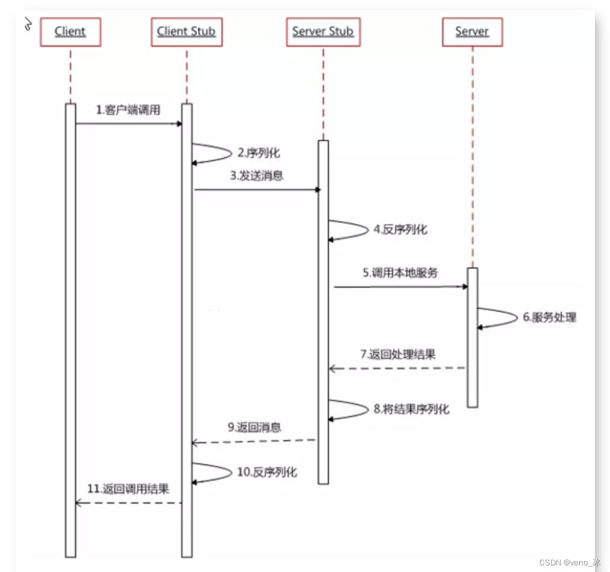
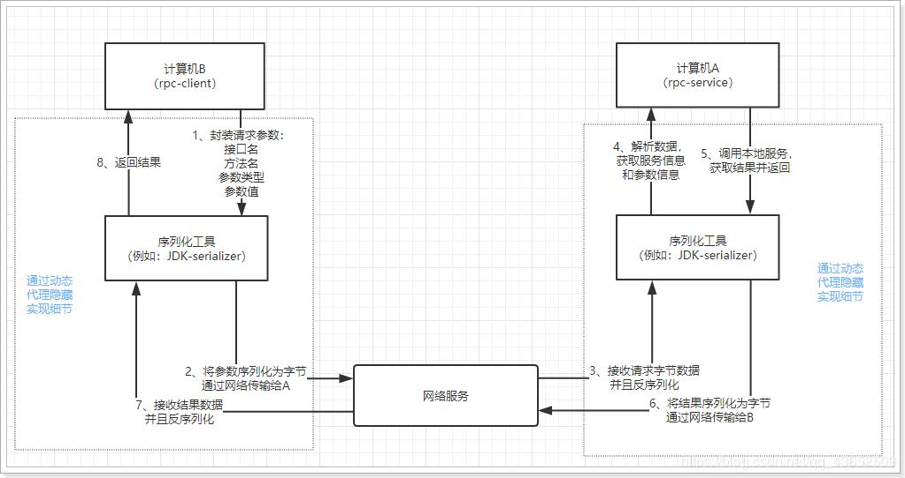
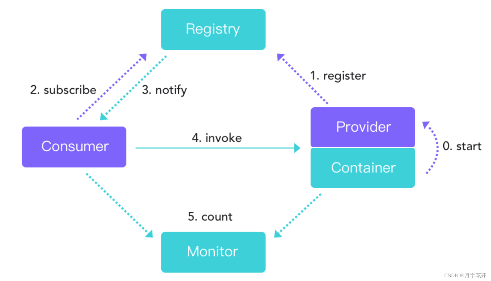

# RPC:远程过程调用协议

RPC（Remote Procedure Call，远程过程调用）协议工作在OSI七层模型的**会话层（Session Layer）**，也就是第五层。RPC允许一个程序在不同的地址空间（通常是不同的计算机）上调用另一个程序，而不需要程序员显式地编写数据的网络传递代码。

需要注意的是，虽然RPC通常与会话层相关联，但实际上它的实现可能跨越多个OSI层，包括传输层和应用层，具体取决于RPC的具体实现方式。例如，一些RPC实现可能会使用传输层的TCP协议来保证数据的可靠传输。但是，从概念和功能的角度来看，RPC主要关联于会话层，因为它涉及到了应用程序会话的建立和管理。

## 提出背景

### 1.写在前面

日常做简单的管理后台系统，一般采用的单体架构：应用、数据库部署在一台服务器

伴随业务越来越多，需求功能越多，要求越高，服务逐渐细分：订单子系统，业务子系统等，系统服务间需要通过远程分布式接口调用通讯，即不同的服务部署在不同服务器上，比如订单子系统在 A 服务上，业务子系统服务在B服务器上，有同步调用、也有异步调用，这个时候我们就需要远程调用不同的服务，使用的时候调用远程服务就像调用本地服务一样方便，将B服务打成jar包，A服务项目引入B服务 jar 包，就能通过 this.xxx( ) 一样调用远程服务，这背后的机制就是通过 RPC 技术。

### 2.电商系统的演变

Dubbo开始于电商系统，因此在这里先从电商系统的演变讲起。

#### 2.1 单一应用框架

当网站流量很小时，只需一个应用，将所有功能如查询、下单、支付、订单管理等都部署在一起，以减少部署节点和成本。

缺点：单一的系统架构，使得在开发过程中，占用的资源越来越多，而且随着流量的增加越来越难以维护。

#### 2.2 垂直应用框架

垂直应用架构解决了单一应用架构所面临的扩容问题，流量能够分散到各个子系统当中，且系统的体积可控，一定程度上降低了开发人员之间协同以及维护的成本，提升了开发效率。

缺点：但是在垂直架构中相同逻辑代码需要不断的复制，不能复用。

#### 2.3 分布式应用架构(RPC)

当垂直应用越来越多，应用之间交互不可避免，将核心业务抽取出来，作为独立的服务，逐渐形成稳定的服务中心。

#### 2.4 流动计算架构(SOA)

随着服务化的进一步发展，服务越来越多，服务之间的调用和依赖关系也越来越复杂，诞生了面向服务的架构体系(SOA)，也因此衍生出了一系列相应的技术，如对服务提供、服务调用、连接处理、通信协议、序列化方式、服务发现、服务路由、日志输出等行为进行封装的服务框架。

#### 2.5 架构演变详解

从以上是电商系统的演变可以看出架构演变的过程：

1. 单应用单服务器；
2. 单应用拆分成多个应用并部署到多个服务器；
3. 单应用拆分成多个应用并实现分布式部署；
4. 流动计算框架（用于提高机器利用率的资源调度和治理中心）

##### 2.5.1 单一应用架构

当网站流量很小时，只需一个应用，将所有功能都部署在一起，以减少部署节点和成本。 此时，用于简化增删改查工作量的 ``数据访问框架(ORM)`` 是关键。

##### 2.5.2 垂直应用架构

当访问量逐渐增大，单一应用增加机器带来的加速度越来越小，将应用拆成互不相干的几个应用，以提升效率。此时，用于加速前端页面开发的 ``Web框架(MVC)`` 是关键。

##### 2.5.3 分布式服务架构

当垂直应用越来越多，应用之间交互不可避免，将核心业务抽取出来，作为独立的服务，逐渐形成稳定的服务中心，使前端应用能更快速的响应多变的市场需求。此时，用于提高业务复用及整合的 ``分布式服务框架(RPC)`` 是关键。

##### 2.5.4 流动计算架构

当服务越来越多，容量的评估，小服务资源的浪费等问题逐渐显现，此时需增加一个调度中心基于访问压力实时管理集群容量，提高集群利用率。此时，用于提高机器利用率的 ``资源调度和治理中心(SOA)`` 是关键。

### 3.远程调用方式

无论是微服务还是分布式服务（都是SOA，都是面向服务编程），都面临着服务间的远程调用。那么服务间的远程调用方式有哪些呢？

常见的远程调用方式有以下几种：

#### 3.1 RPC

Remote Produce Call 远程过程调用，类似的还有RMI（Remote Methods Invoke 远程方法调用，是JAVA中的概念，是JAVA十三大技术之一）。自定义数据格式，基于原生TCP通信，速度快，效率高。早期的webservice，现在热门的dubbo，都是RPC的典型

- RPC的框架：webservie(cxf)、dubbo
- RMI的框架：hessian

#### 3.2 Http

http其实是一种网络传输协议，基于TCP，规定了数据传输的格式。现在客户端浏览器与服务端通信基本都是采用Http协议。也可以用来进行远程服务调用。缺点是消息封装臃肿。

现在热门的Rest风格，就可以通过http协议来实现。

- http的实现技术：HttpClient

#### 相同点

- 底层通讯都是基于socket，都可以实现远程调用，都可以实现服务调用服务

#### 不同点

- RPC：框架有：dubbo、cxf、（RMI远程方法调用）Hessian
  - 当使用RPC框架实现服务间调用的时候，要求服务提供方和服务消费方 都必须使用统一的RPC框架，要么都dubbo，要么都cxf
  - 跨操作系统在同一编程语言内使用
  - 优势：调用快、处理快

- http：框架有：httpClient
  - 当使用http进行服务间调用的时候，无需关注服务提供方使用的编程语言，也无需关注服务消费方使用的编程语言，服务提供方只需要提供restful风格的接口，服务消费方，按照restful的原则，请求服务，即可
  - 跨系统跨编程语言的远程调用框架
  - 优势：通用性强

#### 总结：对比RPC和http的区别

1） RPC要求服务提供方和服务调用方都需要使用相同的技术，要么都hessian，要么都dubbo
而http无需关注语言的实现，只需要遵循rest规范
2） RPC的开发要求较多，像Hessian框架还需要服务器提供完整的接口代码(包名.类名.方法名必须完全一致)，否则客户端无法运行
3） Hessian只支持POST请求
4） Hessian只支持JAVA语言

## RPC概述

### 1.什么是PRC

RPC(Remote Procedure Call Protocol)：**远程过程调用协议**
RPC是一种协议，一种远程过程调用协议，规定了双方通信采用什么格式、以及数据如何传输。

- 指明调用类或者接口
- 指名调用的方法及参数

1. RPC解决的问题：

- 数据怎么封装
- 数据怎么传输，适配不同的协议

2. RPC调用过程可以分为四个阶段，分别是**服务暴露过程**、**服务发现过程**、**服务引用过程**和**方法调用过程**。

3. RPC采用**客户机/服务器模式**。请求程序就是一个客户机，而服务提供程序就是一个服务器。首先，客户机调用进程发送一个有进程参数的调用信息到服务进程，然后等待应答信息。在服务器端，进程保持睡眠状态直到调用信息到达为止。当一个调用信息到达，服务器获得进程参数，计算结果，发送答复信息，然后等待下一个调用信息，最后，客户端调用进程接收答复信息，获得进程结果，然后调用执行继续进行。

4. RPC两个核心模块

- 通讯
- 序列化

### 2.RPC是什么

RPC（Remote Procedure Call）叫作远程过程调用，是一个计算机通信协议，它是利用网络从远程计算机上请求服务，可以理解为把程序的一部分放在其他远程计算机上执行。通过网络通信将调用请求发送至远程计算机后，利用远程计算机的系统资源执行这部分程序，最终返回远程计算机上的执行结果
RPC 是指计算机 A 上的进程，调用另外一台计算机 B 上的进程，其中 A 上的调用进程被挂起，而 B 上的被调用进程开始执行，当值返回给 A 时，A 进程继续执行。调用方可以通过使用参数将信息传送给被调用方，而后可以通过传回的结果得到信息

>说得通俗一点就是：A计算机提供一个服务，B计算机可以像调用本地服务那样调用A计算机的服务。
RPC 的主要功能目标是让构建分布式计算（应用）更容易，在提供强大的远程调用能力时不损失本地调用的语义简洁性

### 3.RPC剖析

通过上面的概念，我们可以知道，实现RPC主要是做到两点：

- 实现远程调用其他计算机的服务
  - 要实现远程调用，肯定是通过网络传输数据。A程序提供服务，B程序通过网络将请求参数传递给A，A本地执行后得到结果，再将结果返回给B程序。这里需要关注的有两点：
    - 1）采用何种网络通讯协议？
      - 现在比较流行的RPC框架，都会采用TCP作为底层传输协议
    - 2）数据传输的格式怎样？
      - 两个程序进行通讯，必须约定好数据传输格式。就好比两个人聊天，要用同一种语言，否则无法沟通。所以，我们必须定义好请求和响应的格式。另外，数据在网路中传输需要进行序列化，所以还需要约定统一的序列化的方式。
- 像调用本地服务一样调用远程服务
  - 如果仅仅是远程调用，还不算是RPC，因为RPC强调的是过程调用，调用的过程对用户而言是应该是透明的，用户不应该关心调用的细节，可以像调用本地服务一样调用远程服务。所以RPC一定要对调用的过程进行封装

#### 3.1.RPC的工作原理

RPC 是一个分布式计算的 CS 模式，总是由 Client 向 Server 发出一个执行若干过程请求，Server 接受请求，使用者客户端提供的参数，计算完成之后将结果返回给客户端。

RPC 工作原理总结：

- Provider：服务提供方，CS 模型中的 Server。
- Consumer： 调用远程服务服务消费方，CS 模型中的 Client。
- Registry：服务注册与发现的服务管理中心。
- Monitor：统计服务的调用次数和调用时间的监控中心。
- Container：服务运行容器，如 jetty。

执行流程：
1）服务集成 RPC 后，服务（这里的服务就是图中的 Provider，服务提供者）启动后会通过 Register（注册）模块，把服务的唯一 ID 和 IP 地址，端口信息等注册到 RPC 框架注册中心（图中的 Registry 部分）。
2）当调用者（Consumer）想要调用服务的时候，通过 Provider 注册时的的服务唯一 ID 去注册中心查找在线可供调用的服务，返回一个 IP 列表（3.notify 部分）。
3）第三步 Consumer 根据一定的策略，比如随机 or 轮训从 Registry 返回的可用 IP 列表真正调用服务（4.invoke）。
4）最后是统计功能，RPC 框架都提供监控功能，监控服务健康状况，控制服务线上扩展和上下线（5.count）

RPC 执行过程总结：

1. 服务容器负责启动，加载，运行服务提供者。
2. 服务提供者在启动时，向注册中心注册自己提供的服务，暴露自己的 IP 和端口信息。
3. 服务消费者在启动时，向注册中心订阅自己所需的服务。
4. 注册中心返回服务提供者列表给消费者，如果有变更，注册中心将基于长连接推送给数据消费者。
5. 服务消费者，从提供这地址列表中，基于软负载均衡算法，选一台提供者进行调用，如果调用失败，再选另外一台服务调用。
6. 服务消费者和提供者，在内存中累计调用次数和调用时间，定时发送一次统计数据到监控中心。

#### 3.2.RPC 调用分类

RPC 调用分以下两种：

1. 同步调用
    客户方等待调用执行完成并返回结果。
2. 异步调用
    客户方调用后不用等待执行结果返回，但依然可以通过回调通知等方式获取返回结果。 若客户方不关心调用返回结果，则变成单向异步调用，单向调用不用返回结果。

>注：异步和同步的区分在于是否等待服务端执行完成并返回结果。

#### 3.3. RPC需要解决的问题

1）通讯问题：主要是通过在客户端和服务器之间建立TCP连接，远程过程调用的所有交换的数据都在这个连接里传输。连接可以是按需连接，调用结束后就断掉，也可以是长连接，多个远程过程调用共享同一个连接。

2）寻址问题：A服务器上的应用怎么告诉底层的RPC框架，如何连接到B服务器（如主机或IP地址）以及特定的端口，方法的名称名称是什么，这样才能完成调用。比如基于Web服务协议栈的RPC，就要提供一个endpoint URI，或者是从UDDI服务上查找。如果是RMI调用的话，还需要一个RMI Registry来注册服务的地址。

3）序列化 与 反序列化：当A服务器上的应用发起远程过程调用时，方法的参数需要通过底层的网络协议如TCP传递到B服务器，由于网络协议是基于二进制的，内存中的参数的值要序列化成二进制的形式，也就是序列化（Serialize）或编组（marshal），通过寻址和传输将序列化的二进制发送给B服务器。

同理，B服务器接收参数要将参数反序列化。B服务器应用调用自己的方法处理后返回的结果也要序列化给A服务器，A服务器接收也要经过反序列化的过程。

#### 3.4.使用 RPC,必须关注各种安全问题

1. 客户端发送消息到远程过程，那个过程是可信的吗?
2. 客户端发送消息到远程计算机，那个远程机器是可信的吗?
3. 服务器如何验证接收的消息是来自合法的客户端吗?服务器如何识别客户端?
4. 消息在网络中传播如何防止时被其他进程嗅探?
5. 可以由其他进程消息被拦截和修改时遍历网络从客户端到服务器或服务器端?
6. 协议能防止重播攻击吗?
7. 如何防止消息在网络传播中被意外损坏或截断?

#### 3.5.远程过程调用的优点

远程过程调用有诸多的优点：

1. 你不必担心传输地址问题。服务器可以绑定到任何可用的端口,然后用 RPC 名称服务来注册端口。客户端将通过该名称服务来找到对应的端口号所需要的程序。而这一切对于程序员来说是透明的。
2. 系统可以独立于传输提供者。自动生成服务器存根使其可以在系统上的任何一个传输提供者上可用,包括 TCP 和 UDP，而这些，客户端可以动态选择的。当代码发送以后，接收消息是自动生成的，而不需要额外的编程代码。
3. 应用程序在客户端只需要知道一个传输地址——名称服务，负责告诉应用程序去哪里连接服务器函数集。
4. 使用函数调用模型来代替 socket 的发送/接收(读/写)接口。用户不需要处理参数的解析。

#### 3.6.本地调用和 RPC 调用的一些差异

1. 本地调用一定会执行，而远程调用则不一定，调用消息可能因为网络原因并未发送到服务方。
2. 本地调用只会抛出接口声明的异常，而远程调用还会跑出 RPC 框架运行时的其他异常。
3. 本地调用和远程调用的性能可能差距很大，这取决于 RPC 固有消耗所占的比重。
正是这些区别决定了使用 RPC 时需要更多考量。当调用远程接口抛出异常时，异常可能是一个业务异常，也可能是 RPC 框架抛出的运行时异常（如：网络中断等）。业务异常表明服务方已经执行了调用，可能因为某些原因导致未能正常执行，而 RPC 运行时异常则有可能服务方根本没有执行，对调用方而言的异常处理策略自然需要区分。

由于 RPC 固有的消耗相对本地调用高出几个数量级，本地调用的固有消耗是纳秒级，而 RPC 的固有消耗是在毫秒级。那么对于过于轻量的计算任务就并不合适导出远程接口由独立的进程提供服务，只有花在计算任务上时间远远高于 RPC 的固有消耗才值得导出为远程接口提供服务。

## 经典面试问题

### 1、面试官：服务启动的时候服务基本信息被注册到注册中心，如果服务提供者挂了，注册中心如何知道服务不可用了呢？

答：服务掉线分为主动下线和心跳检测
比如服务由于发版时，在重启之前先主动通知注册中心：我要重启了，有流量进来先不要分给我，让别的机器服务，等我重启成功后在放流量进来，或者是在管理后台手动直接摘掉机器，这个是主动下线。

**心跳检测**是处理服务非正常下线（如断电断网）的情况，这个时候如果注册中心不知道该服务已经掉线，一旦被其调用就会带来问题。为了避免出现这样的情况，注册中心增加一个心跳检测功能，它会对服务提供者（Provider）进行心跳检测，比如每隔 30s 发送一个心跳，如果三次心跳结果都没有返回值，就认为该服务已下线，赶紧更新 Consumer 的服务列表，告诉 Consumer 调用别的机器。

**问题分析：**阐述了服务端挂了注册中心如何感知的问题，你以为此问题已经完事儿了？还没有，你成功给自己挖了个坑，面试官可能继续深挖，服务提供者（Provider）挂了注册中心能解决，那注册中心自己就不挂了吗？三连问继续。

### 2、面试官：如果注册中心挂了，比如你用的是 Zookeeper，如果 Zookeeper 挂了，那服务之间还能相互调用吗？

答：首先注册中心挂掉也要分两种情况，如果数据库挂了，ZK 还是能用的，因为 ZK 会缓存注册机列表在缓存里。
其次 ZK 本身就是一个集群的，一台机器挂了，ZK 会选举出集群中的其他机器作为 Master 继续提供服务，如果整个集群都挂了也没问题，因为调用者本地会缓存注册中心获取的服务列表。省略和注册中心的交互，Consumer 和 Provider 采用直连方式，这些策略都是可配置的。

**问题分析：** 面试是一个自由交流时间，任何一个点都可能被发散继续深入挖掘，刨根问题，总有你覆盖不到的知识盲区，目的不是为难你，是想了解你的技术沉淀深度。

### 3、面试官：你对 RPC 了解的很透彻，那你能否自己写一个 RPC 框架？可以简答描述下思路也行

答：这个问题，虽然没有自己动手写过，但是我阅读过源码，大致实现思路是这样的。（画图给面试官）

1. 客户端 invoke 方法编写，使用 JDK 的动态代理技术，客户端调用远程服务方法时调用的是 InvocationHandler 的 invoke 方法。
2. 客户端 Filter 方法编写，完善的 RPC 框架少不了监控、路由、降级、鉴权等功能。
3. 创建 Socket，在 Filter 方法中实现 Client.write 方法，其逻辑为从连接池（ChannelPool）中获取连接，然后将数据写进 Channel。
4. 实现数据序列化、压缩，目的减少网络传输的数据量，向服务端发送 request 数据，这里可以使用 Netty 异步通讯框架。
5. 服务端收到客户端发过的消息后，从 Channel 中将消息读出来之前，也会先经反序列化解压。
6. 请求就到了服务端 Filter 中。请求依次经过监控、鉴权方法。
7. 根据客户端传递来的服务信息和参数，通过反射调用相应的业务服务并拿到业务处理结果。然后在 ResponseFilter 中将返回结果写入 Channel。
8. 服务端序列化、压缩等，发送给客户端。
9. 客户端收到消息后，经过客户端反序列化、解压缩，后交给 ResponseThreadPoolProcessor 线程池处理。
10. ResponseThreadPoolProcessor 收到消息后，就将结果返回给之前的方法调用，整个调用请求就结束了。
