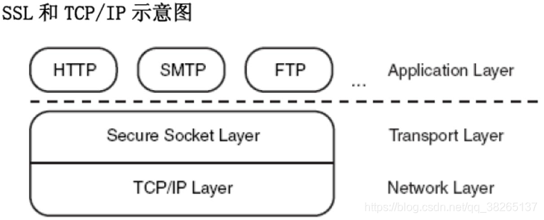

# SSL协议原理详解

## SSL简介

### SSL和TLS

SSL (Secure Sockets Layer)安全套接层。是由Netscape公司于1990年开发，用于保障Word Wide Web（WWW）通讯的安全。主要任务是提供私密性，信息完整性和身份认证。1994年改版为SSLv2，1995年改版为SSLv3.

TLS(Transport Layer Security)安全传输层协议，用于在两个通信应用程序之间提供保密性和数据完整性。该标准协议是由IETF于1999年颁布，整体来说TLS非常类似SSLv3，只是对SSLv3做了些增加和修改。

### SSL协议介绍

SSL是一个不依赖于平台和运用程序的协议，位于TCP/IP协议与各种应用层协议之间，为数据通信提高安全支持。



## SSL加密知名协议

### HTTP over SSL

简写https，加密网页浏览是设计SSL的初衷，HTTP也是第一个使用SSL保障安全的应用层协议。

​当Netscape在它的Navigator里面运用HTTP over SSL的时候，使用`https://`来标识HTTP over SSL，因此我常见的https的全称就是HTTP over SSL。后来HTTPS在RFC2818被标准化。HTTPS工作在`443`端口，而HTTP默认工作在`80`端口。

### Email over SSL

类似于HTTP over SSL，邮件协议例如：

- SMTP，POP3、IMAP也能支持SSL。
- SMTP over TLS的标准文档在RFC2487
- POP3和IMAP over TLS的标准化文档在RFC2595.

## SSL原理详解

### SSL协议结构


SSL的体系结构中包含两个协议子层，其中底层是SSL记录协议层（SSL Record Protocol Layer）；高层是SSL握手协议层（SSL HandShake Protocol Layer）。

SSL协议主要分为两层：

- SSL记录协议层的作用是为高层协议提供基本的安全服务。SSL纪录协议针对HTTP协议进行了特别的设计，使得超文本的传输协议HTTP能够在SSL运行。纪录封装各种高层协议，具体实施压缩解压缩、加密解密、计算和校验MAC等与安全有关的操作。

- SSL握手协议层包括SSL握手协议（SSL HandShake Protocol）、SSL密码参数修改协议（SSL Change Cipher Spec Protocol）和SSL告警协议（SSL Alert Protocol）。握手层的这些协议用于SSL管理信息的交换，允许应用协议传送数据之间相互验证，协商加密算法和生成密钥等。
**SSL握手协议的作用是协调客户和服务器的状态，使双方能够达到状态的同步。**

其中最重要的是记录协议和握手协议：

- SSL记录协议：它建立在可靠的传输（如TCP）之上，为高层协议提供数据封装、压缩、加密等基本功能。
- SSL握手协议：它建立在SSL记录协议之上，用于在实际的数据传输开始之前，通讯双方进行身份认证、协商加密算法、交换加密密钥等。

### SSL建立阶段与IPSec 类比的话

可以分为两个大阶段：

（1）SSL建立的第一阶段：Handshake phase（握手阶段）：

- 协商加密算法
- 认证服务器
- 建立用于加密和MAC（Message Authentication Code）用的密钥

>该阶段类似于IPSec IKE的作用。

（2）SSL建立第二阶段：Secure data transfer phase（安全的数据传输阶段）：

- 在已经建立的SSL连接里安全的传输数据。

>该阶段类似于IPSec ESP的作用

### SSL原理（SSL建立）握手协议总过程


在用SSL进行通信之前，首先要使用SSL的Handshake协议在通信两端握手，协商数据传输中要用到的相关安全参数（如加密算法、共享密钥、产生密钥所要的材料等），并对对端的身份进行验证。

**SSL的建立过程总共有13个包，第一次建立至少需要9个包**。

#### SSL建立第一阶段

客户端首先发送ClientHello消息到服务端，服务端收到ClientHello消息后，再发送ServerHello消息回应客户端。


##### ClientHello

握手第一步是客户端向服务端发送 Client Hello 消息，这个消息里包含了一个客户端生成的随机数 Random1、客户端支持的加密套件（Support Ciphers）和 SSL Version 等信息。


ClientHello中涉及到的消息具体如下：

- 客户端版本
    按优先级列出客户端支持的协议版本，首选客户端希望支持的最新协议版本。

- 客户端随机数Random

- 会话ID（Session id）
    如果客户端第一次连接到服务器，那么这个字段就会保持为空。上图中该字段为空，说明这是第一次连接到服务器。

    如果该字段不为空，说明以前是与服务器有连接的，在此期间，服务器将使用ession ID映射对称密钥，并将Session ID存储在客户端浏览器中，为映射设置一个时间限。如果浏览器将来连接到同一台服务器（在时间到期之前），它将发送Session ID，服务器将对映射的Session ID进行验证，并使用以前用过的对称密钥来恢复Session，这种情况下不需要完全握手。也叫作**SSL会话恢复**。后面会有介绍。

- 加密套件：
    客户端会给服务器发送自己已经知道的密码套件列表，这是由客户按优先级排列的，但完全由服务器来决定发送与否。TLS中使用的密码套件有一种标准格式。上面的报文中，客户端发送了74套加密套件。服务端会从中选出一种来作为双方共同的加密套件。

- 压缩方法：
    为了减少带宽，可以进行压缩。但从成功攻击TLS的事例中来看，其中使用压缩时的攻击可以捕获到用HTTP头发送的参数，这个攻击可以劫持Cookie，这个漏洞我们称为CRIME。**从TLS 1.3开始，协议就禁用了TLS压缩**。

- 扩展包：
    其他参数（如服务器名称，填充，支持的签名算法等）可以作为扩展名使用。
    这些是客户端问候的一部分，如果已收到客户端问候，接下来就是服务器的确认，服务器将发送服务器问候。

##### ServerHello

收到**客户端问候**之后服务器必须发送**服务器问候**信息，服务器会检查指定诸如TLS版本和算法的客户端问候的条件，如果服务器接受并支持所有条件，它将发送其证书以及其他详细信息，否则，服务器将发送握手失败消息。

如果接受，第二步是服务端向客户端发送 Server Hello 消息，这个消息会从 Client Hello 传过来的 Support Ciphers 里确定一份加密套件，这个套件决定了后续加密和生成摘要时具体使用哪些算法，另外还会生成一份随机数 **Random2**。注意，至此客户端和服务端都拥有了两个随机数（Random1+ Random2），这两个随机数会在后续生成对称秘钥时用到。


ServerHello中涉及到的具体参数：

- 服务器版本Version：
    服务器会选择客户端支持的最新版本。

- 服务器随机数Random：
    服务器和客户端都会生成32字节的随机数。用来创建加密密钥。

- 加密套件：
    服务器会从客户端发送的加密套件列表中选出一个加密套件。

- 会话ID（Session ID）：

    服务器将约定的Session参数存储在TLS缓存中，并生成与其对应的Session id。它与Server Hello一起发送到客户端。客户端可以写入约定的参数到此Session id，并给定到期时间。客户端将在Client Hello中包含此id。如果客户端在此到期时间之前再次连接到服务器，则服务器可以检查与Session id对应的缓存参数，并重用它们而无需完全握手。这非常有用，因为服务器和客户端都可以节省大量的计算成本。

    在涉及亚马逊和谷歌等流量巨大的应用程序时，这种方法存在缺点。每天都有数百万人连接到服务器，服务器必须使用Session密钥保留所有Session参数的TLS缓存。这是一个巨大的开销。

    为了解决这个问题，在扩展包里加入了**Session Tickets**, 在这里，客户端可以在client hello中指定它是否支持Session Ticket。然后，服务器将创建一个**新的会话票证(Session Ticket)**，并使用只有服务器知道的经过私钥加密的Session参数。它将存储在客户端上，因此所有Session数据仅存储在客户端计算机上，但Ticket仍然是安全的，因为该密钥只有服务器知道。

    此数据可以作为名为Session Ticket的扩展包含在Client Hello中。

- 压缩算法：
    如果支持，服务器将同意客户端的首选压缩方法。

- 扩展包

**这个阶段之后，客户端服务端知道了下列内容**：

1. SSL版本
2. 密钥交换、信息验证和加密算法
3. 压缩方法
4. 有关密钥生成的两个随机数。

#### SSL建立第二阶段

服务器向客户端发送消息。


服务器启动SSL握手第2阶段，是本阶段所有消息的唯一发送方，客户机是所有消息的唯一接收方。该阶段分为4步：

1. 证书：服务器将数字证书和到根CA整个链发给客户端，使客户端能用服务器证书中的服务器公钥认证服务器。
2. 服务器密钥交换（可选）：这里视密钥交换算法而定
3. 证书请求：服务端可能会要求客户自身进行验证。
4. 服务器握手完成：第二阶段的结束，第三阶段开始的信号

##### Certificate消息（可选）—第一次建立必须要有证书

一般情况下，除了会话恢复时不需要发送该消息，在SSL握手的全流程中，都需要包含该消息。消息包含一个X.509证书，证书中包含公钥，发给客户端用来验证签名或在密钥交换的时候给消息加密。

这一步是服务端将自己的证书下发给客户端，让客户端验证自己的身份，客户端验证通过后取出证书中的公钥。


##### Server Key Exchange（可选）

根据之前在ClientHello消息中包含的CipherSuite信息，决定了密钥交换方式（例如RSA或者DH），因此在Server Key Exchange消息中便会包含完成密钥交换所需的一系列参数。


因为这里是DH算法，所以需要发送服务器使用的DH参数。RSA算法不需要这一步。

>在Diffie-Hellman中，客户端无法自行计算预主密钥; 双方都有助于计算它，因此客户端需要从服务器获取Diffie-Hellman公钥。
由上图可知，此时密钥交换也由签名保护。

##### Certificate Request（可选）------可以是单向的身份认证，也可以双向认证

这一步是可选的，如果在对安全性要求高的常见可能用到。服务器用来验证客户端。服务器端发出Certificate Request消息，要求客户端发他自己的证书过来进行验证。该消息中包含服务器端支持的证书类型（RSA、DSA、ECDSA等）和服务器端所信任的所有证书发行机构的CA列表，客户端会用这些信息来筛选证书。

##### Server Hello Done

该消息表示服务器已经将所有信息发送完毕，接下来等待客户端的消息。


#### SSL建立第三阶段

客户端收到服务器发送的一系列消息并解析后，将本端相应的消息发送给服务器。


客户机启动SSL握手第3阶段，是本阶段所有消息的唯一发送方，服务器是所有消息的唯一接收方。该阶段分为3步：

1. 证书（可选）：为了对服务器证明自身，客户要发送一个证书信息，这是可选的，在IIS中可以配置强制客户端证书认证。
2. 客户机密钥交换（Pre-master-secret）：这里客户端将预备主密钥发送给服务端，注意这里会使用服务端的公钥进行加密。
3. 证书验证（可选），对预备秘密和随机数进行签名，证明拥有（a）证书的公钥。

##### Certificate（可选）

如果在第二阶段服务器端要求发送客户端证书，客户端便会在该阶段将自己的证书发送过去。服务器端在之前发送的Certificate Request消息中包含了服务器端所支持的证书类型和CA列表，因此客户端会在自己的证书中选择满足这两个条件的第一个证书发送过去。若客户端没有证书，则发送一个no_certificate警告。

##### Client Key exchange

根据之前从服务器端收到的随机数，按照不同的密钥交换算法，算出一个pre-master，发送给服务器，服务器端收到pre-master算出main master。而客户端当然也能自己通过pre-master算出main master。如此以来双方就算出了对称密钥。

如果是RSA算法，会生成一个48字节的随机数，然后用server的公钥加密后再放入报文中。如果是DH算法，这是发送的就是客户端的DH参数，之后服务器和客户端根据DH算法，各自计算出相同的pre-master secret.


本消息在给服务器发送的过程中，使用了服务器的公钥加密。服务器用自己的私钥解密后才能得到pre-master key.（向服务器证明自己的确持有客户端证书私钥。）

##### Certificate verify（可选）

只有在客户端发送了自己证书到服务器端，这个消息才需要发送。其中包含一个签名，对从第一条消息以来的所有握手消息的HMAC值（用master_secret）进行签名。

#### SSL建立第四阶段

完成握手协议，建立SSL连接。


客户机启动SSL握手第4阶段，使服务器结束。该阶段分为4步，前2个消息来自客户机，后2个消息来自服务器。

建立起一个安全的连接，客户端发送一个Change Cipher Spec消息，并且把协商得到的CipherSuite拷贝到当前连接的状态之中。然后，客户端用新的算法、密钥参数发送一个Finished消息，这条消息可以检查密钥交换和认证过程是否已经成功。其中包括一个校验值，对客户端整个握手过程的消息进行校验。服务器同样发送Change Cipher Spec消息和Finished消息。握手过程完成，客户端和服务器可以交换应用层数据进行通信。

##### ChangeCipherSpec

编码改变通知，表示随后的信息都将用双方商定的加密方法和密钥发送（`ChangeCipherSpec`是一个独立的协议，体现在数据包中就是一个字节的数据，用于告知服务端，客户端已经切换到之前协商好的加密套件（Cipher Suite）的状态，准备使用之前协商好的加密套件加密数据并传输了）。


>是一条事件消息。

##### Clinet Finished

**客户端握手结束通知**, 表示客户端的握手阶段已经结束。这一项同时也是前面发送的所有内容的hash值，用来供服务器校验（使用**HMAC算法**计算收到和发送的所有握手消息的摘要，然后通过RFC5246中定义的一个伪函数[PRF](https://datatracker.ietf.org/doc/html/rfc5246#section-5)计算出结果，加密后发送。此数据是为了在正式传输应用数据之前对刚刚握手建立起来的加解密通道进行验证。）

##### Server Finished

服务端握手结束通知。

1. 使用私钥解密加密的Pre-master数据，基于之前(Client Hello 和 Server Hello)交换的两个明文随机数 `random_C` 和 `random_S`，计算得到协商密钥:`enc_key=Fuc(random_C, random_S, Pre-Master)`;
2. 计算之前所有接收信息的 hash 值，然后解密客户端发送的`encrypted_handshake_message`，验证数据和密钥正确性;
3. 发送一个 `ChangeCipherSpec`（告知客户端已经切换到协商过的加密套件状态，准备使用加密套件和 `Session Secret`加密数据了）
4. 服务端也会使用 `Session Secret` 加密一段 `Finish` 消息发送给客户端，以验证之前通过握手建立起来的加解密通道是否成功。

根据之前的握手信息，如果客户端和服务端都能对Finish信息进行正常加解密且消息正确的被验证，则说明握手通道已经建立成功，接下来，双方可以使用上面产生的Session Secret对数据进行加密传输了。

### 消息验证代码（HMAC）和TLS数据完整性

当服务器或客户端使用主密钥加密数据时，它还会计算明文数据的校验和（哈希值），这个校验和称为**消息验证代码（MAC）**。然后在发送之前将MAC包含在加密数据中。密钥用于从数据中生成MAC，以确保传输过程中攻击者无法从数据中生成相同的MAC，故而MAC被称为HMAC（哈希消息认证码）。另一方面，在接收到消息时，解密器将MAC与明文分开，然后用它的密钥计算明文的校验和，并将其与接收到的MAC进行比较，如果匹配，那我们就可以得出结论：数据在传输过程中没有被篡改。

### 几个重要的secret key

#### PreMaster secret

PreMaster Secret是在客户端使用RSA或者Diffie-Hellman等加密算法生成的。它将用来跟服务端和客户端在Hello阶段产生的随机数结合在一起生成 Master Secret。PreMaster secret前两个字节是TLS的版本号，这是一个比较重要的用来核对握手数据的版本号。服务端需要对密文中解密出来对的PreMaster版本号跟之前Client Hello阶段的版本号进行对比，如果版本号变低，则说明被串改，则立即停止发送任何消息。

#### Master secret

由于最后通过交换，客户端和服务端都会有Pre-master和随机数，这个随机数将作为后面产生Master secret的种子，结合PreMaster secret，客户端和服务端将计算出同样的Master secret。


为了保证信息的完整性和机密性，SSL需要有**六个加密密钥**：四个密钥和两个IV。为了信息的可信性，客户端需要一个密钥（HMAC），为了加密要有一个密钥，为了分组加密要一个IV，服务器也是如此。SSL需要的密钥是单向的，不同于那些在其他方向的密钥。如果在一个方向上有攻击，这种攻击在其他方向是没影响的。生成过程如下：


主密钥是由一系列的Hash值组成:

```cpp
master_secret = PRF(pre_master_secret，“master secret”，ClientHello.random + ServerHello.random)[0..47];
```


根据要求，有4个密钥用于加密和验证每个消息的完整性，他们是：

> - 客户端写入加密密钥：客户端用来加密数据，服务器用来解密数据。
> - 服务器写入加密密钥：服务器用来加密数据，客户端用来解密数据。
> - 客户端写入MAC密钥：客户端用来创建MAC，服务器用来验证MAC。
> - 服务器写入MAC密钥：服务器用来创建MAC，客户端用来验证MAC。

### SSL会话恢复

会话恢复是指只要客户端和服务器已经通信过一次，它们就可以通过会话恢复的方式来跳过整个握手阶段二直接进行数据传输。


SSL采用会话恢复的方式来减少SSL握手过程中造成的巨大开销。

为了加快建立握手的速度，减少协议带来的性能降低和资源消耗(具体分析在后文)，TLS 协议有两类会话缓存机制：

- 会话标识 session ID: 由服务器端支持，协议中的标准字段，因此基本所有服务器都支持，服务器端保存会话ID以及协商的通信信息，Nginx 中1M 内存约可以保存4000个 session ID 机器相关信息，占用服务器资源较多;
- 会话记录 session ticket :t需要服务器和客户端都支持，属于一个扩展字段，支持范围约60%(无可靠统计与来源)，将协商的通信信息加密之后发送给客户端保存，密钥只有服务器知道，占用服务器资源很少。
- 二者对比，主要是保存协商信息的位置与方式不同，类似与 http 中的 session 与 cookie。二者都存在的情况下，(nginx 实现)优先使用 session_ticket。

会话恢复具体过程(Session ID机制)：

1. 如果客户端和服务器之间曾经建立了连接，服务器会在握手成功后返回 session ID，并保存对应的通信参数在服务器中;
2. 如果客户端再次需要和该服务器建立连接，则在 client_hello 中 session ID 中携带记录的信息，发送给服务器;
3. 服务器根据收到的 session ID 检索缓存记录，如果没有检索到货缓存过期，则按照正常的握手过程进行;
4. 如果检索到对应的缓存记录，则返回 change_cipher_spec 与 encrypted_handshake_message 信息，两个信息作用类似，encrypted_handshake_message 是到当前的通信参数与 master_secret的hash 值;
5. 如果客户端能够验证通过服务器加密数据，则客户端同样发送 change_cipher_spec 与 encrypted_handshake_message 信息;
6. 服务器验证数据通过，则握手建立成功，开始进行正常的加密数据通信。

会话恢复具体过程(session ticket)：

1. 如果客户端和服务器之间曾经建立了连接，服务器会在 new_session_ticket 数据中携带加密的 session_ticket 信息，客户端保存;
2. 如果客户端再次需要和该服务器建立连接，则在 client_hello 中扩展字段 session_ticket 中携带加密信息，一起发送给服务器;
3. 服务器解密 sesssion_ticket 数据，如果能够解密失败，则按照正常的握手过程进行;
4. 如果解密成功，则返回 change_cipher_spec 与 encrypted_handshake_message 信息，两个信息作用与 session ID 中类似;
5. 如果客户端能够验证通过服务器加密数据，则客户端同样发送 change_cipher_spec与encrypted_handshake_message 信息;
6. 服务器验证数据通过，则握手建立成功，开始进行正常的加密数据通信。

### SSL记录协议

SSL记录协议主要用来实现对数据块的分块、加密解密、压缩与解压缩、完整性检查及封装各种高层协议。


每个SSL记录主要包含以下信息：

- 内容类型
- 协议版本号，目前有2.0和3.0版本
- 记录数据的长度
- 数据由载荷
- 散列算法计算消息认证代码


- 将消息分割为多个片段；
- 对每个片段进行压缩
- 加上片段编号(防止重放攻击)计算消息验证码MAC值(保证数据完整性)，追加在压缩片段
- 对称密码加密；
- 加上数据类型、版本号、压缩后的长度组成的报头， 就是最终的报文数据；

### 应用数据传输

在所有的握手阶段都完成之后，就可以开始传送应用数据了。应用数据在传输之前，首先要附加上MAC secret，然后再对这个数据包使用write encryption key进行加密。在服务端收到密文之后，使用Client write encryption key进行解密，客户端收到服务端的数据之后使用Server write encryption key进行解密，然后使用各自的write MAC key对数据的完整性包括是否被串改进行验证。

## HTTPS通信的过程


## 参考文档

[SSL/TLS协议详解(下)——TLS握手协议](https://xz.aliyun.com/t/2531)

[SSL详解](https://blog.csdn.net/shipfsh_sh/article/details/80419994)

[SL/TLS 握手过程详解](https://www.jianshu.com/p/7158568e4867)
