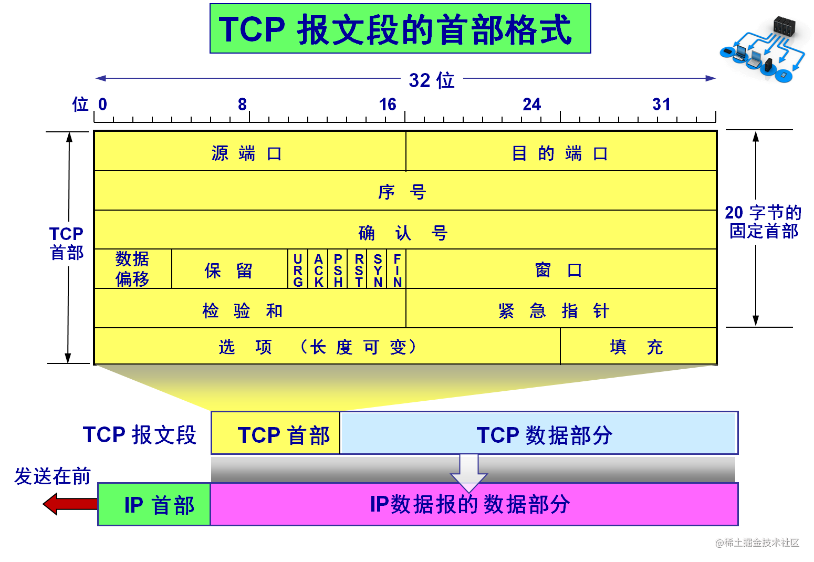
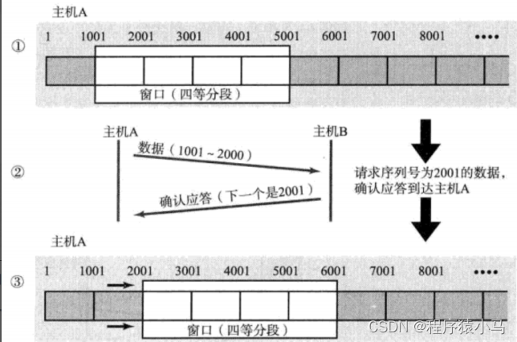
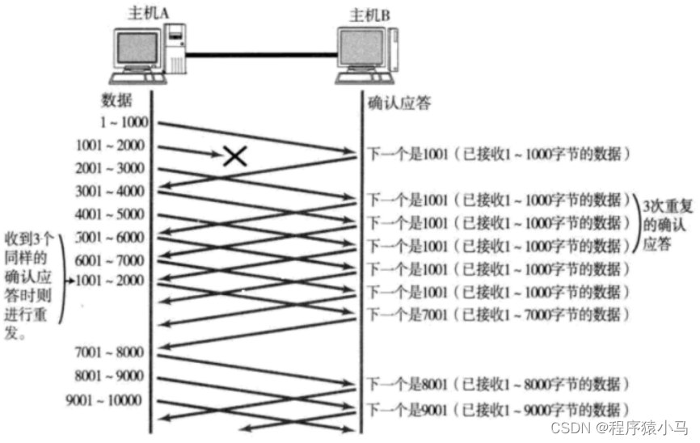
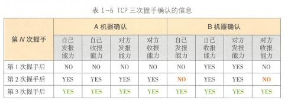
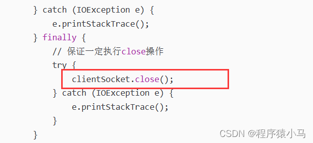

# TCP(Transmission Control Protocol) -- 传输控制协议

传输控制协议(Transmission Control Protocol，TCP)，是一种面向连接、确保数据在端到端间可靠传输的协议。

## 特点

### 1.有连接

面向连接的运输协议。TCP类似于打电话,需要建立连接,才可以发送消息.

### 2.可靠传输

TCP提供可靠的交付。发送方发送的数据,并不是百分百发送给接收方,而是尽力而为,尽可能的把数据传输过去,同时,如果还是传输不过去,至少能知道。

### 3.面向字节流

数据传输与文件读写类似,是"流式"的(一次可以读一个字节或者十个字节或者一百个字节)

### 4.全双工

一个通信通道,可以双向传输。(TCP连接的两端都接收发送缓存和接收缓存。)

### 5.端对端

每一条TCP连接只能有两个端点，一对一
>TCP发送报文的方式也和UDP不同，TCP不关心应用进程一次把多长的报文发送到TCP缓冲中，而是根据对方给出的窗口值和当前网络拥塞的程度来决定一个报文段含多少个字节。如果数据太长，TCP可以划分短一些再发送，如果数据太短，TCP可以等待积累到足够长再发送。

## TCP连接

TCP连接的端口叫做Socket套接字或插口。 根据RFC793的定义，端口号拼接到IP地址就是套接字。
>套接字socket= (ip地址：端口号)

### 会话和连接

- 连接(connection)：传输层的概念
  - 一种传输数据的行为，传输之前，建立一个连接数据收发双方的内存中都建立一个用于维护数据传输状态的对象
- 会话：应用层的概念
  - 有些系统设计中，会话会自动重连(重新创建连接)，或者帮助创建连接
  - 绘画也负责在多次连接中保存状态， 比如HTTP Session在多次请求(连接)间保持状态

### 双工和单工

- 单工：任何一个时刻，数据只能单向发送
  - 只需一条
- 半双工：某个时刻可以向一个方向传输，也可以反向向另一个方向反方向传输，交替进行。
  - 至少一条
- 全双工：任何时刻数据都可以双向收发
  - 大于一条

### Host(主机)

客户端和服务端在TCP协议中有一个平等的名词

### 可靠性

可靠性：保证数据无损传输

- 如果发送方按照顺序发送，然后数据无序地在网络间传递，就必须有一种算法在接手方将数据恢复原有的顺序。
- 如果发送方同时要把消息发送给多个接收方，这种情况叫多播。可靠性要求每个接收方都无损收到相同的副本
  - 多播情况：有一个消息到达任何一个接收者，那么所有的接受者必须都收到这种消息。

### TCP挥手和握手

TCP是一个连接导向的协议，设计有建立连接(握手)和断开连接(挥手)的过程。

- 如果一个Host主动向另一个Host发起连接，成为SYN(Synchronization),请求同步。
- 如果一个Host主动断开请求，称为FIN(Finish)，请求完成。
- 如果一个Host给另一个Host发送数据，称为PSH(Push)，数据推送。

>接收方收到数据后，都需要给发送方一个ACK相应

## TCP如何保证可靠传输

1. 建立连接：保障双方传输通道正常。
2. 数据包编号确认：保障数据到达。
3. 数据包有效性检验：保障数据正确性。
4. 超时重传：尽可能保证数据可达。
5. 滑动窗口和拥塞控制：避免网络拥堵导致传输失败。

**TCP是面向连接的，所以有客户端和服务端之分**需要服务端在相应端口上建立监听，等待客户端建立连接。
协议第二行和第三行是序列号。前者是指所发送数据包中数据部分第一个字节的序号，后者是指期望收到来自对方下一个数据包中数据部分第一个字节的序号。
头部长度(4bit)表示TCP报头的大小，这样接收方才能准确地计算出包中数据部分的开始位置。(数据部分以上的大小)
TCP的FLAG位(6bit)分别代表ACK、SYN、FIN、URG、PSH、RST，都以置1表示有效。
注：SYN：建立连接时的同步信号；ACK：对收到的数据进行确认，所确认的数据有确认序号表示；FIN：表示后面没有数据需要发送，同时意味着建立的连接需要关闭了。

## TCP Segment TCP协议段



TCp一个报文段分为首部和数据部分，而TCP的全部功能都体现在它首部中各个字段的作用。
>协议每一行4字节,任何一条数据都是有序号的,但是确认序号只有应答报文(ack)有。(序号和确认序号已经应答报文后面会详细介绍)  
>
### 1.第一行：源端口和目的端口 2字节+2字节 (32位)

1. 源端口（Source Port）：源计算机上的应用程序的端口号，占16 位(bit)。
2. 目的端口（Destination Port）：目标计算机的应用程序端口号，占16 位(bit)。

>TCP的分用功能是通过端口号实现的
>
### 2.第二行：序列号seq 4字节 (32位)

1. CP序列号（Sequence Number）：占(32bit)它表示本报文段所发送数据的第一个字节的编号。在 TCP 连接中，所传送的字节流的每一个字节都会按顺序编号。
   - 序号范围是[0,2^32-1]，使用 mod 2^32运算。TCP每一个字节都要按照顺序编号。
   - 如果SYN的值是1时，这个字段的值就是初始序列值(ISN)，用于对序列号进行同步。这时，第一个字节的序列号比这个字段的值大1，也就是ISN加1。
   - 当SYN标记不为1时，这是当前数据分段第一个字母的序列号；

### 3.第三行：确认号ACK 4字节 (32位)

TCP确认号:(Acknowledgment Number，ACK Number):占32位。

- 它表示接收方期望收到发送方下一个报文段的第一个字节数据的序号。
- 其值是接收计算机即将接收到的下一个序列号，也就是下一个接收到的字节的序列号加1。

>例如，B正确收到了A发送过来的一个报文段，其序号字段为501，数据长度为200，则序号为（501~700），这表明B正确接受了A发送到700为止的数据，因此B的期望收到的下一个数据序号为701。
==确认号为N，则说明到序号N-1为止的所有数据都已正确接收到。==

### 3.第四行 数据偏移+符号位+保留位+

#### (1)数据偏移字段

##### i.4位首部长度(Header Length)

1. 数据段中的“数据”部分起始处距离 TCP 数据段起始处的字节偏移量，占 4 位。
    >其实这里的“数据偏移”也是在确定 TCP 数据段头部分的长度，告诉接收端的应用程序，数据从何处开始。
2. 一个TCP报头长度是可变的,并不是像UDP的报头一样固定8个字节.
    >因此,首部长度就描述了TCP报头具体多长,另外,选项部分之前的固定是20个字节.
3. 首部长度(值*4字节)-20字节 = 选项长度(值*4字节)
    >注意：首部长度这里的单位不是字节,而是4字节.
    如果首部长度的值是5,此时表示整个TCP报头的长度是 4*5 = 20字节(此时相当于没有选项)
    如果首部长度的值是15,此时表示整个TCP报头的长度是4*15 = 60字节(此时相当于选项是40个字节)

##### ii.保留(3位) 3、4、6；  保留位+标志位=12

1. 为 TCP 将来的发展预留空间，目前必须全部为 0。
2. 在进行程序开发的时候,其中一个重点考虑的事情就是可扩展性(有些功能现在不需要,以后可能用得到).此处,TCP的保留6位,也是为了以后的扩展来考虑的.

>为什么要有保留位呢?
这是因为,对于网络协议来说,扩展升级是一件成本极高的事情.以UDP为例,UDP报文长度是2个字节,因此一个包最大是64kb,现在想要升级一下UDP协议,让它支持更大的长度,比如使用4个字节表示报文长度,理论上是可行的,但是实际操作成本极高.
比如:全世界上百亿能上网的计算机/路由器等等..此时这个设备的操作系统里,就是支持2个字节的UDP,要想进行升级,就需要让这些设备的操作系统都升级为能够支持4个字节的UDP.显然,这样做的成本极高.
如果引入了"保留位",此时升级操作成本就会降低不少,如果后续TCP引入了一些新的功能,就可以使用这些保留位字段,此时,对于原来TCP的报头结构的影响是最小的,老的设备即使不升级也更容易兼容.

##### iii.9位标志位

1. ECN:(NS—ECN-nonce)ECN显式拥塞通知（Explicit Congestion Notification）是对TCP的扩展，定义于RFC 3540（2003）。
   - ECN允许拥塞控制的端对端通知而避免丢包。ECN为一项可选功能，如果底层网络设施支持，则可能被启用ECN的两个端点使用。
   - 在ECN成功协商的情况下，ECN感知路由器可以在IP头中设置一个标记来代替丢弃数据包，以标明阻塞即将发生。
   - 数据包的接收端回应发送端的表示，降低其传输速率，就如同在往常中检测到包丢失那样。
2. CWR(Congestion Window Reduce)：拥塞窗口减少标志，用来表明它接收到了设置 ECE 标志的 TCP 包。
   - 并且，发送方收到消息之后，通过减小发送窗口的大小来降低发送速率
   - 理解：告知发送方，我方拥堵，你降低一下窗口发送速率
3. ECE==ECN（ECN Echo）：用来在 TCP 三次握手时表明一个 TCP 端是具备 ECN (显式拥塞通告)功能的。
   - 在数据传输过程中，它也用来表明接收到的 TCP 包的 IP 头部的 ECN 被设置为 11，即网络线路拥堵。
   - 理解：数据传输过程中，TCP包头部的ECN字段设置为11，表示网络线路拥堵
4. URG（Urgent）：紧急指针是否有效,表示本报文段中发送的数据是否包含紧急数据。URG=1 时表示有紧急数据。当 URG=1 时，后面的紧急指针字段才有效
   - 理解：标记是否有紧急数据，URG=1后面的紧急指针字段(Urgent Pointer)才有效
5. ACK：表示前面的确认号字段是否有效。ACK=1 时表示有效。只有当 ACK=1 时，前面的确认号字段才有效。
   - 标志位为1表示是应答报文,为0则不是应答报文。TCP 规定，连接建立后，ACK 必须为 1
   - 理解：ACK 必须为 1，表示TCP 确认号（Acknowledgment Number，ACK Number）有效
6. PSH（Push）：告诉对方收到该报文段后是否立即把数据推送给上层。如果值为 1，表示应当立即把数据提交给上层，而不是缓存起来
   - 理解：提示接收端应用程序立刻从 TCP 缓冲区把数据读走,告知接收方是否马上将数据提交给上层，PSH=1，马上提交不是缓存起来
7. RST：对方要求重新建立连接；我们把携带 RST 标识的称为 "复位报文段"
   - 表示是否重置连接。如果 RST=1，说明 TCP 连接出现了严重错误（如主机崩溃），必须释放连接，然后再重新建立连接。
   - 理解：是否释放连接，重新建立连接， RST=1需要重新连接
8. SYN：在建立连接时使用，用来同步序号。把携带 SYN 标识的称为 "同步报文段"
   - 当 SYN=1，ACK=0 时，表示这是一个请求建立连接的报文段；
   - 当 SYN=1，ACK=1 时，表示对方同意建立连接。
   - SYN=1 时，说明这是一个请求建立连接或同意建立连接的报文。只有在前两次握手中 SYN 才为 1。
9. FIN：通知对方，本端要关闭了,标记数据是否发送完毕。如果 FIN=1，表示数据已经发送完成，可以释放连接。称携带 FIN 标识的为 "结束报文段"

##### (iv)16位窗口大小字段

1. 窗口大小（Window Size）：占 16 位。不需要等待就能直接发送的数据的最大的量称为"窗口大小".(后面会详细介绍)
   - 它表示从 Ack Number 开始还可以接收多少字节的数据量，也表示当前接收端的接收窗口还有多少剩余空间。该字段可以用于 TCP 的流量控制。
   - 理解：TCP流量控制，表示目前还有多少空间，能接收多少数据量

### 5.第五行

#### (1)16位校验和:TCP 校验和字段

    - 校验位（TCP Checksum）：占 16 位。它用于确认传输的数据是否有损坏。发送端基于数据内容校验生成一个数值，接收端根据接收的数据校验生成一个值。
    - 对整个的TCP报文段，包括TCP头部和TCP数据，以16位字进行计算所得。这是一个强制性的字段。
    - 两个值必须相同，才能证明数据是有效的。如果两个值不同，则丢掉这个数据包。Checksum 是根据伪头 + TCP 头 + TCP 数据三部分进行计算的。
    - 理解：校验传输过程中数据是否损坏，丢包等,和UDP的校验和一样,作用都是验证传输的数据是否正确

#### (2)紧急指针字段

    - 紧急指针（Urgent Pointer）：仅当前面的 URG 控制位为 1 时才有意义。它指出本数据段中为紧急数据的字节数，占 16 位。
    - 本报文段中的紧急数据的最后一个字节的序号。
    - 当所有紧急数据处理完后，TCP 就会告诉应用程序恢复到正常操作。即使当前窗口大小为 0，也是可以发送紧急数据的，因为紧急数据无须缓存。
    - 理解：标识哪部分数据是紧急数据；URG 控制位为 1 ，表示紧急数据字节数，此时会优先处理紧急数据，窗口大小为 0，也是可以发送紧急数据的，因为紧急数据无须缓存。 

### 6.第六行：可选项字段

#### 选项（Option）

相当于是对这个TCP报文的一些属性进行解释说明.可以自定义头部字段，长度不定，但长度必须是 32bits(4字节) 的整数倍。多40字节。每个选项的开始是1字节的kind字段，说明选项的类型。

- 0：选项表结束（1字节）
- 1：无操作（1字节）用于选项字段之间的字边界对齐。
- 2：最大报文段长度（4字节，Maximum Segment Size，MSS）通常在创建连接而设置SYN标志的数据包中指明这个选项，指明本端所能接收的最大长度的报文段。通常将MSS设置为（MTU-40）字节，携带TCP报文段的IP数据报的长度就不会超过MTU（MTU最大长度为1518字节，最短为64字节），从而避免本机发生IP分片。只能出现在同步报文段中，否则将被忽略。
- 3：窗口扩大因子（3字节，wscale），取值0-14。用来把TCP的窗口的值左移的位数，使窗口值乘倍。只能出现在同步报文段中，否则将被忽略。这是因为现在的TCP接收数据缓冲区（接收窗口）的长度通常大于65535字节。
- 4：sackOK—发送端支持并同意使用SACK选项。
- 5：SACK实际工作的选项。
- 8：时间戳（10字节，TCP Timestamps Option，TSopt）
  - 发送端的时间戳（Timestamp Value field，TSval，4字节）
  - 时间戳回显应答（Timestamp Echo Reply field，TSecr，4字节）

### 7.第七行：TCP数据

数据部分(可以不发送任何数据)

## TCP关键指标

### MSS(Maxiumun Segment Size)--最大报文段长度

MSS是面试中经常会问到的一个TCPHeader中的可选项(Options)
可选项控制TCP段的大小，它是一个协商字段(Negotiate)
（MSS）是TCP协议的一个选项，用于在TCP连接建立时，收发双方协商通信时每一个报文段所能承载的最大数据长度（不包括文段头）

- 协商是双方都需要遵循的标准，配置不能由单方决定，需要双方协商。
a.TCP段的大小(MSS)涉及发送、接收缓冲区的大小设置
b.双方实际发送接收包的大小，对拆包和粘包的过程有指导作用

太大的MSS的缺点：

- 降低性能，因此接收方可能不愿意接收
- 资源的占用，用户占用服务器太多的资源，意味着其他的用户就需要等待或者降低他们的服务质量
- 支持TCP协议工作的IP协议，工作效率也会下降
  - TCP不拆包，就会导致IP拆大量的包
    - 在网络中，每次能够传输的数据不能太大，受限于具体的网络传输设备(物理特性)
  - IP协议拆分太多的封包没有意义
    - 可能导致属于同个TCP段的封包被用不同的网络路线传输，加大延迟
    - 拆包需要消耗硬件和计算资源

是不是MSS越小越好呢？

- MSS太小的情况下，会浪费传输资源(降低吞吐量)

>TCP协议是如何恢复数据的顺序的，TCP拆包和粘包的作用是什么？
TCP拆包的作用：将任务拆分处理，降低整体任务出错的概率，以及减少底层网络处理的压力，粘包过程需要保证数据经过网络的传输，又能恢复到原始的顺序。
中间需要数学提供保证顺序的理论依据。
TCP利用(发送字节数、接收字节数)的唯一性来确定封包之间的顺序关系

### RTT(Round-Trip Time)： 往返时延


- 由结点A向结点B发送多个分组，这些分组要一个等着一个去发，于是就有了分组的发送时延。
- 而A和B并不是相邻的，分组从A发送到B也是需要时间的，而这就是结点A到结点B的传输时延。
- 同时B接收了多组分组，在处理这些分组时也是需要有一定的处理时间的，且这些分组有可能不能一下子全部处理完，可能还需要进行排队，于是就有了结点B的处理和排队时延。
- 而通常情况结点B的处理和排队时延和结点B到A的传播时延是可以被忽略掉的（时间相对太少）。


## TCP核心机制

### 1.确认应答

"应答报文",也叫做"ack"(acknowledge缩写).
>**TCP进行可靠传输,最主要的就是靠这个确认应答机制:**
A给B发送了个消息,B收到之后就会返回一个应答报文(ACK),此时,A收到应答报文之后,就可以知道刚才发的数据成功到达B了.

```
先发后至：
在网络上,可能存在"先发后至",两个主机之间,路线存在多条,数据报1和数据报2走的都是不同路线,数据报1转发路径上的路由器/交换机和数据报2转发路径上的路由器/交换机也不一样,此时,这俩数据报到达顺序会有变数.
如何解决上述"后发先至"的问题呢?
给所有数据都进行编号(传输数据和应答报文)
当引入了序号以后,此时就不担心顺序乱了,即使顺序乱了,也可以通过序号来区分当前应答报文是针对哪个数据进行的了.
任何一条数据(传输的数据和应答报文)都是有序号的,但是,确认序号,只有应答报文有(普通报文里确认序号字段里的值无意义).
一条报文是不是应答报文,取决于ACK这个标志位,如果标志位1,就是应答报文,否则不是.
TCP的字节的序号是依次累加起来的,这个依次累加,是基于上一条TCP数据报的最后一个字节的序号,起始字节序号就是上一条TCP数据报的最后一个字节序号+1.
每个TCP数据报报头填写的序号只需要写TCP数据的头一个字节序号即可.
{
    e,g.:
        数据(1~1000)
        确认应答(1001)
        数据(1001~2000)
        确认应答(下一个是2001)

    应答报文中填写的序号是1001和1002,就是在1000和2000的基础上+1,
    针对确认序号是1001的应答报文来说,表示的含义有两个:
    1.小于1000的数据都已经确认收到了。
    2.主机A接下来应该从1001这个序号开始继续发送。
    确认序号的取值,是收到的数据的最后一个字节序号+1。
}
```

- 小结:
  - TCP可靠传输能力,最主要的就是靠确认应答机制来保证的。
  - 通过应答报文,就可以让发送方清楚的知道数据是否传输成功。
  - 进一步的引入了序号和确认序号,针对多组数据进行详细的区分。

### 2.超时重传

超过一定时间,还没响应,就重新传输.
确认应答考虑的是数据成功传输的情况,如果数据传输过程中丢包了呢?这就是超时重传机制要解决的问题。

>**丢包涉及到两种情况:**
1.发的数据丢了
2.返回的ack丢了
对于发送方而言,就是没有收到ack,区分不了是哪种情况.此时,就都会认为是丢包了.
丢包是一个概率性问题(通常情况下,丢包的概率是比较小的),因此,如果重新发一下这个数据报,还是有很大的概率传输成功的.
因此,TCP就引入了重传机制,在丢包的时候,就要重新发送一次同样的数据.
TCP直接引入了一个时间阈值,发送方发送了一个数据之后,就要等待ACK,此时开始即使,如果在时间阈值之内,ack都没有到达,说明此时丢包了。

由于重传机制的引入,这又会带来一个新问题:这会导致接收方重复的消息,可能收到多次.
如下图:

如果这是一个支付请求,造成的影响是非常大的,值得庆幸的是==TCP针对这种重复数据的传输,会特殊处理:去重.==
>TCP存在一个"接收缓冲区"这样的存储空间(接收方操作系统内核里的一部分),每个TCP对应的socket对象都有一个接收缓冲区和一个发送缓冲区.
==主机B收到主机A的数据,实际上是主机B的网卡读到了数据,然后将这个数据放到主机B对应的socket对象的接收缓冲区中,这个接收缓冲区可以想象成一个阻塞队列,根据数据的序号,TCP很容易识别出当前接收缓冲区里的两条数据是否重复,如果重复,就将后来的这份数据就直接丢弃.保证了应用系统调用read读取到的数据,一定是不重复的.
TCP使用这个接收缓冲区,对收到的数据进行重新排序,使应用程序read到的数据是保证有序的(和发送顺序一致)==

>由于去重和重新排序机制的存在,发送方只要发现ack没有按时到达,就会重传数据,即使重复了,顺序乱了,接收方也能很好的处理(去重和排序都依赖TCP报头的序号)

- 重传的数据是否有可能又丢包了呢?
答案是有可能的.因此超时重传可能会重传多次,重传的次数也并非很多次,这是因为,当重传几次都没传过去,再重传也就意义不大了.
假设一次丢包的概率是10%,传输成功的概率是90%,如果第一次丢包,第二次重传也丢包的概率是1%,第三次重传又丢包的概率是0.1%.连续重传都丢包的概率是非常低的.
因此,重传达到一定的次数,就不会重传了,会认为网络出现故障.接下来,TCP会尝试重置连接(相当于断开重连一样),如果重置还是失败,就彻底断开连接了。

小结:

- TCP的可靠传输就是靠确认应答和超时重传来进行体现的。
- 其中确认应答描述的是传输顺利的情况,超时重传描述的是传输出现问题的情况。。
- 这两者相互配合,共同支撑整体的TCP可靠性。

注:
==TCP的可靠性是通过三次握手来保证的,这句话是错误的!!!!!!!==
三次握手与TCP的可靠性有关,但是起到的效果是与超时重传和确认应答相比是微乎其微的。

### 3.连接管理

先来解释一下连接管理:
TCP建立连接

==当这两部分信息都被维护好以后,此时连接就有了,此时,也把保存这部分信息的这个空间(数据结构)称为**连接**==
断开连接:A和B将自己存储的连接信息(数据结构)删了,此时连接就断开了.
管理:描述了连接如何建立,如何断开
TCP建立连接的过程是:三次握手
TCP断开连接的过程是:四次挥手
由于三次握手和四次挥手比较重要,博主放到第四部分重点介绍.

### 4.滑动窗口

TCP作为一个传输层协议，最核心的能力是传输
传输需要保证可靠性，还需要控制流速，这两个核心的能力均由滑动窗口提供。

#### 请求/响应模型


请求--回复：每一个请求都需要等待该请求的响应。

- 吞吐量很低，产生网络的空闲资源，浪费带宽


请求--请求--响应--响应：发送方有请求就发送出去而不等待响应

- 吞吐量提升
- 如果同时需要发送的数据很多，可能带宽不足

#### 滑动窗口的操作过程

1. 最左边表示已接受，中间为滑动窗口，右边为未发送

   

2. 有两个封包的ACK到达

   

3. 窗口向右进行滑动

   

4. 重传--有包未到达
   4号包未到达：

   

   先向右滑动至4，再进行重传

   

#### 快速重传

- 以缓冲区在TCP中
  - 如果接收方向想丢弃某个段，可以选择不发ACK，发送超时后，会重发这个TCP段
  - 有时接收方希望催促发送方尽快补发某个TCP段，这时可以使用快速重传能力。
- 如果发送方多次收到同一个ACK，就意味着接收方希望发送方重传该段，就会触发快速重传。

#### 滑动窗口大小的大小

- 单位不是段，是字节。因为具体的报文段长度不同，不好操作。

##### 初始窗口大小（Initial Window, IW）

初始窗口大小是TCP连接建立之初发送方向接收方通告的窗口大小，这个值可以根据不同的实现和配置有所不同。传统上，许多实现遵循RFC 5681的规定，初始窗口大小通常设置为1 MSS（Maximum Segment Size，最大段大小）。但是，为了更好地利用网络带宽，一些实现和RFC 6928推荐了更大的初始窗口，比如IW = 10 MSS，以快速填满带宽。

##### 接收窗口（Receive Window, RWND）

接收窗口是接收方在TCP头部的窗口字段中告知发送方的当前可以接收的数据量。这个值反映了接收方缓冲区的可用空间，随着数据被处理，可用空间增加，窗口大小可能会增大。接收窗口大小是流量控制的核心，可以动态调整以适应接收方的处理能力和网络状况。

##### 滑动窗口的扩展

TCP支持窗口扩大因子（Window Scale Option），通过TCP选项协商在三次握手时确定。这个特性允许窗口大小字段的16位限制被突破，理论上最大可以扩展到 $2^{31} - 1$ 字节。这在高带宽延迟产品（High Bandwidth Delay Product, BDP）的网络环境中尤为重要，可以充分利用网络带宽。

##### 窗口的调整

TCP滑动窗口的大小不是静态不变的，它可以根据网络条件和接收方的处理能力动态调整。例如，在拥塞控制机制中，当检测到网络拥塞时，窗口大小可能会减少以降低发送速率；而当网络状况改善，没有检测到数据丢失时，窗口大小会逐渐增加，直至达到最优值。

##### 快速打开（TCP Fast Open）

虽然不是直接关于滑动窗口大小的调整，TCP Fast Open是一种优化技术，它允许在三次握手期间就开始发送数据，理论上可以减少首次数据传输的延迟。这在一定程度上也影响了数据传输的早期窗口行为。

#### 流速控制

发送、接收窗口的大小可以用来控制TCP协议的流速

假设RTT = 1ms,带宽是1mb/s,窗口大小为1kb,
那么1ms刚好可以发送一个1kb的数据(含TCP头)
1s就可以发送1mb的数据，刚好可以将带宽用满
如果RTT再慢一些，比如RTT = 10ms,这样的设计就只能用完1/10的带宽。
实际更复杂

##### 总结

1. 有了窗口，发送方利用滑动窗口算法发送消息；
接收方构造缓冲区接收消息，并给发送方ACK
2. 滑动窗口和流速控制是怎么回事？
滑动窗口是TCP协议控制可靠性的核心，发送方将数据拆包，变成多个分组。然后将数据放入一个拥有滑动窗口的数组，依次发出，仍然遵循先入先出(FIFO)的顺序。
但是窗口中的分组会一次性发送。窗口中序号最小的分组如果收到ACK，窗口就会发生滑动。
如果最小序号的分组长时间没有收到ACK，就会触发整个窗口的数据重新发送。
平均延迟是固定的。

#### 滑动窗口举例讲解

确认应答 超时重传 连接管理 都是给TCP的可靠性提供支持.
引入了可靠性,其实付出了代价,会降低传输效率.
TCP会在保证可靠的基础上,尽可能的提高传输效率(尽量降低效率的折损)
==对于基本确认应答的情况来说,每次发一个数据,都需要等,等ack到了再发下一个.==

滑动窗口的本质就是不等待的批量发送一批数据,然后用一份时间来等待这一组数据的多个ack.

把不需要等待就能直接发送的数据的最大的量称为"==窗口大小==".
图中的窗口大小就是4000.

> ==当批量发送了窗口大小的数据之后,发送方就要等待ack了,并不是等待所有的ack都到达才继续往下发数据,而是收到一条ack,然后发送一条数据,这样就保证了此处等待的ack始终都是固定的值.==
比如上图,当发送了窗口大小4000的数据,然后开始等待,收到一条ack以后,继续往下发数据,但是等待的ack始终是4条。

观察上图来理解"滑动":
主机A 本来等待的是 ack 是 1001 - 5000 ,接下来收到了 2001 这个ack,这说明之前的数据(1001 -2000) 的数据已经确认收到了,此时就立刻发送 5001 - 6000 的数,此时意味着等待ack的范围是2001-6000。窗口大小始终是4000，但是等待的ack一直在向后滑动。
>设想一下,如果上述发生丢包的情况下,该如何处理?
1.如果ack丢了
如果丢失一部分ack,不需要做任何处理,丢了就丢了,不会有任何影响。

理解这里的确认序号的含义:
确认序号表示:该序号往前的所有数据都已经确认到达了。
比如上图中:1001这个ack丢了,但是2001这个ack没丢,2001表示:1-1000 和 1001-2000的数据都到达了。2001这个ack其实涵盖了上一个1001这个ack.
实际上,这里的ack并不是老老实实的全部都发的,可能会故意少发一部分(并不影响可靠性,同时节省系统资源),但是不至于全部丢完ack.
2.如果发的数据丢了。

由于1001-2000丢包了,接下来2001-3000到达主机B后,B给A返回的ACK确认序号仍然是1001,意思就是在索要1001开头的数据.接下来的几个数据,B返回的ACK确认序号都是1001,此时,A收到3个同样的确认序号,于是对1001-2000的数据开始重传.接下来,由于2000-7000的数据B都已经收到了,B会开始索要7001开头的数据.
上述丢包重传的方式,叫做"快速重传".
可以视为是"超时重传"机制在滑动窗口下的变形.
如果当前传输数据密集,按照滑动窗口的方式来传输,此时按照快速重传来处理丢包。
如果当前传输数据稀疏,不再按照滑动窗口方式了,此时按照之前的超时重传来处理丢包。

### 5.流量控制

5.流量控制
这是一种干预发送的窗口大小的机制.
滑动窗口,窗口越大,传输效率就越高(一份时间等的ack就多了),但是,窗口的大小不能无限大.
这是因为:
>1.完全不等ack,可靠性的保障就会出现问题.
2.窗口太大也会消耗太多的系统资源,
3.发送方发送的太快,接收方可能处理不过来,此时发了也白发.

流量控制要做的工作就是第三点,根据接收方的处理能力,协调发送方的发送速率.
>如何衡量接收方的处理能力呢?
直接看接收方的接收缓冲区的剩余大小!!.
每次主机A给主机B发送个数据,B就需要计算一下接受缓冲区的剩余大小,然后把这个值,通过ack报文返回给A,A就根据这个返回的值决定接下来的发送速率是多少,也就是窗口大小是多少.这个窗口大小也就是之前TCP报文结构报头中的窗口大小(报文是ack的时候,才有效)
``16位窗口大小,并不是意味着,窗口的大小最大是64Kb.TCP为了让窗口更大,在选项部分引入了窗口扩展因子.``
比如窗口的大小已经是64kb,窗口扩展因子中写了个2,意思就是让 64kb << 2 = 256kb

发送方的窗口大小并不是固定的,而是随着传输过程的进行,动态调整的。
当窗口大小为0的时候,发送方就要暂停发送数据,开始等待ack,在等待ack的过程中,会给B发送窗口探测报文,这个报文不具备任何业务逻辑,只是为了触发ack查询窗口大小。

### 6.拥塞控制

流量控制和拥塞控制共同决定了发送方的窗口大小是多少.
流量控制:考虑的是接收方的处理能力.
拥塞控制:描述的是传输过程中中间节点的发送能力.

>在数据传输过程中,有很多个节点,如上图.在介绍流量控制的时候,只考虑了接收方和发送方,但是没有考虑中间节点.

==如果要考虑数据传输的效率,就不能忽略中间节点的发送能力.==
类似于木桶效应,一个木桶的储水能力,取决于最短的木块,而非最长的木块.
接收方的处理能力,好量化衡量,但是,中间节点却不好衡量.
于是,设计TCP的大佬们就通过"实验"的方式,来测试出合适的值.
简而言之,就是在危险的边缘跃跃欲试(丢包的边缘)


1. 初始阶段,由于初始窗口比较小,每一轮不丢包都会使窗口扩大一倍(指数增长),当增长速率达到阈值之后,此时指数增长就成了线性增长,增长的前提是不丢包.
2. 接下来,传输过程丢包了,说明此时的发送速率已经接近网络极限了,此时就把窗口大小缩小成很小的值,然后重复上面指数增长和线性增长的过程.
3. 拥塞窗口不是一个固定的值,而是一直动态变化的,随着时间的推移,逐渐达到一个动态平衡的过程.
==拥塞窗口和流量控制的窗口,共同决定了发送方实际的发送窗口(拥塞窗口和流量控制窗口的较小值)==

### 7.延时应答

延时应答也是提高效率的机制,也是基于滑动窗口做一些处理.
延时应答是接收方在收到数据以后,不是立即返回ACK了,而是等待一段时间再返回.
在等待的这段时间里,接收方的应用程序就能够==把接收缓冲区的数据给消费一些,这样接收缓冲区剩余空间就更大了.==

实际上,延时应答采用的方式,就是在滑动窗口的方式下,ack不再每条数据都返回了,比如上图:隔一条返回一个ack.
实际上 剩余空间大小变化是一个复杂的过程,既取决于发送方的发送,又取决于接收方的处理.

### 8.捎带应答

捎带应答也是提高效率的方式,是在延时应答的基础之上引入的.
服务器客户端程序,最典型的模型就是"一问一答".
以业务上的请求和响应为例:
A给时间服务器B发送了一个请求"现在几点了".当服务器B收到了这个请求之后,立即发送一个ack"我看看".
然后一段时候后回复"11:30",这也是个业务上的响应,是在B的应用程序里发送的,于是A收到之后,就会立刻给B返回一个ack"我知道了".

在上图中,红色部分内容都是ack,ack是由系统内核立刻返回的.
这个业务上的响应"11:30" 和 "我看看" 本身是不同的时机,但是由于TCP存在延时应答,就导致等待ACK("我看看")的过程中,B就已经要给A发送业务响应("11:30")了,于是就可以让业务数据捎带上这个ACK("我看看")一起发送过去了.

### 9.面向字节流

由于TCP是面向字节流的,这引入了一个问题:粘包问题.
比如客户端A和服务器B进行了多次交互.

接收缓冲区将刚刚收到的多个数据报都放到一起了

应用程序read读取的时候,读到哪里才算一个完整的应用层数据报呢?
由于TCP是面向字节流的,一次读一个字节/N个字节都是可以的,这就导致一次读到的数据可能是半个应用层数据报,也有可能是一个应用层数据报,还有可能是多个应用层数据报,把这个问题称之为"粘包问题".

假设接收到上述三条数据,应用层调用read的时候:
如果read的是6个字节,此时就正好读出了 aaaaaa,这是一个完整的应用层数据报.
如果read的是7个字节,此时就读出了aaaaaab,这是"一个半"应用层数据报.
如果read的是5个字节,此时就读出了aaaaa,这是"半个"应用层数据报.
在TCP层次,没有socket   api告诉我们应该读几个字节,具体怎么读,取决于程序猿自己.

>在传输层可以看到上述是三个不同的数据报,但是应用层看到的是完整的字节流 abc都是连在一起的,所以说,需要在应用层做出区分.
那么,该如何读取到一个完整的应用层数据报呢?
解决方案其实很简单,在应用层进行处理,约定好应用层协议,尤其是明确应用层数据报和应用层数据报之间的边界就好了.方法主要有两个:
1)约定好分隔符

2)约定每个包的长度
比如:在每个应用层数据最前面加上长度.


### 10.异常情况

传输过程中出现了不可抗力,导致出现下面几种情况.

1. 进程崩溃了
2. 主机关机(按照正常流程关机)
3. 主机掉电
4. 网线断开
1)和2) 是一类(正常情况):
1):进程没了,对应的PCB就没了,对应的文件描述符表就释放了,相当于socket.close()
此时内核会继续完成四次挥手,此时其实仍然是一个正常断开的流程.

2):主机关机要先杀进程,然后才正式关机(杀死进程的过程中,也是和上面一样触发四次挥手)

3)和4)是一类(非正常情况):
显然来不及挥手.
假设是接收方掉电了,发送方仍然在发送数据,发完数据要等待ACK,ack等不到就超时重传,N次重传也收不到ACK.
重传几次,还没有应答,就尝试重置TCP连接(复位报文段..RST).显然这个重置也会是失败,放弃连接(单方面放弃了)
如果是发送方掉电.
接收方发现没数据了,没数据是发送方挂了还是发送方要等会再发,接收方不知道,就先等待.接收方就要周期性的给发送方发送一个消息,确认下对方是否还工作正常.
接收方发送的这个消息就是心跳包.
心跳包也是一个形象的比喻:1.心跳是周期性的 2.如果心跳无了也就挂了.
心跳包来确认通信双方处在正常的工作状态中.

### 11.TCP拆包和粘包

1. 原因:
   - 为了稳定性，一次发送的数据越多，出错的概率越大
   - 为了效率，拆包数据包就能更好地利用这些并行的路径
   - 发送和接收数据的时候，都存在着缓冲区。
     - 缓冲区(buffer)：是在内存中开辟的一块区域，目的是缓冲
     - 在传输层封包不能太大，一般以缓冲区大小为单位
     - TCP协议：会将数据拆分成不超过缓冲区大小的一个个部分。
     - 每个部分有一个独特的名词，叫作TCP段(TCP Segment)

2. 拆包：将数据拆分成多个TCP段传输
3. 粘包：将多个数据合并成一个TCP段发送

## 三次握手与四次挥手

1. 建立连接的过程(三次握手)
   - 保持连接和可靠性约束，TCP协议要保证每一条发出的数据必须给返回。
     1. 客户端发消息给服务端(SYN)
     2. 服务端准备好进行连接。
     3. 服务端针对客户端的SYN给一个ACK
     4. 服务端发送一个SYN给客户端
     5. 客户端准备就绪
     6. 客户端给服务端发送一个ACK
   - 第一次握手：1:SYN
   - 第二次握手：3+4:SYN-ACK
   - 第三次握手：6:ACK

2. 断开连接的过程(4次挥手)
   1. 客户端发消息给服务端FIN
   2. 服务端立即响应ACK
   3. 服务端准备就绪
   4. 服务端发送FIN
   5. 客户端准备就绪
   6. 客户端响应ACK
   - 第一次挥手：1
   - 第二次挥手：2
   - 第三次挥手：4
   - 第四次挥手：6

>为什么TCP是3次握手，4次挥手
TCP是一个双工协议，为了让双方都保证，建立连接的时候，连接双昂都需要向对方发送SYN(同步请求)和ACK(响应)，握手阶段双方都没有繁琐的工作，因此一方向另一方发起同步(SYN)之后，另一方可以将自己的ACK和SYN打包成一条消息回复，因此是3次握手--需要3次数据传输。
到了挥手阶段，双方可能都有未完成的工作。收到挥手请求的一方，必须马上响应(ACK)，表示接收到了挥手请求。最后等所有工作结束，再发送请求中断连接(FIN)，因此是四次挥手。

### TCP建立连接--三次握手

#### 1.三次握手本质
>
>三次握手,本质上是四次交互.
通信双方要各自向对方发送一个"建立连接"的请求,也要各自向对方回应一个ack.这里其实一共有四次信息交互,但是,中间的两次交互是可以合并成一次的,因此就构成了"三次握手".

#### 2.三次握手的过程


>注意不要遗漏全双工下两缓存（读/写缓存）的分配和变量的分配。

1. CLOSED：表示初始状态。
2. LISTEN：该状态表示服务器端的某个SOCKET处于监听状态，可以接受连接。
3. SYN_SENT：这个状态与SYN_RCVD遥相呼应，当客户端SOCKET执行CONNECT连接时，它首先发送SYN报文，随即进入到了SYN_SENT状态，并等待服务端的发送三次握手中的第2个报文。SYN_SENT状态表示客户端已发送SYN报文。
4. SYN_RCVD: 该状态表示接收到SYN报文，在正常情况下，这个状态是服务器端的SOCKET在建立TCP连接时的三次握手会话过程中的一个中间状态，很短暂。此种状态时，当收到客户端的ACK报文后，会进入到ESTABLISHED状态。
5. ESTABLISHED：表示连接已经建立，可以进行通信了。

#### 2.三次握手为什么要把第二次第三次交互合并

为什么要把中间的两次交互合并呢?不合并行不行?
不行!!必须合并,这里关系到封装分用,封装分用两次一定比封装分用一次的成本更高.

#### 3.为什么不可以是两次握手？

1. 为了确保链路的可靠性，两次握手的过程并不能确保链路以及可靠的建立。


1. 防止超时(避免脏连接)：TTL(网络报文生存时间)往往都会超过TCP请求超时时间，如下图所示，如果两次握手可以创建连接，那么传输数据并释放连接后，第一个超时的连接请求才到达B机器的话，B机器会以为A创建新连接的请求，然后确认同意创建连接请求。因为A机器的状态不是SYN_SENT，所以直接丢弃了B的确认数据，造成B机器单方面连接完毕。


【例子】
当client发出的第一个连接请求报文段并没有丢失，而是在某个网络结点长时间的滞留了，以致延误到连接释放以后的某个时间才到达server。
本来这是一个早已失效的报文段。但server收到此失效的连接请求报文段后，就误认为是client再次发出的一个新的连接请求。于是就向client发出确认报文段，同意建立连接。
假设不采用“三次握手”，那么只要server发出确认，新的连接就建立了。
由于现在client并没有发出建立连接的请求，因此不会理睬server的确认，也不会向server发送数据。但server却以为新的运输连接已经建立，并一直等待client发来数据。这样，server的很多资源就白白浪费掉了。
采用“三次握手”的办法可以防止上述现象发生。例如刚才那种情况，client不会向server的确认发出确认。server由于收不到确认，就知道client并没有要求建立连接。

#### 4.为什么不能是四次握手？

没有必要，四次也可以但是会产生性能消耗上的增加，即冗余。

#### 5.SYN洪范攻击


>SYN Flood是一种非常危险而常见的DoS攻击方式。到目前为止，能够有效防范SYN Flood攻击的手段并不多，SYN Cookie就是其中最著名的一种。

SYN Cookie是对TCP服务器端的三次握手协议作一些修改，专门用来防范SYN Flood攻击的一种手段。它的原理是，在TCP服务器收到TCP SYN包并返回TCP SYN+ACK包时，不分配一个专门的数据区（缓存及相关变量），而是根据这个SYN包计算出一个cookie值。在收到TCP ACK包时，TCP服务器再根据那个cookie值检查这个TCP ACK包的合法性。如果合法，再分配专门的数据区（缓存及相关变量）进行处理未来的TCP连接。

#### 6.三次握手的作用

验证通信双方各自的接收能力和发送能力是否正常.

#### 7.三次握手的意义

1. 让通信双方各自建立对对方的"认同".(保存对方的信息)
2. 验证通信双方各自的接收能力和发送能力是否正常.
3. 在三次握手过程中,双方协商一些重要参数.
TCP通信过程中,有些数据需要通信双方相互同步,此时就需要这样的交互过程,恰好可以利用三次握手的机会,来完成数据的同步.

#### 8.TCP连接的详细流程图


客户端是主动的一方,服务器是被动的一方.一定是客户端先向服务器发起"建立连接请求"。
客户端和服务器这个身份概念,只是按照主不主动进行区分的,同一个程序,在不同的场景下可能是作为服务器也可能作为客户端。
客户端主动给服务器发送的建立连接请求,称为"SYN"(同步报文段)
也就是之前在TCP报头结构中看到的6个标志位中的一个。


### 2.四次挥手--断开连接

"挥手"和"握手"一样,都是形象的叫法,都是客户端和服务器之间的数据交互。
四次挥手和三次握手类似,通信双方各自向对方发送一个断开连接的请求,然后再给一个回应。

#### 1.四次挥手的过程


上述是四次挥手的流程图:
FIN是结束文段 ,在TCP报头结构的6个标志位中也有

FIN的发起,不是由内核控制的,而是由应用程序调用socket的close方法(或者进程退出) ,才会触发FIN
ack是由系统内核控制的,当服务器收到FIN之后,会立刻返回一个ack.
服务器发送的FIN,只有服务器的应用程序执行到对应的close方法,才会触发FIN,和上面立刻发送的ACK是有一个时间差的,时机不同,通常情况下不能合并.

接下来,通过观察之前写过的基于TCP的简单客户端服务器网络通信程序的代码来加深理解.
[TCP简单客户端服务器网络通信程序的代码](https://blog.csdn.net/qq_54469537/article/details/128918565?spm=1001.2014.3001.5502)
观察TCP版本的回显服务器的代码

这里的break决定循环退出,break的原因是因为上面hasNext的结果是false,当流对象读到了EOF(文件结束标记)时,hasNext的结果就是false.
为什么会读到EOF呢?
是因为内核接收到了对方发来的FIN数据报,这里客户端的代码并没有显式的写close,但是当客户端进程退出以后,就会触发socket.close,也就触发FIN.

当循环结束以后,就会执行服务器这里的close操作,此时,服务器就会触发FIN.
在上述代码中,当前循环一结束,就会立即执行close操作触发FIN,此时的ack和FIN之间时间间隔就比较短,此时系统可能就会把这两个合并成一个了.
但是,如果之间间隔比较长,在close之前执行别的工作,比如:睡眠1000ms,此时就无法合并了.
接下来,观察一下断开连接阶段(四次挥手)的详细流程图:

>四次挥手也涉及两个TCP的重要状态:

1. CLOSE_WAIT
出现在被动断开连接的一方.
等待关闭(等待socket调用close方法)
建立连接请求一定是客户端先发起的,但是断开连接请求可能是客户端主动发起,也有可能是服务器主动发起.

2. TIME_WAIT
出现在主动断开连接的一方.
TIME_WAIT要保持当前的TCP连接状态不要立即断开.

3. 为什么不立即释放?
这是因为:此时最后一个ack刚发送出去,可能还未到达,万一这个ack丢包了,就没法处理了.于是TIME_WAIT会等,如果等了一段时间后,还没有收到重传的FIN,此时就认为这个ack已经到达了,然后就彻底释放连接了.
(但是,有没有可能这个重传的FIN恰好也丢包了?有可能!但是这种情况概率比较低,如果真的发生了,就只能自认倒霉了.)

#### 2.通过观察,会发现,断开连接也是四次信息交互,中间两次也能合并吗?

通常情况下不能(特殊情况下可以)
两个数据发送的时机相同才能合并，如果是不同时机，就不能合并。

>三次握手的中间两次能够合并,是因为这两次信息交互是同一时机.
具体来说,三次握手这三次信息交互过程,是纯内核完成的(应用程序感知不到,也干预不了)
服务器的系统内核收到syn之后,会立即发送一个ack也会立即发送一个syn

#### 3.三次握手和四次挥手中的超时重传

在三次握手和四次挥手的过程中,同样是存在超时重传的.
如果是最后一个ack丢包了,在服务器的角度来看,服务器不知道是因为自己发的FIN丢了,还是ack丢了,所以统一视为是FIN丢了,进行重传操作.
既然服务器可能要重传FIN,那么客户端就要对这个重传的FIN进行ACK响应.很明显,如果直接将TCP连接释放了,这样的ACK就无法进行了,因此,使用TIME_WAIT会保留一段时间,就是为了能够处理最后一个ACK丢包的情况,能够在收到重传的FIN之后,进行ACK响应.

#### 4.TIME_WAIT保留2MSL后释放

TIME_WAIT保留2MSL,之后就真正释放了.
这个MSL是一个约定时间.指的是互联网上,两个节点之间,数据传输消耗的最大时间,通常情况下MSL的值是60s.
