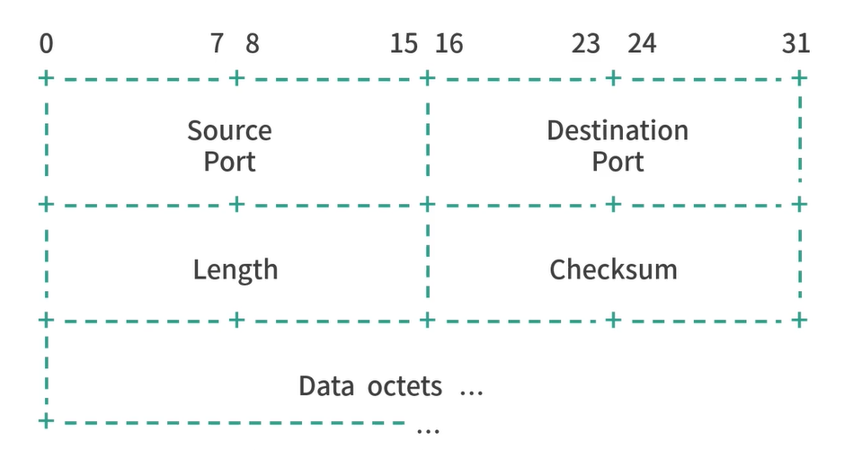
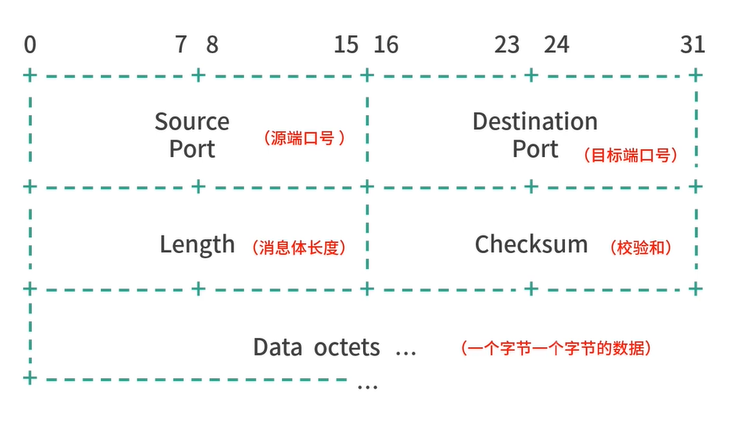
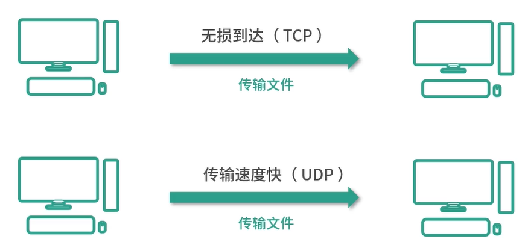
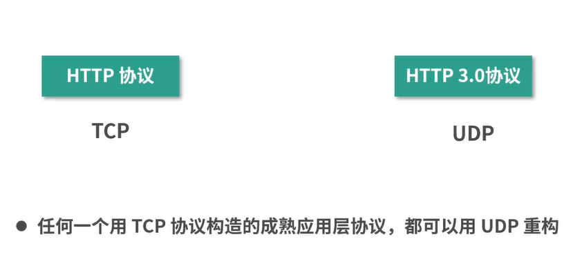

# UDP协议--用户数据报协议

UDP(User Datagram Protocol):目标是在传输层提供直接发送报文(Datagram)的能力。

- Daragram是数据传输的最小单位。
- UDP协议不会帮助拆分数据，它的目标只有一个，就是发送报文

为什么不直接调用IP协议呢？如果直接裸发数据，IP协议不香吗？

- 传输层协议是承接应用层的调用，因此要附上端口号，代表不同的应用。
- IP协议是承接传输层的调用，将数据从主机传输到主机。
  - IP 层不能区分应用

设计目的：在允许用户直接发送报文的情况下，最大限度的简化应用的设计。

1. 校验和(checksum)机制：校验数据在传输过程中有没有丢失、损坏是一个普遍的需求
2. 如果一个数据封包Datagram发生了数据损坏，UDP可以通过Checksum纠错或者修复。

## UDP和TCP的区别

1. 目的差异
TCP：提供可靠的网络传输
UDP：在提供报文交换能力基础上，尽可能地简化协议轻装上阵。

2. 可靠性差异
TCP：在保证可靠性提供更好的服务。
    三次握手建立连接，保证双方同时在线。
    时间窗口，持续收集无序的数据，直到数据可以合理的排序组成连续的结果。
UDP：只管发送数据封包。
    不需要ACK，不关心是否成功。

3. 连接 vs 无连接
TCP：面向连接的协议(Connection-oriented Protocol)
UCP：无连接协议(Connection-less Proticol)

4. 流控技术(Flow Control)
确保发送方一次发送多个报文而使得接收方不堪重负
TCP：流控技术
    - 在发送缓冲区中存储数据
    - 在接收缓冲区中接收数据
UCP：没有提供类似的能力

5. 传输速度
TCP：协议复杂，分包长，有连接、可靠性检查，速度慢。
UCP：协议简化，封包小，没有连接、可靠性检查等。速度更快

6. 场景差异
    TCP：不适合高速数据传输场景。
    UCP：Ping和DNSlookup只需要一次简单的请求/返回不需要建立连接。

    
    

    1. TCP的场景：
       - 远程控制(SSH)
       - File Transfer Protocol(FTP)
       - 邮件(SMTP、IMAP)等
       - 点对点文件传输(微信等)
    2. UDP的场景：
       - 网络游戏
       - 音视频传输
       - DNS
       - Ping
       - 音视频
    3. 模糊地带
       - HTTP(目前以TCP为主)
       - 文件传输

7. 总结

- 互联网协议群的传输层
  - UDP协议：不提供可靠性，不代表不能解决可靠性
    - UDP的核心价值：灵活、轻量、构造了最小版本的传输层协议
    - 在这个基础上还可以扩展实现：实现连接(connection)，实现会话(Sesion)，实现可靠性(Reliability)
  - TCP协议
    - TCP的核心价值：可靠、有序、面向连接，构造了全面的传输层服务
    - 在这个基础上实现了：
      - 连接管理：通过三次握手建立连接，四次挥手优雅断开，确保双方通信准备就绪。
      - 数据流控制：使用滑动窗口机制，根据接收方处理能力动态调整发送速率，避免拥塞。
      - 拥塞控制：采用慢启动、拥塞避免、快速重传和恢复等策略，动态调整数据发送速率，应对网络拥塞。
      - 错误检测与纠正：校验和功能确保数据完整性，丢失或损坏的数据段能够被检测并重新传送。
      - 按序传输：保证数据段按照发送顺序到达接收端，通过序列号和确认应答机制处理乱序问题。

- 学习协议的设计，对工作很有启示
  - TCP协议可以培养思维的缜密性
    - 序号的设计
    - 滑动窗口的设计
    - 快速重发的设计
    - 内在状态机的设计
  - UDP协议可以带动我们反思自己的技术架构
    - 轻量
    - 简单专注

- 传输层的基本需求：
  - 报文传输
  - 可靠性
  - 流量控制
  - 连接和会话

- TCP和UDP协议的优势和劣势：
  - TCP：
    - TCP最核心的价值就是提供封装好的一套解决可靠性的优秀方案。
    - TCP在确保吞吐量、延迟、丢包率的基础上，保证可靠性
      - 著名实验：TCP协议将数据在卫星和地面间传播了很多次，没有任何损坏。
  - UDP：
    - UDP提供了最小版的实现，只支持Checksum
    - UDP最核心的价值：灵活、轻量、传输速度快
