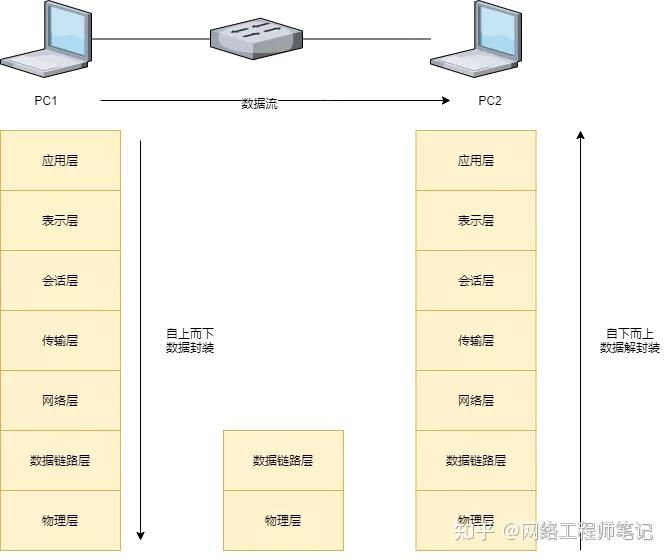

# 计算机网络

## OSI模型的七层框架

应用层
    协议：HTTP（超文本传输协议）、FTP（文件传输协议）、SMTP（简单邮件传输协议）、SNMP、Telnet、SIP、SSH、NFS、RTSP、XMPP、Whois、ENRP、等等
    硬件：无特定硬件，但通常会涉及到服务器、客户端设备等。

表示层
    协议：会使用如JPEG、MPEG等数据格式编码协议。
    XDR、ASN.1、SMB、AFP、NCP、等等

会话层
    协议：NetBIOS（网络基本输入输出系统）
    ASAP、SSH、RPC、NetBIOS、ASP、Winsock、BSD Sockets、等等

传输层
    协议：TCP（传输控制协议）、UDP（用户数据报协议）、TLS、RTP、SCTP、SPX、ATP、IL、等等
    硬件：网关。网关可以在第四层及以上工作，负责不同网络间的数据传输。

网络层
    协议：IP（互联网协议）、ICMP（互联网控制消息协议）、OSPF（开放最短路径优先）、IGMP、IPX、BGP、RIP、IGRP、EIGRP、ARP、RARP、X.25、等等
    硬件：路由器。路由器根据IP地址进行数据包的路由选择。

数据链路层
    协议：PPP（点对点协议）、ARP（地址解析协议）、SLIP（串行线协议）等。以太网、令牌环、HDLC、帧中继、ISDN、ATM、IEEE 802.11、FDDI、PPP
    硬件：网桥、交换机。这些设备用于连接网络段，处理数据帧的传输。

物理层
    协议：定义了电气信号、接口、电缆标准等，例如IEEE 802.3（以太网标准）。
    硬件：网卡、铜缆、网线、光缆、无线电、集线器、中继器、调制解调器。这些硬件负责传输原始比特流。

## 网络层次划分

```cpp
TCP/IP四层模型  TCP/IP五层模型   OSI七层模型
                                   应用层
                                   表示层
应用层------------>应用层--------->会话层
传输层------------>传输层--------->传输层
网络层------------>网络层--------->网络层         
                   数据链路层----->数据链路层
网络接口层-------->物理层---------->物理层
```


```cpp
OIS 七层模型对应协议：
    ISO/OSI    TCP/import       传输对象：                      协议：
    应用层                                                      
    表示层                         
    会话层----->应用层              报文                        SMTP FTP FELNET DNS TFTP RPC 其他
    传输层----->传输层              数据包(packet)传输协议分组   TCP    UDP
    网络层----->国际网层(IP层)      IP数据报                    IP ICMP(IPV4)   ARP RARP     
    数据链路层->网络接口             帧                         网络接口协议(链路控制，媒体访问)
    物理层----->硬件(物理网络)       比特流                     以太网、令牌环、X.25网、FDDI、其他网络
```

```cpp
OSI七层模型:
    应用层------>处理网络应用
    表示层------>数据表示
    会话层------>互联主机通信
    传输层------>端到端的连接
    网络层------>寻址和最短寻址
    数据链路层-->接入介质
    物理层------>二进制传输
```

### OSI参考模型各层的作用

1. [物理层](./OSI七层模型/物理层/物理层.md)：该层为上层提供了一个传输数据的可靠的物理媒体。确保原始的数据在各种物理媒体上传输
   * 功能：
     * 定义了网络设备之间物理连接的规格，如电缆类型、信号类型、电压等级等。
     * 负责在物理媒体上传输和接收原始比特流。
     * 管理物理线路的激活、维护和关闭。
   * 作用包括：
     * 位传输：确保二进制位的准确传输。
     * 接口特性：定义物理接口的电气、机械特性。
     * 信号传输：规定信号的编码、同步等。
   * 总结：
     * 是最底层，直接与硬件打交道，提供透明的比特流传输服务。
     * 基本数据单位是比特（bit）。传输的基本单位是**比特流**，即0和1，也就是最基本的电信号或光信号，是最基本的物理传输特征。
     * 不涉及数据的结构、意义或格式。


2. [数据链路层](./OSI七层模型/数据链路层/数据链路层.md)：将来自网络层的数据可靠的传输到相邻节点的目标网络机网络层。
   * 功能：将数据组合成数据块
     * 控制帧在物理信道上的传输。
     * 处理传输差错
     * 调节发送速率以使与接收方匹配
     * 两个网络实体之间提供数据链路通路的建立、维持和释放的管理。
   * 数据链路层由**MAC(介质访问控制子层)**和**LLC(逻辑链路控制子层)**组成。
     * 介质访问控制子层的主要任务是规定如何在物理线路上传输帧。（和物理层相连）
     * 数据链路控制子层主要负责逻辑上识别不同协议类型，并对其进行封装。也就是说数据链路控制子层会接受网络协议数据、分组的数据报并且添加更多的控制信息，从而把这个分组传送到它的目标设备。（和网络层对接）
   * 作用包括：
     * 物理地址寻址
     * 数据的成帧
     * 流量控制
     * 数据的检错
     * 重发
   * 总结：
     * 数据链路层为网络层提供可靠的数据传输；
     * 传输的基本单位为“帧”，将比特组合成字节，再将字节组合成帧。
     * 使用链路层地址（以太网使用MAC地址）来访问介质，并为网络层提供差错控制和流量控制服务。
     * 主要的协议：以太网协议；
     * 两个重要设备名称：网桥和交换机


3. [网络层](./OSI七层模型/网络层/网络层.md)
   * 功能：
     * 负责在不同网络间的数据包传输，选择最佳路径进行数据转发。
     * 提供逻辑寻址（如IP地址），实现不同网络设备间的通信。
     * 实现分组（Packet）的分割与重组。
   * 作用包括：
     * 路由选择：决定数据包从源到目的地的传输路径。
     * 流量控制：避免网络拥塞。
     * 网络互联：支持不同网络间的通信。
   * 总结：
     * 关键协议：[IP（Internet Protocol）](./网络协议/IP协议/IP协议.md)。IP协议是网络层中的核心协议。IP协议非常简单，仅仅提供不可靠、无连接的传送服务。
     * 传输的基本数据单位是`包/数据包（Packet）`或`分组`，提供IP地址，负责把数据包从源网络传输到目标网络的路由选择工作。
     * 核心设备：路由器。


4. [传输层](./OSI七层模型/传输层/传输层.md)
   * 功能：
     * 确保端到端的数据传输服务，负责分割与重组数据，并保证数据的正确排序。
     * 提供面向连接的服务（TCP）和无连接的服务（UDP）。
   * 作用包括：
     * 进程寻址：通过端口号识别不同的应用程序。
     * 错误检测与恢复。
     * 流量控制与拥塞控制。
   * 总结：
     * 关键协议：[TCP（Transmission Control Protocol）](./网络协议/TCP/tcp.md)和[UDP（User Datagram Protocol）](./网络协议/UDP/UDP.md)。
     * 基本数据单位是段(Segment)，提供面向连接或非面向连接的数据传递以及进行重传前的差错检测。
     * 负责端到端的可靠数据传输。


5. [会话层](./OSI七层模型/会话层/会话层.md)
   * 功能：
     * 管理会话的建立、维护和终止，包括对话控制和同步。
     * 提供数据交换的定界和同步服务，确保数据传输的连续性和完整性。
   * 作用包括：
     * 会话控制：启动、暂停、终止会话。
     * 同步：确保数据正确排序。
     * 安全性措施。
   * 总结：
     * 促进应用之间的有效沟通，但现代网络中，这些功能往往由该层的通信由不同设备中的应用程序之间的服务请求和响应组成。即**由应用层直接处理**
     * 常用协议：[RPC(远程过程调用协议)](./网络协议/RPC(远程过程调用协议)/RPC_远程过程调用协议.md)

6. [表示层](./OSI七层模型/表示层/表示层.md)
   * 功能：
     * 处理数据的表示形式，包括数据加密、解密、压缩、解压缩等。
     * 确保一个系统的应用层发送的数据以能被另一个系统的应用层识别的形式传输。
   * 作用包括：
     * 数据格式转换。
     * 数据加密与解密。
     * 数据压缩与解压缩。
   * 总结：
     * 负责数据的表现形式，使得应用层可以处理统一的数据格式。


7. [应用层](./OSI七层模型/应用层/应用层.md):OSI参考模型中最靠近用户的一层，为应用程序提供网络服务。
   * 功能：
     * 直接与用户或应用程序交互，为用户提供网络服务。
     * 包含了各种高层协议，满足电子邮件、文件传输、网页浏览等需求。
   * 作用包括：
     * 用户界面。
     * 文件传输、电子邮件、WWW服务等应用协议。
     * 数据加密、解密、格式转换等（有时也由下层处理）。
   * 总结：
     * 是OSI模型的最高层，提供最终用户服务。
     * 包括HTTP、FTP、SMTP等多种协议。


### 数据封装/解封装



>PC1和PC2需要进行数据通信？那么PC1发送给PC2的数据包需要根据OSI参考模型至上而下进行数据封装，PC2收到数据包至下而上进行解封装

这里的封装和解封装的概念可以使用寄快递和取快递类比，中间的传输介质就是物流公司。

寄快递的时候是不是需要将物品层层包装起来，其实就是数据包封装的过程；取快递的时候需要拆解包裹，这个其实就是数据包解封装的过程。


## 经典问题

### 在浏览器中输⼊URL并按下回⻋之后会发⽣什么

>超⾼频⾯试题，从这道⾯试题开始可以延伸到计算机⽹络有关的很多问题，如果这道题答的很好，可以把⾯
试官引导到你更熟悉的地⽅。

1. 第⼀步：输⼊URL并解析
    >这⾥可以引申到URL的组成部分，这⾥不做过多的展开。

    输⼊ `URL` 后，浏览器会解析出协议、主机、端⼝、路径等信息，并构造⼀个HTTP请求（浏览器会根据请求头判断是否有 HTTP缓存 ,并根据是否有缓存决定是从服务器获取资源还是使⽤缓存资源，具体内容会在`HTTP`缓存章节讲解。

2. 第⼆步：DNS域名解析, 将域名解析成对应的IP地址
    在发送`HTTP`请求之前，浏览器需要知道想要访问⽹⻚(`url`)对应的IP地址，这就需要使⽤到 `DNS`域名解析 （DNS域名解析的具体内容也会在后⾯章节中讲解）。

3. 第三步：建⽴起TCP连接之三次握⼿
    >这⾥是重中之重，可以扩展很多问题，⽐如为什么是三次，不是两次、四次？如果第⼀次握⼿丢失了会发⽣什么？三次握⼿过程中可以携带数据吗？

    客户端和服务器之间进⾏HTTP请求和HTTP响应的过程中，需要建⽴起TCP连接，TCP连接需要进⾏三次握⼿（具体内容在后⾯章节中讲解）。

4. 第四步：浏览器发送HTTP/HTTPS请求到web服务器
    >这⼀步也可以扩展很多问题，⽐如HTTP/HTTPS的区别？请求的⽅式？请求的状态码，凡是与HTTP请求的问题都可以问。

5. 第五步：服务器处理HTTP请求并返回HTTP报⽂
    >HTTP响应报⽂和状态码也是常考的内容。

    服务器会接受请求并将其传递给请求处理程序并发送HTTP响应，⼀般响应报⽂包含：请求的⽹⻚以及状态码，压缩类型，如何缓存的⻚⾯，设置的cookie;

6. 第六步：浏览器渲染⻚⾯
    >浏览器渲染⻚⾯的流程对于前端同学来说也是必会的、还会牵扯到回流和重绘的问题。

7. 第七步：断开连接之TCP四次挥⼿
    >这⾥也是特别重要的知识点，四次挥⼿的过程，为什么是四次？
